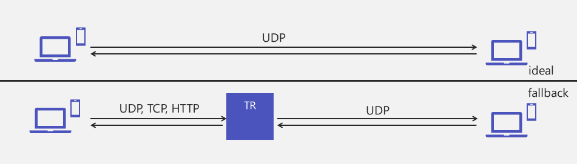
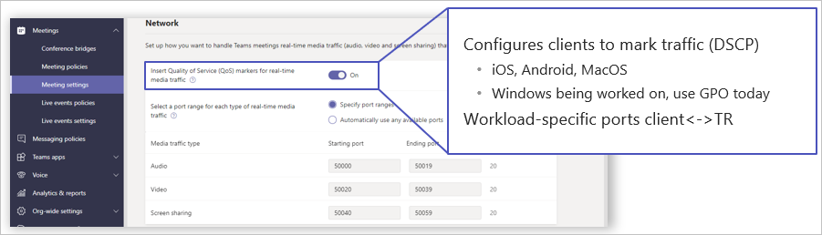

Earlier it was mentioned that transport relays are the servers that Microsoft Teams connects to, at least for media. Transport relays translate between various protocols so that everybody can speak to each other. Ideally, everybody is speaking UDP over (by default) port 3478/udp. UDP is great for audio and video because it is so efficient when compared to TCP and HTTP.

However, in situations such as the bottom half of the diagram below where somebody cannot use UDP, they would have to use TCP or HTTP. The transport relay can translate between TCP, HTTP, and UDP. Depending on how you connect on one side of a network versus another dictates which protocol you'll use to connect to the transport relay.

If there are five people on the call and four people can connect via UDP and the fifth can only connect via TCP, that TCP connection has no direct impact on the other four attendees. The other four continue to use the optimal UDP and the fifth attendee will use TCP. TCP is a slower protocol that is not as efficient for real-time audio and video, so that fifth attendee may have a potentially poorer audio and video experience.

How do we find a transport relay?

An *Anycast IP address* is a single IP address assigned to geographically dispersed servers. You can connect to an Anycast IP address and it routes you to the closest transport relay. When you start up Teams, Teams always looks for one specific IP address of 52.113.192.2.  Anycast will then route you to the closest Azure Front Door. An available transport relay answers and redirects from the Anycast IP to an IP address of the exact server you will connect to.

By default, Microsoft Teams media uses 3478/udp for all media. That is controlled by an on-off switch found in the Teams admin center.

If you leave it off, everything stays on 3478/udp. If you turn on this switch, you'll see that Teams will use 3478/udp for media negotiation and discovery, 3479/udp for audio, 3480/udp for video, and 3481/udp for sharing.

The reason you would enable this setting is Quality of Service (QoS). Now that you're using four ports (and three specifically for media) you can apply different priorities to different media. Audio is almost always chosen to be the highest priority, video the second highest, and sharing the third highest priority.

## Learn more

- [Implement Quality of Service in Microsoft Teams](/microsoftteams/qos-in-teams?azure-portal=true)
