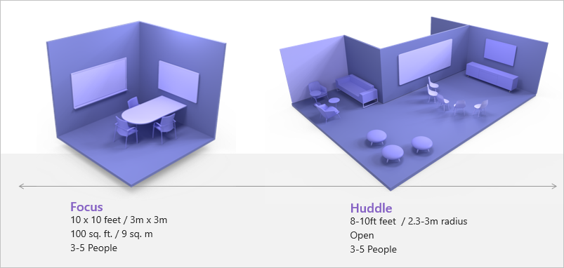
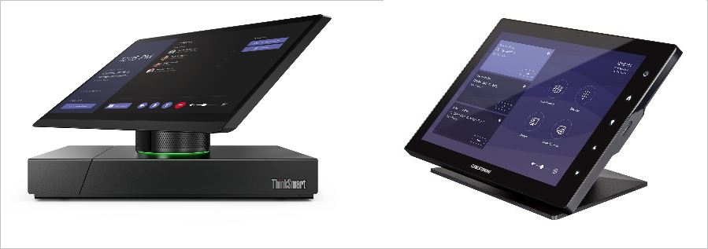
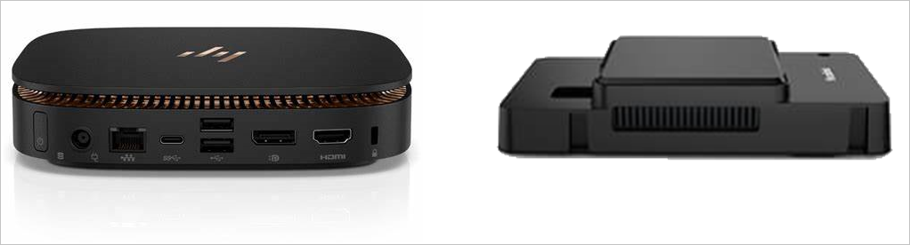

Here's a partial list of questions that need to be asked when designing meeting spaces for Teams Rooms.

- What type of furniture is in the room?
- What sort of materials are on the walls in the room?
- Are the walls made of glass?
- How bright or dark is the room?  
- How large is the room?
- What kind of field of view should the camera have?
- How are you going to run cables to the table microphones, cameras, and displays?

In the below left image, we see a small focus room. This is a great place for Teams Rooms, be it a collaboration bar for Microsoft Teams or the full Windows-based Teams Rooms.

On the right is a different situation. This is the type of environment that is great for Surface Hub, an all-in-one digital whiteboard, meetings platform, and collaborative computing device that brings the power of Windows 10 to teamwork. As there's no table in front of any of the chairs, people can get up and walk directly to the Surface Hub to interact with it. By putting tables in front of the chairs, people may feel hesitant to walk around the table to get to the Surface Hub. When going with Surface Hub, be sure that the room is designed to encourage interactivity with the device.

As you analyze your meeting spaces, decide if Teams Rooms is the right device for the space or if Surface Hub makes more sense. In some cases, it makes sense to put both Teams Rooms and Surface Hub in the same room and configure Coordinated Meeting Join between the two.

Here's some  things you'll want to consider when selecting equipment for your meeting spaces:

- **The camera** is important in a meeting space. You must decide how well the camera you choose can handle the lighting in the room.  Do you need pan, tilt, and zoom, or can it be a static camera? The camera's field of view is important. The wider the field of view, the less depth the camera can focus on accurately.  The narrower the field of view, the deeper into the room the camera can look.
- **The microphone array** is important in picking up the voices of the attendees. You can decide if you want the microphones to be on a table or in the ceiling. One advantage of ceiling-based microphones is they don't pick up vibrations as people bump into the table.
- **Cable management** should not be overlooked. You don't want people to move the center of table console and pull cables loose. You also need to be able to run cables discreetly in walls or through floor covers, underneath tables, and to various other locations in the room where you need to put Teams Rooms equipment.
- **The sound profile**. The more glass and plastic in a room, the more vibrations there will be. You may need to add sound dampening to a room.
- **The light profile**. You want to make sure that the remote attendees get a good clear view of the attendees inside the meeting space. If the room is too dark, the camera will not be able to properly capture the in-room attendees. If the room is too bright, it can be difficult to read the front of room displays.

**The touchscreen console**. The center of table touchscreen console is the device that users interact with when joining and managing a meeting. There are many different form factors. Some have compute modules built-in and some can swivel the display. Some consoles have a high tilt angle and some lay a little more flat.

**The compute module**. Teams Rooms support compute modules from several vendors. The compute modules have been designed to match with the correct Teams Rooms configuration so that they have enough USB, HDMI, and other required ports. The compute module runs Windows 10 Enterprise IoT.

**The camera**. Cameras are an important part of the Teams Rooms environment, and there are many different options. Some cameras are housed in a console that also contains the microphone and speakers, such as the camera on the left. The camera on the right is a traditional pan/tilt/zoom camera that works well in larger meeting spaces.
You'll need to consider the field of view and if other features like automatic speaker framing are needed.

**The content camera**. There are specific certified cameras that support the content camera feature. You can see examples of two of them below.

The ideal size of the capture area of an analog whiteboard is between 1.8m-2.7m/6-9 ft. wide. Whiteboards larger than 3.6m/12ft will not be picked up by the camera. Note that the whiteboard should be white and not another color. If you have a whiteboard that is the entire length of the wall, the camera will not be able to show the whole thing. The recommendation is to take colored tape and tape an outline of the camera's field of view directly on the whiteboard.

This provides two advantages. First, it helps the content camera frame the whiteboard as it can detect a border. More importantly, it will let someone who's drawing on the whiteboard know if they're about to draw outside of what the camera can see. If they were to draw outside the taped area, the camera won't show it, and they'll be encouraged to continue diagramming inside the frame.

**Audio considerations**. Audio is crucial so everyone can hear what's going on. On the left is a sound bar that hangs below the front of room display. The sound bar includes both the speakers and the microphone. On the right is a speaker-only sound bar. There are also microphones that can be placed throughout the room.

**Display options**. There are many different display options. You can use displays hanging on a wall or a projector. Make sure that the displays are sized properly for the space. 4K displays are supported, but Teams will only show up to a 1080p image.
When should you use a single monitor versus dual monitors? A single monitor is good primarily for small rooms, while dual monitors are great for large rooms. Note that in either single or dual monitor scenarios, a monitor can be touch-enabled to support interactive inking.

*What are the requirements for a touchscreen?* Any touch-enabled monitor that works with Windows 10 will work with Teams Rooms. You may need to go into Windows Settings and verify that tablet PC settings are configured correctly to enable the monitors touch features.

*Are all the walls in the meeting space glass?* In that case, you can't mount on the wall and you'll have to get creative, opting for a projector and screen or purchasing a stand to hold the display.

**Use the right cables and connectors**. If the room already has existing displays, make note of the make and model, and make sure the connectors on the existing displays will work with Teams Rooms.

- Always be certain you're using cables and extenders that work to the vendor's specifications. If the vendor dictates a category 6 cable should be used to connect components, use only category 6 cabling. If you use something like category 5 or 5E, you can expect that there will be issues with the system. The OEM manufacturers have specified the cabling requirements, and it is in your best interest to match the requirements.
- Make sure that the cable lengths needed for a room are within specifications of a given cable type. If not, you'll have to use an extender. Not all technologies support extenders, such as USB 3.0.
- When buying cables, make sure that the connector will fit into the compute module or the console display. Some cables have large connectors and putting two connectors next to each other won't physically fit.
- Connection locking capabilities are a nice feature. First, it can help prevent cable theft. But more importantly, it'll help cables from accidentally being pulled loose. Some HDMI cables have been engineered to require extra force to pull the cable loose.
