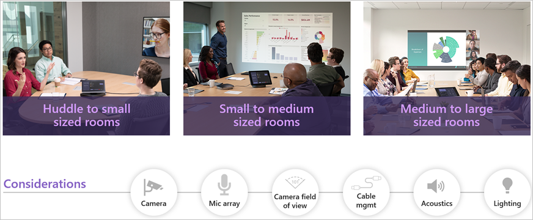

When reviewing your rooms and spaces, what should you look for? Here are some things to consider but it is not an exhaustive list. You should be thorough when analyzing and inventorying your meeting spaces.

- What is the goal of this room?
- Will cables need to be run on top of the floor?
- Is there a physical whiteboard?
- Does the room have any apparent ambient noise issues, such as a loud air conditioning unit?
- Do you need to control external devices such as lowering shades or turning on a projector?
- Can the walls support the display weight?

While you review your spaces, take photos of everything in the meeting space. This becomes important documentation over the lifecycle of the room.  If you need to send a technician to a room, you can tell them the Teams Rooms make and model, how the cables are run, and if the microphones are in the ceiling. You may not be able to visit every space that you are going to outfit with Teams Rooms. As such, make sure a coworker or vendor takes all the photos that they can. For example, some pictures should be taken showing under the table, the top of the table, the ceiling, the floor, and even behind the display.

This will give you an idea of how you can run cables, if you're going to need extenders, how you will need to secure the cables, where you're going to get power, and even if you can put speakers and microphones in the ceiling. If there's an existing display, take a photo of the display's make and model. Research the display to make sure it has the right connectors to match with the Teams Rooms equipment.

You should be able to get the dimensions of the room from your facilities team. You should also do your own measurements of the items in the room. How long and wide is the table? How far away is the display from the table? How far and how close will the attendees be able to sit from the camera, speakers, and microphones?

Cameras, microphones, and speakers all have documented ranges for optimal performance. With these measurements, you can be certain that you've purchased the right audio and video equipment for a given space.

Once you have all the dimensions, you can work with your Teams Rooms vendor to validate that the right equipment is being chosen for the right space. You should then store this information in a central location so that it's easy to reference in the future. Microsoft Teams is a great place to store this! You could create a Microsoft Teams Rooms team, and then add channels for each building or location. Within that channel, you can store all the images, cabling diagrams, measurements, and copies of the instruction manuals for all the devices.
