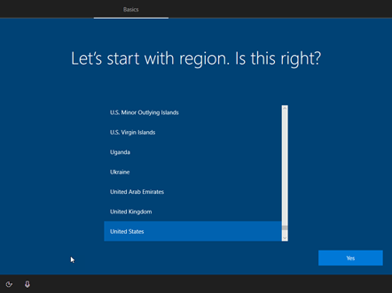
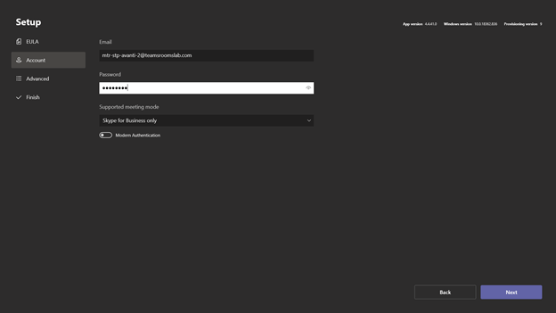
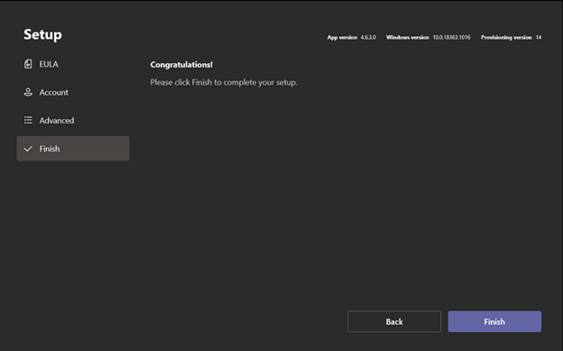

When you first power on Teams Rooms, the first screens you see are the out-of-box experience (OOBE) ones. Microsoft Windows is initially installed, and you’ll be asked a few questions during the install.

1. Select your region from the list and click **Yes**. In the example here, Teams Rooms is being installed in the United States, so United States is selected and then **Yes** is clicked.

   

2. Select the correct keyboard layout. Scroll through the list to find the right keyboard for you and click *Yes*.
1. You'll be asked if you need a second keyboard layout. Make a choice if you need to.
1. The Windows install proceeds for about another half-hour and reboots once or twice. When the Windows installation completes, you're brought to the Teams Rooms out-of-box experience.
1. Read through and accept the end-user license agreement. 
1. Provide the resource account you want to use with this installation.
1. Enter the e-mail address of the resource account and the password. 
1. Select a supported meeting mode.  There are three available options:

   - Skype for Business (default) and Microsoft Teams
   - Skype for Business and Microsoft Teams (default)
   - Skype for Business

   When you create a meeting on the Teams Rooms console, whichever one is set as default dictates what kind of meeting is created. If you have Skype for Business (default) and Microsoft Teams set, then when you create a new meeting on the console, it will be a Skype for Business meeting.

   If you have Skype for Business and Microsoft Teams(default) set, when you click **New Meeting** on the console, it will be a Microsoft Teams meeting.

   The third option only supports joining Skype for Business meetings. With this option set, if someone sends a Teams meeting invite to this room, it will not be able to join that meeting. You will also not be able to manage this Teams Rooms in Teams admin center.

1. You can also enable Modern Authentication. 
1. After entering and setting the necessary values click **Next**. 

   

1. The Advanced screen is meant for advanced Skype for Business configurations. Check with a Skype for Business expert if you need to fill out these values. In most cases, you can just skip this screen by clicking **Next**.
1. If you have Microsoft certified Teams Rooms equipment connected, you'll see the congratulations message. If not, you'll need to connect the center of room console to the compute module.
1. Click **Finish** to complete the out-of-box experience for both Windows and Microsoft Teams Rooms.

   
