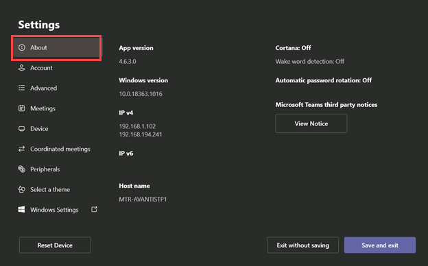
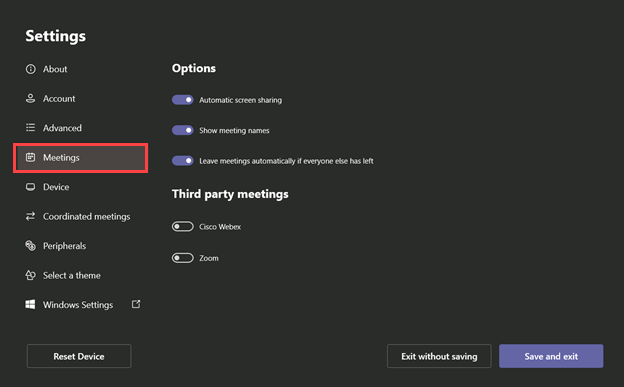
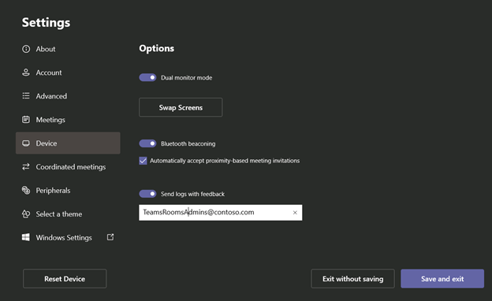
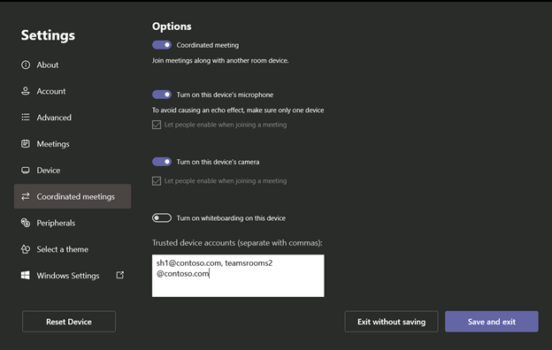
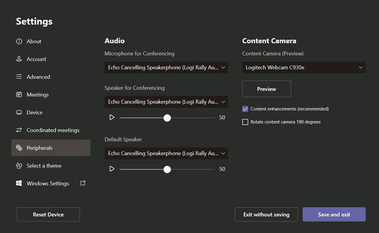
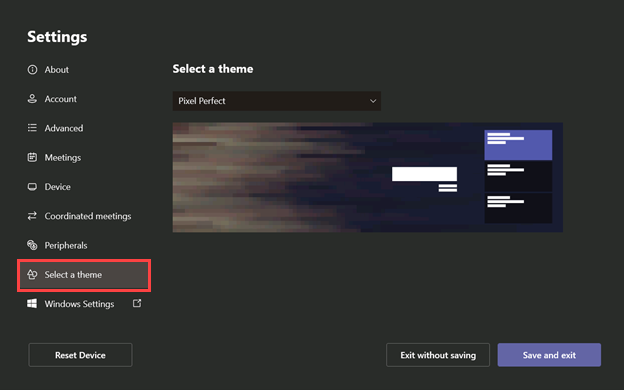

After you've changed the Admin password and installed the latest updates (the initial key actions), you may want to review the Teams Rooms settings. To do this, select **More** and then **Settings.**

## Review the Settings screen

### The About screen

The initial screen is About, which shows the app version, the Windows version, the IP addresses, and the host name.

### The Account and Advanced screens

The Account and Advanced screens are the same as what is shown during the out-of-box experience.



### The Meetings screen

In Meetings, you have a few options to consider.

- One is **Automatic screen-sharing**. This means if someone takes their laptop and connects it via HDMI cable to the console, it will immediately be shared into the room. If you'd like to disable that feature, untick **Automatic Screen Sharing**.
- When meetings are shown on the console, the name of the meeting is displayed, such as *Weekly Status Meeting*. If you're in a secure environment and don't want to have meeting names display unnecessary information, such as *Acquisition of Tailspin Toys*, you may want to disable the **Show meeting names** feature. The Teams Rooms console will then show only the name of the meeting organizer on the console.
- The third option is **Leave meetings automatically if everyone else has left**. If all the remote attendees have left the meeting, and the meeting time has expired, then the meeting room will automatically exit the current meeting. This is a security feature so that the meeting doesn't stay active while no one is around.
- Finally, you have **Third-party meetings**. This is the ability of Teams Rooms to join meetings hosted by external providers such as Cisco and Zoom. If you want to enable this feature, select the third parties you want to connect with and make sure your resource account has the following Exchange settings enabled:

  - Process External Meeting Messages: True
  - Delete Comments: False
  - Delete Subject: False

   

   You can set these values via Exchange Online PowerShell with the following command:

   ```powershell
   Set-CalendarProcessing <Teams Rooms Resource Account UPN  > -ProcessExternalMeetingMessages $True -DeleteComments $False -DeleteSubject $False
   ```

You'll also need to disable Microsoft 365 Threat Protection link rewrite for any third-party domain names (such as **.webex.com*), using the article ["Do not rewrite the following URLs" lists in Safe Links policies](/microsoft-365/security/office-365-security/atp-safe-links?do-not-rewrite-the-following-urls-lists-in-safe-links-policies).

#### The Device screen

The Device screen lets you set a few hardware options.

- If you have two front-of-room displays connected, you should enable the Dual monitor mode option. Dual monitor mode shows a gallery view of attendees on one screen and any shared content on the other. If you'd like to swap which screen shows the meeting content and which screen shows the remote attendees, you can do that by clicking **Swap screens**.
- The **Bluetooth beaconing** setting is used to enable Proximity Join. People can add Teams Rooms meetings simply by being close to the room and adding them from the Join screen of their Android, iOS, or Windows 10 devices.
- **Automatically accept proximity-based meeting invitations** means Teams Rooms will automatically join the meeting if it was invited via Proximity Join. If you disable this, you'll have to hit a button on the console to manually join the meeting.
- **Send logs with feedback** allows you to send logs from the device to your Teams Rooms administrators. When in a meeting, there is a feedback button on the console. In-room attendees can select that feedback button and report any issues they encountered. That feedback, along with system logs, will then be forwarded to the e-mail address listed here.

   

### The Coordinated meetings screen

Coordinated meeting join is a unique feature of Teams Rooms and Surface Hub. Suppose you have a meeting room that has both Teams Rooms and Surface Hub in it. You can configure it so that when Teams Rooms joins a meeting, Surface Hub will automatically join that meeting. You can configure which device to use for microphone, camera, and whiteboarding. Generally, you would use Teams Rooms for audio and camera as those should be the superior audio/visual devices. Similarly, the Surface Hub would be the default device for whiteboarding. You can also use coordinated join to automatically invite another Teams Room.



### The Peripherals screen

In the Peripherals screen, you can change the microphone, speaker, and default speaker. You can also set the default speaker volumes.

### Content Camera

The Content Camera option lets you select which camera you'll use for this feature. Only a subset of certified cameras are supported to record analog whiteboards. You can see the list of [supported content cameras](/MicrosoftTeams/rooms/requirements#certified-firmware-versions-for-usb-audio-and-video-peripherals) on the Microsoft Teams Rooms requirements page.

### Content enhancements (recommended)

The Content enhancements option is used to enable the content camera to maximize the view of analog Microsoft Whiteboards by framing the board and turning the person diagramming at the analog whiteboard transparent. Disabling this option returns the camera to its basic operation of just showing the analog whiteboard without added intelligence.



### Select a theme

Teams Rooms ships with pre-installed themes. In this area, you have the chance to change the themes from the default setting to a new one. In this example, Pixel Perfect has been selected as the theme.



## Learn more

- [Read about the Content Camera feature](/MicrosoftTeams/rooms/content-camera?azure-portal=true)
- [Installing custom themes](/microsoftteams/rooms/xml-config-file#custom-theme-images)
