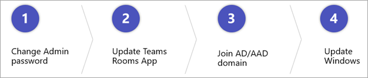
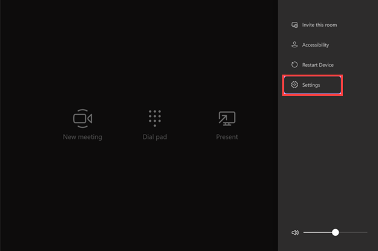
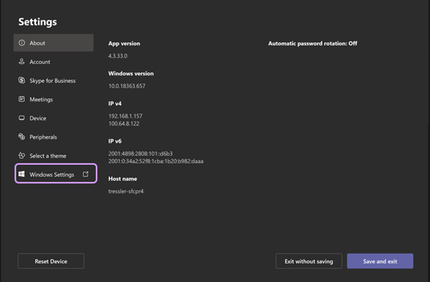
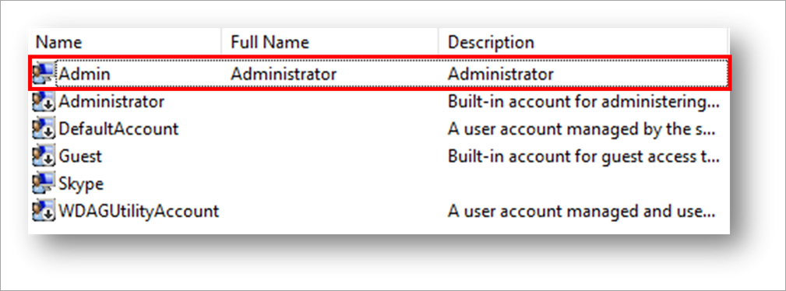
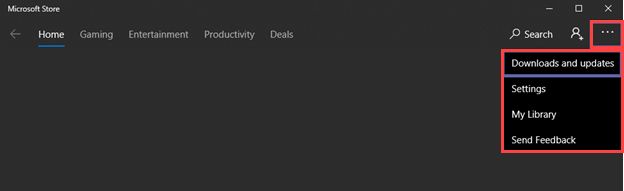
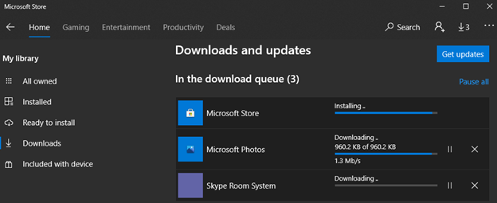
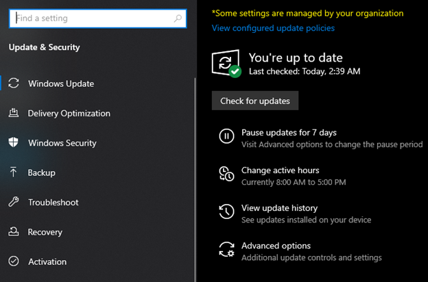

Now that the out-of-box experience is complete, there are four key actions you should consider taking.

1. **Change the Admin password**. You should first change the Admin password to something only you know. By default, all Teams Rooms devices ship with the exact same Admin password. It's poor security to keep that default password set.
1. **Update the Teams Rooms app**. The second step is to update the Teams Rooms app itself. Make sure you're on the latest version of Teams Rooms app as there are new features and fixes with each release.
1. **Join Active Directory (AD) or Azure Active Directory (Azure AD)**. The third change is optional, and that's to join Active Directory or Azure Active Directory. Joining Active Directory or Azure Active Directory allows you to import administrators into the local administrators group of Teams Rooms.
1. **Update Windows**. Finally, and this is important, update Windows *after* you have updated the Teams Rooms app and rebooted. If you update Windows before you update Teams Rooms, you may end up in a scenario where you have an installed version of Windows that is unsupported by Teams Rooms. To avoid this, always update the Teams Rooms app before you update Windows.

   

## 1. Change the Admin password

To change the Admin password, you need to access the Windows interface. So how do you get to the Windows interface on Teams Rooms?

### Access Windows settings

1. On the console, click **More** and then **Settings**.

   

1. From the Settings screen, you can click on **Windows Settings** which will close out the Teams Rooms app and bring up the familiar Windows 10 sign-in screen.

   

1. Sign in as Admin with the default password and you'll see the standard Windows 10 desktop.
1. To change the password for the Admin account, navigate to **Windows Settings** on the console.
   1. Open  **Computer Management**.
   1. Navigate to **Local Users and Groups**.
   1. Select **Users**.
   1. You can see the Admin account listed in the screenshot here. Right-click on it and select **Set Password . . .**

   

   You can also change the password using PowerShell.

   ```powershell
   $Password = Read-Host -AsSecureString  
   $UserAccount = Get-LocalUser -Name 'Admin'  
   $UserAccount | Set-LocalUser -Password $Password
   ```

You don't need to leave the admin account enabled or even installed. You can completely remove it. Just be sure before you do that, that you have another local administrator account configured. Otherwise you'll lock yourself out of Teams Rooms and will have to perform a complete reinstallation.

## 2. Update the Teams Rooms App

On every installation of Teams Rooms, a scheduled task is added that runs at 2:01  in the morning. Its job is to go to the Microsoft Store and Windows Update, pull down any applicable updates, install them, and reboot the device. This keeps Windows patched and Teams Rooms running the most recent version.

To manually update the Teams Rooms app, follow these steps.

1. On the console, navigate to **Windows Settings** and open the Microsoft Store.  
1. After you open the Store, click on the ellipses at the upper right to show the menu. Then click on **Downloads and updates**.

   

1. From the screen that pops up, click **Get updates** to check for any updates.

   

1. If there are any updates to any installed apps, they will be downloaded and installed. In the image here, there is an update underway for Skype Room System. This is the name used for the Microsoft Teams Rooms app. After the app is installed, it is recommended to reboot Teams Rooms so any new settings can be properly applied.

   

## 3. Join Active Directory or Azure Active Directory

After you've updated the Teams Rooms app, you can optionally join Teams Rooms to Active Directory or Azure Active Directory. Adding Teams Rooms to a Windows domain can add some minor manageability benefits. For example, you can import a group of administrators to the local administrator group to ease administrative access to Teams Rooms. The article [To join an already configured Windows 10 device](/azure/active-directory/user-help/user-help-join-device-on-network#to-join-an-already-configured-windows-10-device) will help you join Teams rooms to a domain. You perform these steps in the Windows Settings admin interface.

## 4. Update Windows

Teams Rooms is designed to check daily for Windows updates. If any are available, it will download them and install them as part of the script that runs daily at 2:01 in the morning. This will install not just security patches but also  full version updates to Windows. Teams Rooms is not supported on every version of Windows 10. The Teams Rooms app installs blockers to prevent newer versions of Windows from being installed with which it is not yet compatible. Therefore, it is important to avoid installing versions of Windows newer than what Teams Rooms supports. The article [Windows 10 release support](/MicrosoftTeams/rooms/rooms-lifecycle-support#windows-10-release-support?azure-portal=true) shows which versions of Windows 10 are supported with Teams Rooms.

Because the Teams Rooms app blocks the installation of unsupported versions of Windows, it's critical that you update the Teams Rooms app before you update Windows. After you've updated the Teams Rooms app and rebooted, you can manually install pending updates to Windows.

1. After navigating to Windows Settings on the console, type **Windows updates** in the search bar on the Windows task bar and press **Enter**.

   

2. From this screen, click on **Check for updates**. Windows will then look for any available updates and install them.

> [!IMPORTANT]
> After changing the Admin password and updating Teams Rooms, be sure to update the firmware of the attached components (such as cameras, microphones, and speakers) and of the Windows 10 compute module as well. Check with the Teams Rooms manufacturer for guidance on performing these updates.
>
