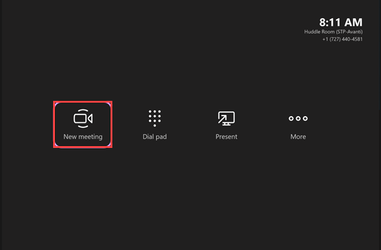
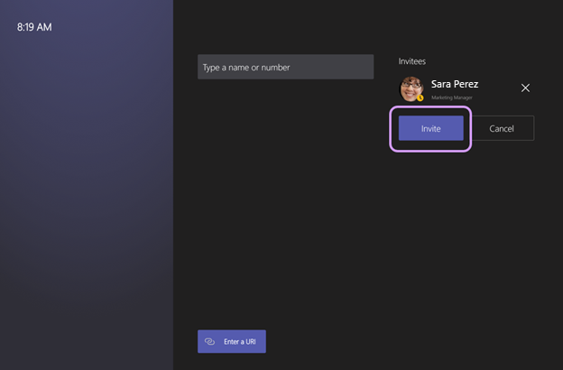
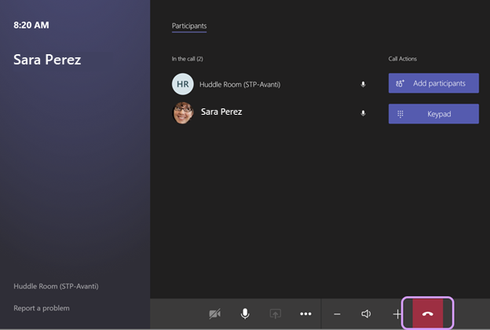
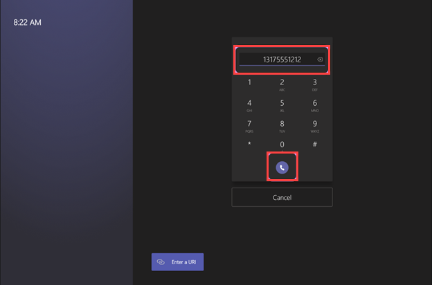
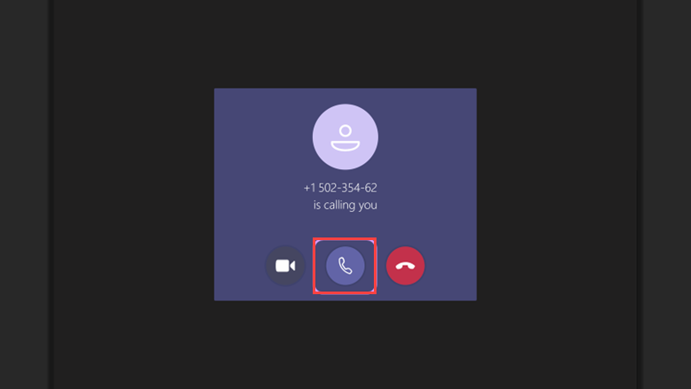
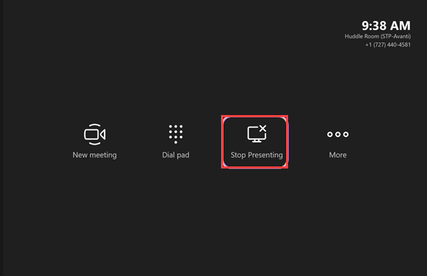
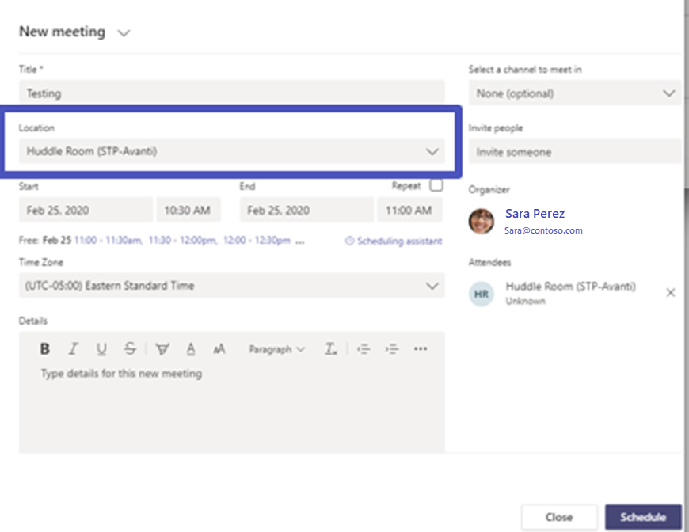
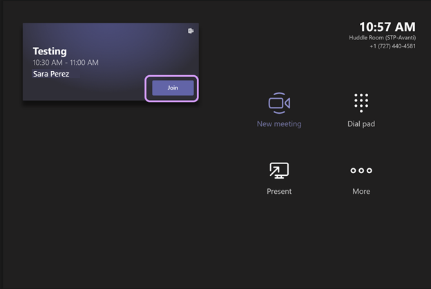

You're now ready to validate and test Teams Rooms to make sure all's working properly. The steps here will help you test all  the major features.

## Conduct feature tests

### Test meeting join

1. Create a new meeting. Select **New Meeting** on the console.

   

1. Type in the name of someone in your organization. In the following examples, we'll use Sara Perez. After typing Sara's  name, you'd select her account from the list of results and then choose **Invite** to invite her to the meeting.

   

1. We see that Sara has joined the meeting. At this point, you would work with Sara to make sure the camera and audio are working correctly and that you can see each other. You should also share a laptop into the meeting via the HDMI cable connected to the console.

1. When you're finished, select the **Hang up** icon.

   > [!NOTE]
   > On the bottom left of the screen you can see **Report a problem**. This would be chosen by users if they had an issue to report. You need to set up an e-mail address in the Device sections of Teams Rooms settings for this option to appear.
   >

### Test dial-out calling

If your resource account is configured with a telephone number, you can test dial-out calling.

1. Select the **Dial pad** button. This brings up a new screen with a dial pad. You can type in the phone number you're trying to reach and then hit the **Dial** icon.
1. Test the audio to make sure you can reach the remote attendee and that you can hear each other clearly.  
1. Once you've validated that the audio and the phone call work, you can hang up and move on to the next test.

   

### Test dial-in calling

In the dial-in test, you dial the phone number of the resource account.

1. Using your mobile device, call the room, and you'll see a prompt on the console.
1. Choose to answer with audio only, as video won't work on a public telephone call. Make sure that you can successfully answer the call and validate that audio works just as in the dial-out test.
1. After you verify that the call worked as expected, you can hang up and move on to the next test.

   

### Test HDMI ingest

The next test validates the HDMI ingest feature.

1. Using a laptop, connect an HDMI cable to it and to the console.
1. If auto-sharing is enabled, the screen will change to show the **Stop presenting** icon. The front-of-room display will show the same thing that's being shown on the laptop. If auto-sharing is not enabled, you'll have to click the **Present** icon on the console.
1. When you're done with this test, click **Stop Presenting.**

   

### Test joining a scheduled meeting

The next test validates joining a scheduled meeting.

1. In the example below, a meeting is being scheduled from the Teams client. You can see the location of Teams Room has been added into the meeting invite. As a reminder, this is the resource account. This resource account will auto-accept the invite and then the console will update to show the meeting.

   > [!NOTE]
   > Learn about resource accounts and how to add one to a meeting in the module **Deploy Microsoft Teams Rooms**.
   >

   

1. Click the **Join** button to test the meeting.
1. Teams Rooms joins the meeting and then you can test with another remote attendee (Sara in this example) to make sure audio, video, and sharing work correctly.
1. After validating that the meeting join worked, you can hang up and leave the meeting.

   

After you've completed those initial tests, there may be some additional things that need to be validated.

- Make sure that the resource account name and phone number are shown correctly in the upper right of the console.
- Make sure that cameras are functional and positioned optimally. If the camera supports pan, tilt, and zoom features, make sure they are working correctly.
- When conducting your test meetings, be sure to walk around the room and make sure you can be heard in all areas where attendees are expected to speak. Be sure that you can hear the other person well throughout the room. This will validate that speaker and microphone placements are correct.
- For the console, make sure cables are secure and not pinched. They should be secure to avoid accidents.
- If the console can swivel or move around the desk, make sure it can do so freely without pinching any cables.
- Make sure the display brightness on the console and front of room displays is acceptable for the environment. No one wants to sit in a dark room with a super bright console. Conversely, it's difficult to read a console when you're in a very bright room and the brightness is turned down too low on the console.
