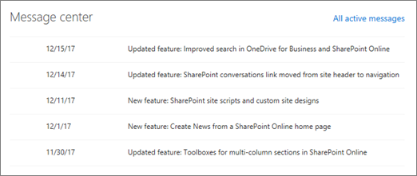
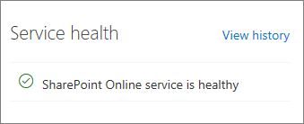

Some basic reports can be viewed from the SharePoint admin center. You can see at a glance:

- **Reports,** such as the number of files that have specific types of activity each day for the past 30 days and the number of total and active sites each day for the past 30 days.

  

- **Message center posts,** including official announcements about new and changed SharePoint features to help you manage upcoming changes. Each post gives you an overview of a change and how it may affect your users.

  

- **Service health,** including whether the SharePoint service is healthy, or if it's experiencing an active advisory or incident.

  

## Learn more

When you're done with a link, use the **Back** arrow in your browser to come back to this page.

- [Activity reports in the Microsoft 365 admin center](/office365/admin/activity-reports/activity-reports?redirectSourcePath=%252farticle%252f30e5558f-d3c0-4a3b-a0d5-58fc7750c0ad%252f&)
- [Navigate and utilize the reports in Microsoft 365 usage analytics](/office365/admin/usage-analytics/navigate-and-utilize-reports)
