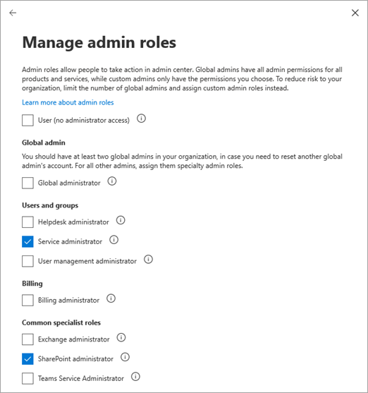
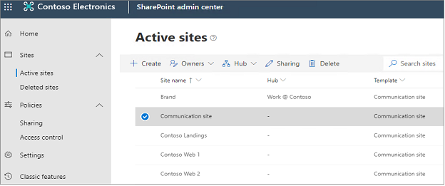

In Microsoft 365, the SharePoint administrator is responsible for managing SharePoint sites, guest sharing, overall site architecture, and monitoring user activity. Global administrators in Microsoft 365 have all the permissions of a SharePoint administrator and can assign others to the SharePoint administrator role. SharePoint administrators who also have the Service administrator role can see important information in the Microsoft 365 admin center, such as the health of the SharePoint service, and change and release notifications.

Users assigned the SharePoint administrator role have access to the SharePoint admin center and can create and manage sites, manage guest sharing, and other content controls. SharePoint administrators can also manage Microsoft 365 Groups, including creating, deleting, and restoring groups, and changing group owners. Global administrators and SharePoint administrators don't have automatic access to all sites, but they can give themselves access to any sites if needed.

## Key tasks of the SharePoint administrator

SharePoint can be administered either in the SharePoint admin center or by using the SharePoint PowerShell module.

The SharePoint Management Shell is a PowerShell module that lets you run command-line operations. It makes performing batch operations more efficient and is the only way to perform some management tasks in SharePoint.

Some of the key tasks SharePoint administrators can do include:

- Turning external sharing on or off for SharePoint and individual sites.
- Adding and removing site administrators.
- Registering hub sites.
- Viewing reports to monitor file and user activity (admin center only).

## Learn more

When you're done with a link, use the **Back** arrow in your browser to come back to this page.

- [Get started with the new SharePoint admin center](/sharepoint/get-started-new-admin-center)
- [Introduction to the SharePoint Online Management Shell](https://support.office.com/article/Introduction-to-the-SharePoint-Online-Management-Shell-C16941C3-19B4-4710-8056-34C034493429)
