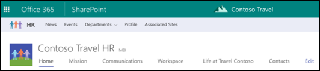

Getting the most value from hub sites requires some up-front planning. Having a solid information architecture is an important prerequisite for realizing a well-maintained and well-performing portal.

SharePoint administrators determine how many hub sites can be created in their organization and who can associate sites with each hub site. Sites associated with a SharePoint hub site will have a hub site navigation bar added to the top of the site to customize the look of the site and apply site design features such as additional navigation links, applications, or custom lists with specific columns.

The organizing concepts for hubs are:

- Association
- Navigation

## Association

When a site owner associates a site with the hub, the site inherits the hub site theme and shared navigation. Content from the site will roll up to the hub site, and the site will be included in the hub site search scope.

Associating with the hub does not automatically add the site to the hub navigation. Hub site owners determine which sites are included in the navigation. They can also configure the News, Sites, and Highlighted content to roll up activity from all associated sites or only selected sites.

Association with a hub does not change the permissions on a site. If you associate a site that has restricted access with a hub, only users who have access to the restricted site will see content rolled up on the hub.

## Navigation

The hub site owner determines which sites are reflected in the shared navigation and can also include links to other resources. This navigation appears at the top, below the suite bar. Most of the time, you will want to add associated sites to your hub navigation. That's one of the benefits of the experiences that you can enable with a hub. Your hub navigation can have up to three levels, which lets you organize your hub family in a way that helps users discover and find relevant content.

You can choose to not add every associated site to your navigation, or decide to add sites that aren't associated to the hub.

## Shared navigation

At the top of a hub site and any associated sites, above the site navigation, is the hub site navigation bar. If you are the hub site owner, you can customize this navigation bar with links that make sense for your hub site and associated sites, and choose to use the megamenu layout.

## Search across the hub

When you search from a SharePoint hub site, content on the hub site itself along with content on any associated sites is returned in the search results. Users will only see content that they have access to.

## Organizing content on the hub site home page

To get the most out of the hub site, the site's owner can add the following types of content to the home page:

- News published on a hub site and on any associated sites
- The most active sites associated with the hub site
- Any content you want to highlight from sites associated with the hub
- Events from sites associated with the hub site

## Learn more

When you're done with a link, use the **Back** arrow in your browser to come back to this page.

- [What is a SharePoint hub site?](https://support.office.com/article/what-is-a-sharepoint-hub-site-fe26ae84-14b7-45b6-a6d1-948b3966427f?ui=en-US&rs=en-US&ad=US)
