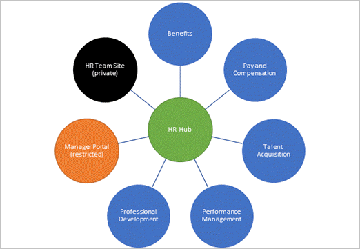

One of the key principles of modern intranets is that each unit of work should get a separate site to optimally manage governance and growth over time. Each communication site and Microsoft 365 Group-connected team site is created as a site that can have its own permissions. A hub site should be considered its own unit of work that brings together numerous other sites.

Every SharePoint site can be associated to a hub, creating a flat structure of sites that share navigation, branding, and other elements. SharePoint hub sites create relationships with other sites by using links, rather than hierarchy or ownership, so that you can adapt to the changes in the way you work.

> [!NOTE]
> Any team site or communication site can be registered as a hub site by the SharePoint administrator.

## Hub sites and finding information

Hub sites complement the search experience by helping you discover information in context.

Architects must think about creating experiences that will allow intranet users to find what they need in multiple "find" scenarios:

- I know it exists, and I know where it is.
- I know it exists, but I don't know where it is.
- I don't know if it exists.

These scenarios are enabled with a combination of navigation, search, and discovery and should be a factor in how you design and organize your hub sites. One of the important capabilities that hub sites enable is the serendipitous discovery of information because they can surface contextually relevant content from sites you may not follow but that are associated with the hub.

Using a guiding principle of creating a site for each unit of work, the example below shows a Human Resources (HR) family of sites that includes seven HR functional sites plus a home hub, connecting the related sites for an overall HR experience.

You don't have to have a hub site for every function. However, when a function provides multiple logically different services (as in the HR example), it's a good practice to create a hub site to provide a single starting place for your users. A site can only associate with a hub family. However, hub families can be connected to one another using links either on the page or in hub navigation.

## Hub site security

Sites associated with a SharePoint hub site don't inherit the permissions of the hub site or any other sites associated with it. Each site, including the hub site, retain their individual permission settings.

## Learn more

When you're done with a link, use the **Back** arrow in your browser to come back to this page.

- [Planning your SharePoint hub sites](/sharepoint/planning-hub-sites)
