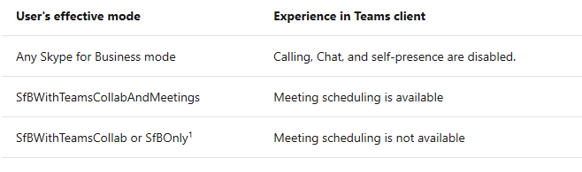
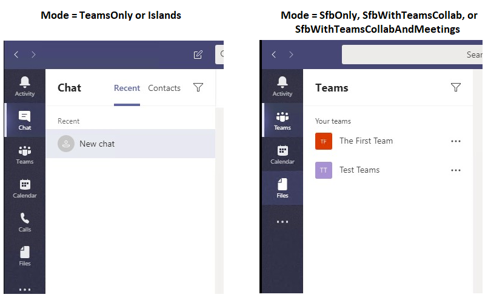
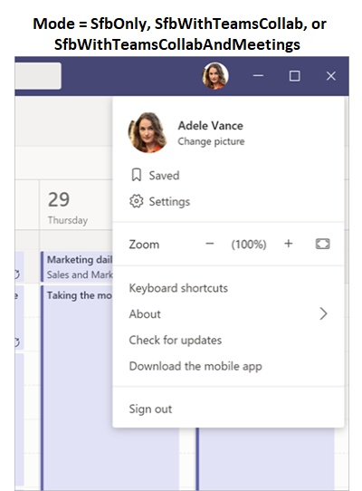

The available functionality in Teams depends on the user's coexistence mode, as set by TeamsUpgradePolicy. The following table summarizes the behavior:
 

The following screenshots illustrate the difference between Teams Only or Islands mode and all other modes. Note that the chat and calling icons are available by default with Teams Only or Islands mode (left screenshot), but not with the other modes (right screenshot):

 

In addition, self presence is not available in the other modes, as shown here.

 
From a technical perspective, a user’s mode governs several aspects of the user's experience:

- Incoming routing: In which client (Teams or Skype for Business) do incoming chats and calls land?

- Presence publishing: Is the user's presence that is shown to other users based on their activity in Teams or Skype for Business?

- Meeting scheduling: Which service is used for scheduling new meetings and ensuring that the proper add-in is present in Outlook? Note users can always join any meeting, whether it be a Skype for Business meeting or a Teams meeting.

- Client experience: What functionality is available in Teams and/or Skype for Business client? Can users initiate calls and chats in Teams, Skype for Business or both? Is Teams & Channels experience available?
For more details on routing and presence behavior based on mode, see Coexistence with Skype for Business.

## Learn more

When you're done with a link, use the **Back** arrow in your browser to come back to this page.

- [Teams client experience and conformance to coexistence modes ](https://docs.microsoft.com/MicrosoftTeams/teams-client-experience-and-conformance-to-coexistence-modes)