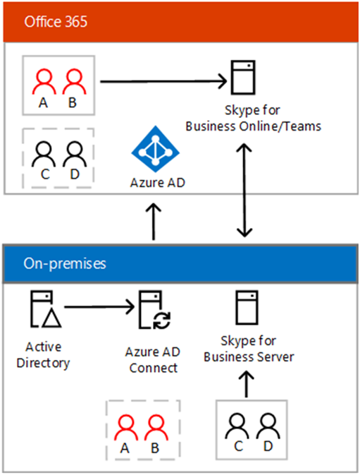

Learn about the hybrid connectivity requirements.

## About Shared SIP Address Space functionality
With hybrid connectivity set up, you can have some users homed on-premises in Skype for Business Server and others in Teams or Skype for Business Online.

This type of configuration relies on shared SIP address space functionality, and is sometimes referred to as "split domain" -- meaning users of a domain are split between using Skype for Business Server on premises and Teams or Skype for Business Online, as shown in the following diagram:

