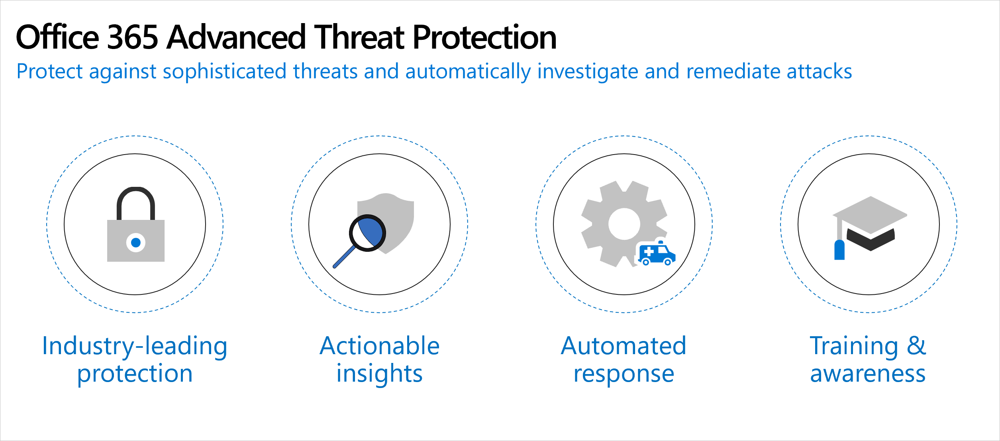

## Learn Office 365 specific terminology, threats, and concepts

**Microsoft Defender for Office 365** is a cloud-based email filtering service that helps protect your organization against unknown malware and viruses by providing robust zero-day protection. It includes features to safeguard your organization from harmful links in real time. Microsoft Defender for Office 365 has rich reporting and URL trace capabilities that give administrators insight into the kind of attacks happening in your organization.

Microsoft Defender for Office 365 provides the following benefits:

- **Industry-leading Protection.** Microsoft Defender for Office 365 uses 6.5 trillion signals daily from email alone to quickly and accurately detect threats and protect users against sophisticated attacks such as phishing and zero-day malware. Microsoft Defender for Office 365 blocked 5 billion phish emails and analyzed 300k phish campaigns in 2018 protecting 4 million unique users from advanced threats.
- **Actionable Insights**. Actionable insights are presented to security administrators by correlating signals from a broad range of data to help identify, prioritize, and provide recommendations on how to address potential problems. The recommendations include remediation actions empowering administrators to proactively secure their organization.
- **Automated response**. Investigation and remediation in post-breach scenarios can be difficult, expensive, and time-consuming. Most organizations lack the expertise and resources needed for rapid investigation and effective remediation. Microsoft Defender for Office 365 provides advanced automated response options that security operators can leverage saving a significant amount of time, money, and resources. 
- **Training & awareness**. Social engineering attacks such as phishing often look legitimate and are hard to spot for busy users. It's critical to train end users to make the right decisions in the event of an attack. In-product notifications help users understand the risks of performing an action such as clicking on a suspicious link. Features such as attack simulator help administrators launch realistic threat simulations to train users to be more aware and vigilant. User reporting capabilities empower users to notify Microsoft of suspicious content.

The following are the primary ways you can use Microsoft Defender for Office 365 for message protection:

- In a Microsoft Defender for Office 365 filtering-only scenario, Microsoft Defender for Office 365 provides cloud-based email protection for your on-premises Exchange Server environment or any other on-premises SMTP email solution.
- Microsoft Defender for Office 365 can be enabled to protect Exchange Online cloud-hosted mailboxes.
- In a hybrid deployment, Microsoft Defender for Office 365 can be configured to protect your messaging environment and control mail routing when you have a mix of on-premises and cloud mailboxes with Exchange Online Protection for inbound email filtering.
