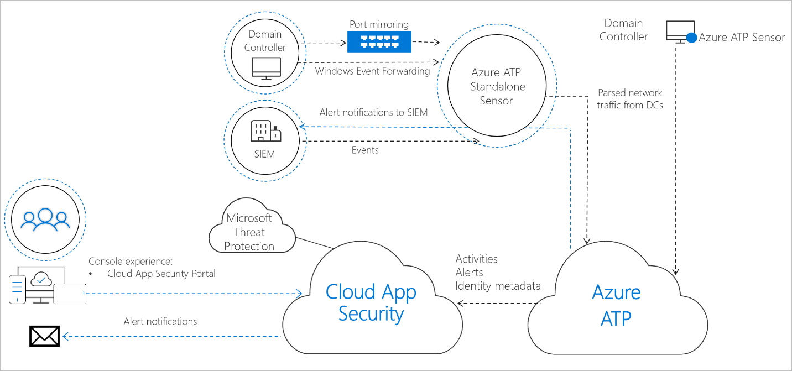

>[!IMPORTANT]
>Threat protection product names in Microsoft are changing. [Read more about this and other updates](https://www.microsoft.com/security/blog/?p=91813). We'll be updating names in products and in the Learn content in the near future.

At a high level, the following steps are required to enable Azure ATP:

1. Create an instance on Azure ATP management portal.
2. Specify an on-premises AD service account in the AATP portal.
3. Download and install the sensor package.
4. Install the Azure ATP sensor on all domain controllers.
5. Integrate your VPN solution (optional).
6. Exclude the sensitive accounts you’ve listed during the design process.
7. Configure the required permissions for the sensor to make SAM-R calls.
8. Configure integration with Microsoft Cloud App Security.
9. Configure integration with Windows Defender ATP (optional).

The following diagram shows the Azure ATP architecture. In this unit, we will discuss how to configure the Azure ATP Sensor.

Installed directly on your domain controllers, the Azure ATP sensor accesses the event logs it requires directly from the domain controller. After the logs and network traffic are parsed by the sensor, Azure ATP sends only the parsed information to the Azure ATP cloud service (only a percentage of the logs are sent).

The Azure ATP sensor has the following core functionality:

- Capture and inspect domain controller network traffic (local traffic of the domain controller)
- Receive Windows events directly from the domain controllers
- Receive RADIUS accounting information from your VPN provider
- Retrieve data about users and computers from the Active Directory domain
- Perform resolution of network entities (users, groups, and computers)
- Transfer relevant data to the Azure ATP cloud service

The Azure ATP sensor has the following requirements:

- KB4487044 is installed on Server 2019. Azure ATP sensors already installed on 2019 servers without this update will be automatically stopped.
- The Azure ATP sensor supported domain controller OS list:
  - Windows Server 2008 R2 SP1 (not including Server Core)
  - Windows Server 2012
  - Windows Server 2012 R2
  - Windows Server 2016 (including Windows Server Core but not Windows Nano Server)
  - Windows Server 2019 (including Windows Core but not Windows Nano Server)
- The domain controller can be a read-only domain controller (RODC).
- 10 GB of disk space is recommended. This includes space needed for the Azure ATP binaries, Azure ATP logs, and performance logs.
- The Azure ATP sensor requires a minimum of 2 cores and 6 GB of RAM installed on the domain controller. 
- Power option of the Azure ATP sensor to high performance.
- Azure ATP sensors can be deployed on domain controllers of various loads and sizes, depending on the amount of network traffic to and from the domain controllers, and the amount of resources installed.
- When running as a virtual machine, dynamic memory or any other memory ballooning feature is not supported.

### To install the Azure ATP sensor:

1. Download and extract the sensor file. Run **Azure ATP sensor setup.exe** and follow the setup wizard.
2. On the Welcome page, select your language and click **Next**.

   

3. The installation wizard automatically checks if the server is a domain controller or a dedicated server. If it's a domain controller, the Azure ATP sensor is installed. If it's a dedicated server, the Azure ATP standalone sensor is installed. For example, for an Azure ATP sensor, the following screen is displayed to let you know that an Azure ATP sensor is installed on your dedicated server:

   

4. Under **Configure the sensor**, enter the installation path and the access key, based on your environment:

   - **Installation path**: The location where the Azure ATP sensor is installed. By default, the path is **%programfiles%\Azure Advanced Threat Protection sensor**. Leave the default value.
   - **Access key**: Retrieved from the Azure ATP portal.

    

5. Click **Install**. 

After the Azure ATP sensor is installed, do the following to configure Azure ATP sensor settings:

1. Click **Launch** to open your browser and sign into the Azure ATP portal.
2. In the Azure ATP portal, go to **Configuration**. Under the System section, select **Sensors**.

   

3. Click on the sensor you want to configure and enter the following information:

   - **Description**: Enter a description for the Azure ATP sensor (optional).
   - **Domain Controllers** (FQDN) (required for the Azure ATP standalone sensor, this can't be changed for the Azure ATP sensor): Enter the complete FQDN of your domain controller and click the **plus sign** to add it to the list. For example, dc01.contoso.com.

     The following information applies to the servers you enter in the Domain Controllers list:

     - All domain controllers whose traffic is being monitored via port mirroring by the Azure ATP standalone sensor must be listed in the Domain Controllers list. If a domain controller isn't listed in the Domain Controllers list, detection of suspicious activities might not function as expected.
     - At least one domain controller in the list should be a global catalog. This enables Azure ATP to resolve computer and user objects in other domains in the forest.

   - **Capture Network adapters** (required):
     - For Azure ATP sensors, all network adapters that are used for communication with other computers in your organization.
     - For Azure ATP standalone sensor on a dedicated server, select the network adapters that are configured as the destination mirror port. These network adapters receive the mirrored domain controller traffic.

   

4. Click **Save**.

