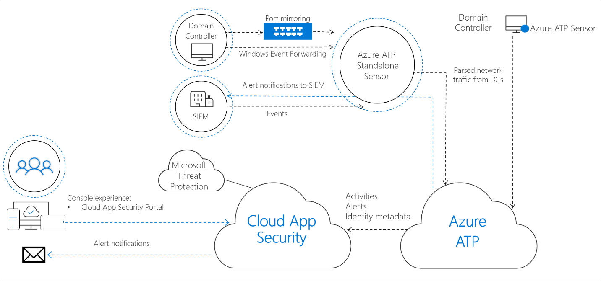
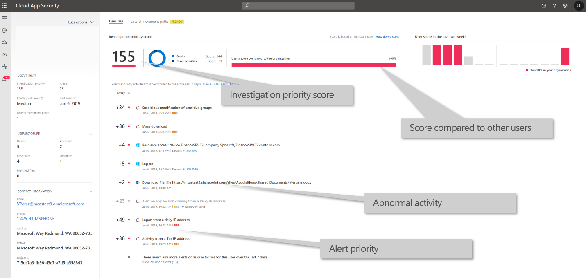
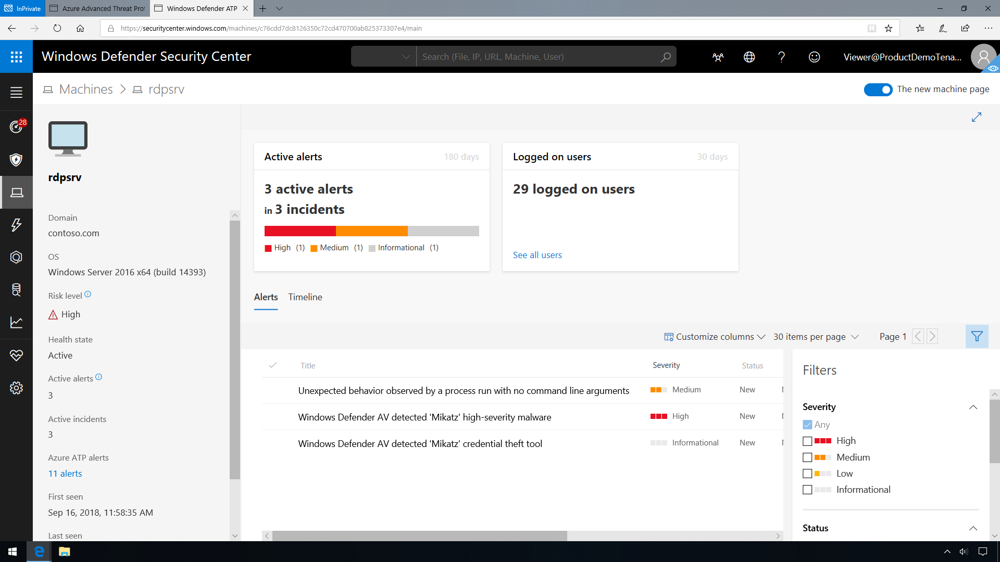
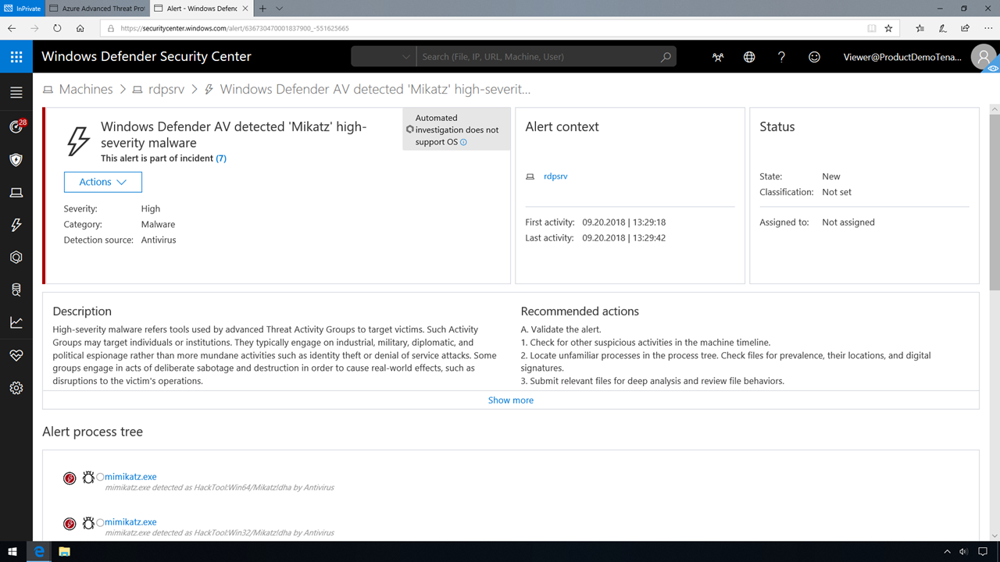
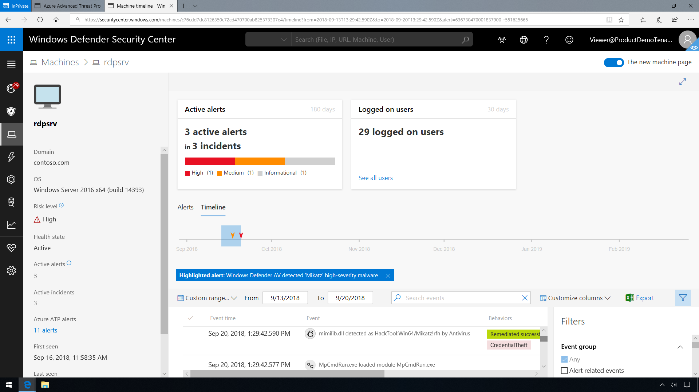

The Microsoft Defender for Identity cloud service runs on Azure infrastructure and is currently deployed in the US, Europe, and Asia. Microsoft Defender for Identity cloud service is connected to Microsoft's intelligent security graph. This enables Microsoft Defender for Identity to integrate with Microsoft Cloud App Security, as part of a Microsoft 365 Defender monitoring strategy.

Once integrated into Microsoft Cloud App Security, you'll be able to see on-premises activities for all the users in your organization. You will also get advanced insights on your users that combine alerts and suspicious activities across your cloud and on-premises environments. Additionally, policies from Microsoft Defender for Identity will appear on the Cloud App Security policies page. The following screenshot shows Microsoft Defender for Identity reporting within Cloud App Security.

>
> [!VIDEO https://www.microsoft.com/videoplayer/embed/RE4CVTT]

Microsoft Defender for Identity also enables you to integrate Microsoft Defender for Identity with Microsoft Defender for Endpoint, for an even more complete threat protection solution. While Microsoft Defender for Identity monitors the traffic on your domain controllers, Microsoft Defender for Endpoint monitors your endpoints, together providing a single interface from which you can protect your environment.
Once Microsoft Defender for Endpoint and Microsoft Defender for Identity are integrated, you can click on an endpoint to view Microsoft Defender for Identity alerts in the Microsoft Defender for Endpoint portal.

Having this level of insight into system running processes allows an analyst to locate event sequences leading to a compromise of the network. In the screenshot below, there are high severity alerts pointing to malware being installed on the system.

Clicking into the alert verifies that a Pass-The-Hash (PtH) attack occurred using the tool Mimikatz. Under actions for the alert, we can also review a timeline of events surrounding the credential theft.

