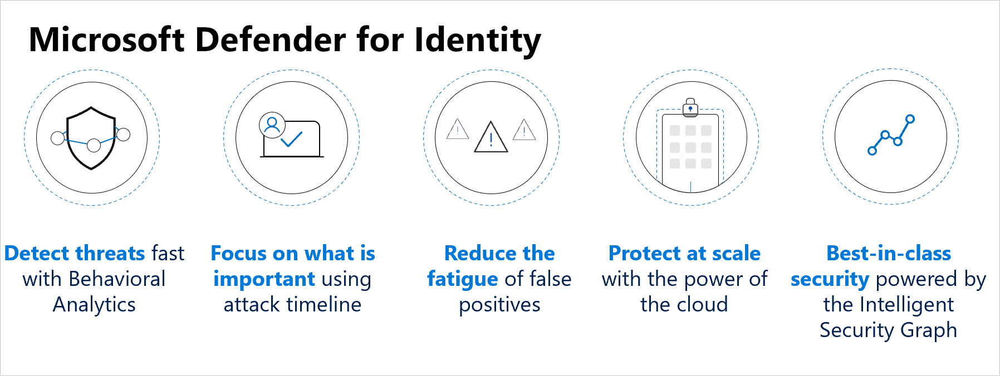
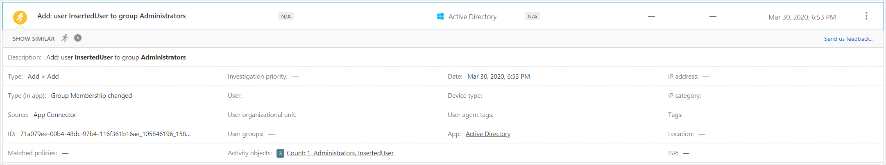
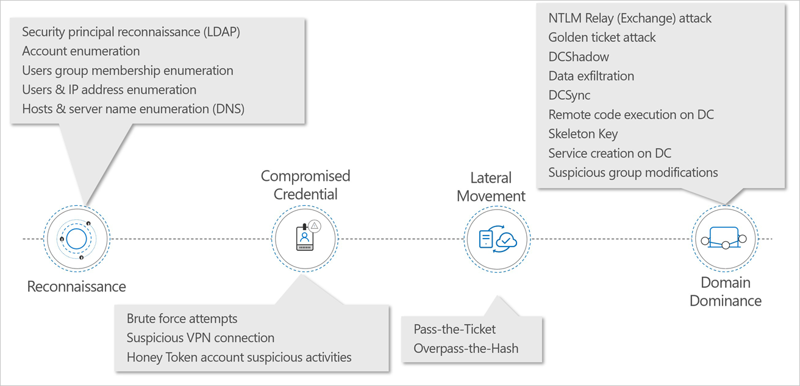
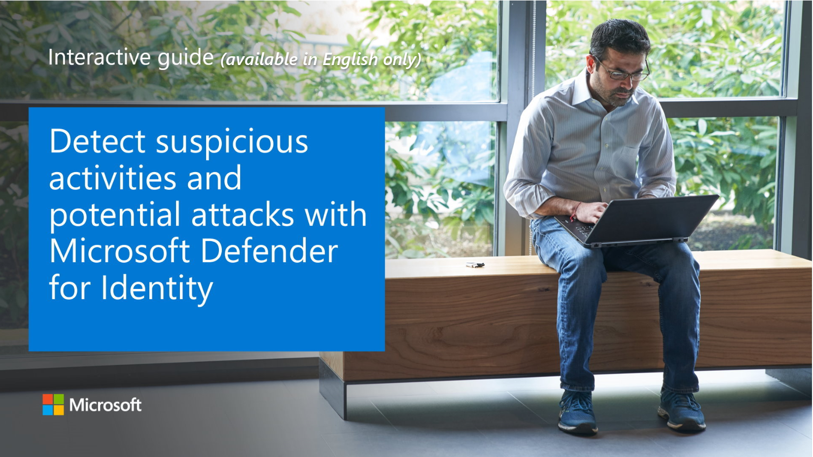

**Microsoft Defender for Identity** is a cloud-based security solution that leverages your on-premises Active Directory signals to identify, detect, and investigate advanced threats, compromised identities, and malicious insider actions directed at your organization.

Microsoft Defender for Identity provides the following benefits:

- Monitor users, entity behavior, and activities with learning-based analytics
- Protect user identities and credentials stored in Active Directory
- Identify and investigate suspicious user activities and advanced attacks throughout the kill chain
- Provide clear incident information on a simple timeline for fast triage

## Monitor and profile user behavior and activities

Microsoft Defender for Identity monitors and analyzes user activities and information across your network, such as permissions and group membership. It then creates a behavioral baseline for each user. Microsoft Defender for Identity then identifies anomalies with adaptive built-in intelligence, giving you insights into suspicious activities and events, revealing the advanced threats, compromised users, and insider threats facing your organization. Microsoft Defender for Identity's proprietary sensors monitor organizational domain controllers, providing a comprehensive view for all user activities from every device.

## Protect user identities and reduce the attack surface

Microsoft Defender for Identity provides you invaluable insights on identity configurations and suggested security best-practices. Through security reports and user profile analytics, Microsoft Defender for Identity helps dramatically reduce your organizational attack surface, making it harder to compromise user credentials and advance an attack. Microsoft Defender for Identity's visual Lateral Movement Paths help you quickly understand exactly how an attacker can move laterally inside your organization to compromise sensitive accounts and assists in preventing those risks in advance. Microsoft Defender for Identity security reports help identify users and devices that authenticate using clear-text passwords and provide additional insights to improve your organizational security posture and policies.

## Identify suspicious activities and advanced attacks across the cyber-attack kill-chain

Typically, attacks are launched against any accessible entity, such as a low-privileged user, and then quickly move laterally until the attacker gains access to valuable assets – such as sensitive accounts, domain administrators, and highly sensitive data. Microsoft Defender for Identity has a large range of detections across the Kill-chain from **reconnaissance** through to **compromised credentials** to **lateral movements** and **domain dominance**.

For example, in the reconnaissance stage, LDAP reconnaissance is used by attackers to gain critical information about the domain environment. Information that helps attackers map the domain structure, and identify privileged accounts for use later. This detection is triggered based on computers performing suspicious LDAP enumeration queries or queries targeting sensitive groups.

Brute force attacks are a common way to compromise credentials. This is when an attacker attempts to authenticate with multiple passwords on different accounts until a correct password is found or by using one password in a large-scale password spray that works for at least one account. Once found, the attacker logs in using the authenticated account. Microsoft Defender for Identity can detect this when it notices multiple authentication failures occurring using Kerberos, NTLM, or use of a password spray.

The next stage is when attackers attempt to move laterally through your environment, using pass-the-ticket, for example. Pass-the-ticket is a lateral movement technique in which attackers steal a Kerberos ticket from one computer and use it to gain access to another computer by reusing the stolen ticket. In this detection, a Kerberos ticket is being used on two (or more) different computers.

Ultimately, attackers want to establish domain dominance. One method, for example is the DCShadow attack. This attack is designed to change directory objects using malicious replication. This attack can be performed from any machine by creating a rogue domain controller using a replication process. If this occurs, Microsoft Defender for Identity triggers an alert when a machine in the network tries to register as a rogue domain controller.

This is not the complete set of detections, but it shows the breadth of detections Microsoft Defender for Identity covers.

### Explore how to detect suspicious activities and potential attacks with Microsoft Defender for Identity

View a [video version](https://www.microsoft.com/videoplayer/embed/RE4Gq4n) of the interactive guide (captions available in more languages).

Be sure to click the full-screen option in the video player. When you're done, use the **Back** arrow in your browser to come back to this page.
