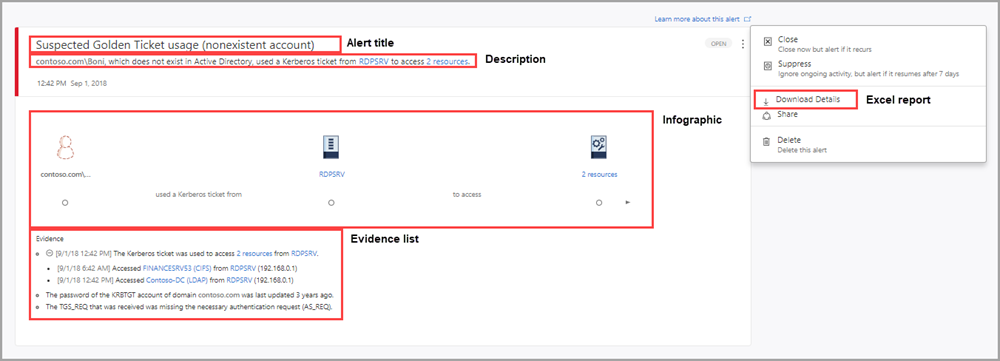
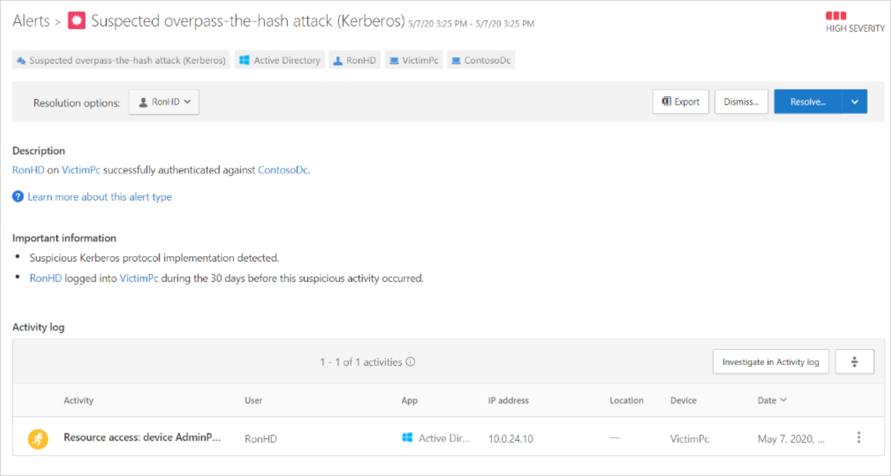
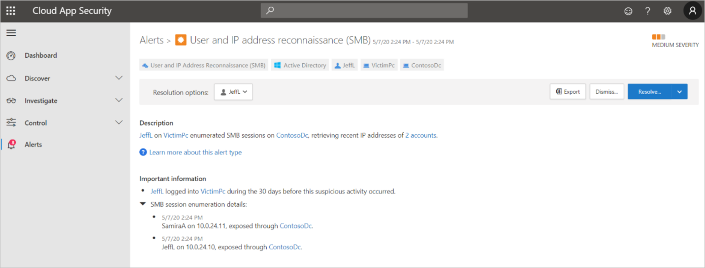
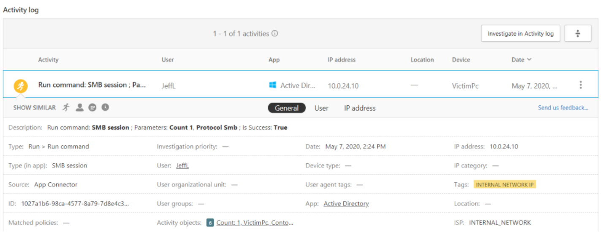
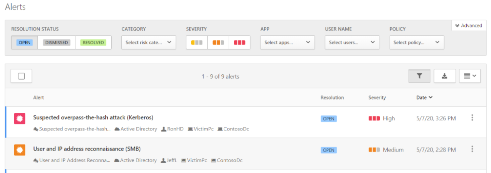
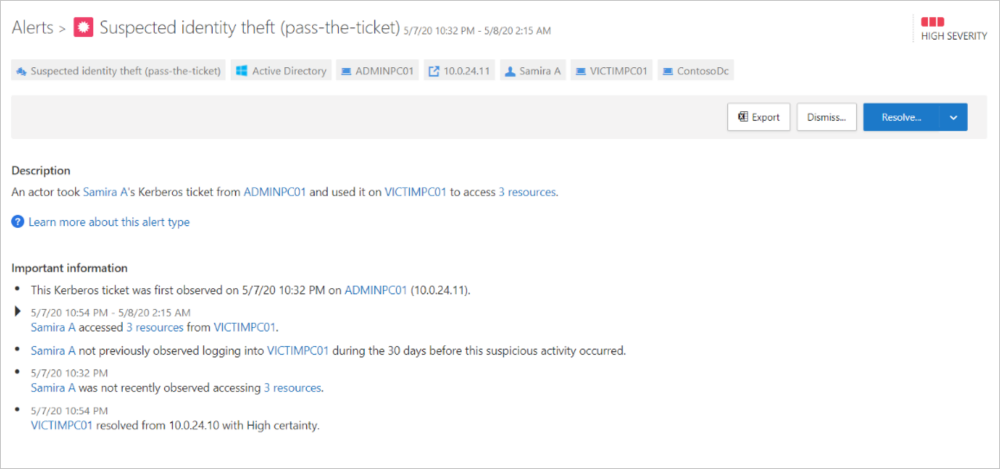
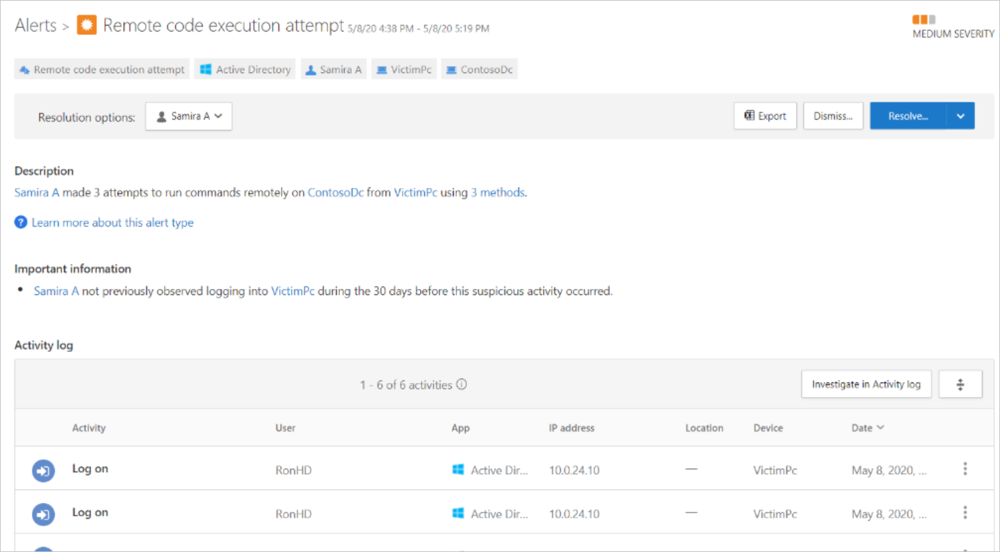
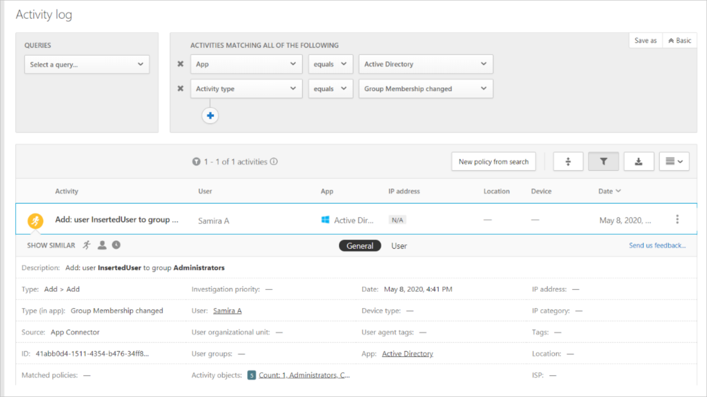
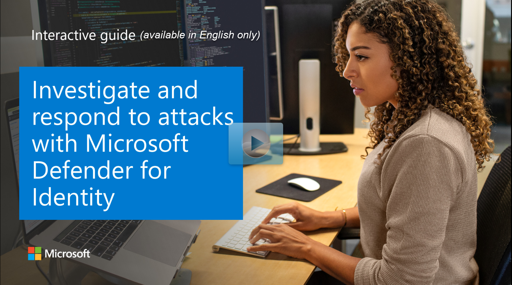

Microsoft Defender for Identity security alerts explain suspicious activities detected by Microsoft Defender for Identity sensors on your network, and the actors and computers involved in each threat. Alert evidence lists contain direct links to the involved users and computers, to help make your investigations easy and direct.

Microsoft Defender for Identity security alerts are divided into the following categories or phases, like the phases seen in a typical cyber-attack kill chain:

- Reconnaissance phase alerts
- Compromised credential phase alerts
- Lateral movement phase alerts
- Domain dominance phase alerts
- Exfiltration phase alerts

Each Microsoft Defender for Identity security alert includes:

- **Alert title.** Official Microsoft Defender for Identity name of the alert.
- **Description.** Brief explanation of what happened.
- **Evidence.** Additional relevant information and related data about what happened to help in the investigation process.
- **Excel download.** Detailed Excel download report for analysis

Alerts can also be viewed within Microsoft Defender for Cloud Apps:

The following scenario describes an investigation into an attacker gaining administrator access to the domain controller and compromising the Active Directory domain and forest.

The first alert we notice in the Defender for Cloud Apps portal shows **User and IP address reconnaissance** (SMB). Clicking into this alert, we see (under Description) that a user was able to learn the IP addresses of two accounts by enumerating SMB sessions on the domain controller.

Within the alert, we can also find the activity log, which shows more information about the command that was run.

Back in the Alerts overview, we can see a more recent alert pointing to an **overpass-the-hash attack**.

Opening the suspected overpass-the-hash-attack (Kerberos) alert, we see evidence that the user account was part of a lateral movement path.

The next alert shows a **Suspected identity theft (pass-the-ticket)**.

Microsoft Defender for Identity has detected theft of a ticket from a domain administrator to the infiltrated PC. The Defender for Cloud Apps portal shows exactly which resources were accessed using the stolen tickets.

In the next alert, we see that the stolen credentials were used to run a remote command on the domain controller.

Looking into the Activity Log for the alert, we see that the command was to create a new user within the Administrators group.

From all the previous alerts, we suspect that an attacker has:

- Infiltrated a PC.
- Used the PC to determine IP addresses of other users' PCs, one of which belongs to a domain administrator.
- Performed an overpass-the-hash attack by stealing the NTLM hash from another user who previously authenticated to the infiltrated PC to access any resource the user has permissions for. (In this case, local admin rights to IP addresses previously exposed)
- Used the newly stolen credentials to gain access to the domain administrator's PC.
- Used their access to the domain administrator's PC to steal the identity of the domain administrator.
- Used the domain administrator's identity to access the domain controller, and created a new user account with domain administrative permissions.

With domain administrative permissions, the attacker has effectively compromised the environment. Now they are free to perform any number of attacks, such as a Skeleton Key attack.

### Explore how to investigate and respond to attacks with Microsoft Defender for Identity

View a [video version](https://www.microsoft.com/videoplayer/embed/RE4GiZJ) of the interactive guide (captions available in more languages).

  

Be sure to click the full-screen option in the video player. When you're done, use the **Back** arrow in your browser to come back to this page.
