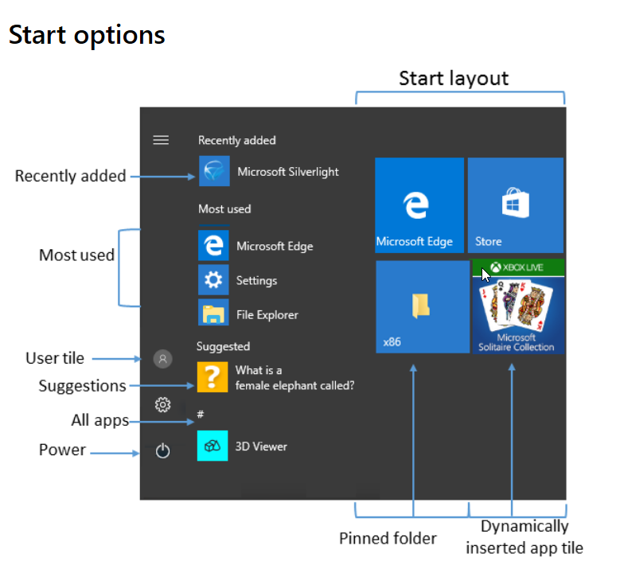
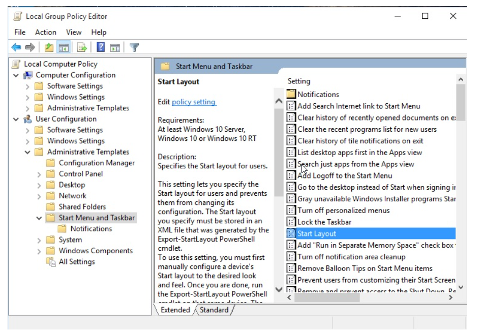

After your updated apps are deployed, you'll want to sync the start and taskbar layouts on your users' systems. To do this in the past, you may have used the copy profile method to configure standard layouts for users' start menus and taskbar settings.

In Windows 10 Pro, Enterprise, and Education, you can use Group Policy, MDM, PowerShell, or provisioning packages to deploy customized start and taskbar layouts. You don't need to reimage the user's systems, and you can update or revise the layout by editing the output xml file. This means you can customize the layout for different departments or organizations.

## Configure a customized start and taskbar layout

### Create a layout with PowerShell and XML

1. Configure a sample system with the new layout.
2. Use the **PowerShell** [Export-StartLayout]( /powershell/module/startlayout/export-startlayout) cmdlet to generate an XML file.
3. Place this file on a network share or cache it locally as part of your deployment sequence. It needs to be reachable as a read-only file once the user signs in.
4. Use Group Policy or the [Import-StartLayout]( /powershell/module/startlayout/Import-StartLayout) cmdlet to reference this file.

> [!NOTE]
> For general Windows PowerShell information, check out the [Windows 10 PowerShell command reference](/powershell/windows/get-started).

### Use Group Policy to deploy settings

After you define the start and taskbar settings you want to use across your domain, you can use Group Policy to deploy those settings. Use the Group Policy Management Console (GPMC) to configure a domain-based Group Policy Object (GPO) that references the xml settings file you've created. GPO settings are located in the start menu and taskbar administrative template.

You can also use the Local Group Policy Editor to provide a customized Start and taskbar layout for any user who signs in on a local computer.

You can find detailed instructions on using Group Policy at [Customize Windows 10 Start and taskbar with Group Policy]( /windows/configuration/customize-windows-10-start-screens-by-using-group-policy).

### Use provisioning packages to deploy settings

You can also use a provisioning package, created with **Windows Configuration Designer,** to deploy domain-wide start and taskbar settings.

1. The **PowerShell** [Export-StartLayout]( /powershell/module/startlayout/export-startlayout) cmdlet exports a description of the current start layout in .xml file format.
2. In Windows Configuration Designer, you'll use the **Policies/Start/StartLayout** setting to provide the contents of the .xml file that defines the start and taskbar layout.

You can find detailed instructions on using provisioning packaging at [Customize Windows 10 Start and taskbar with provisioning packages]( /windows/configuration/customize-windows-10-start-screens-by-using-provisioning-packages-and-icd).

> [!IMPORTANT]
> If you use a provisioning package to configure the taskbar, your configuration will be reapplied each time the explorer.exe process restarts. This means that any changes your users make (like pinning or unpinning an app) are overwritten each time the configuration is applied. To allow users to make changes that will persist, apply your configuration by using Group Policy.
