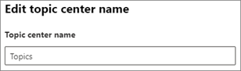

## Change the name of the topic center in Microsoft 365 admin center

After you have set up and configured the Topic center, you can change the name in the Microsoft 365 admin center. You must be a Global administrator, SharePoint administrator, or Knowledge administrator to perform these tasks.

**To access topics management settings:**

1. In the Microsoft 365 admin center, click Settings, then Org settings.
1. On the Services tab, click Topic experiences.
1. Select the Topic center tab. See the following sections for information about each setting.

Update your topic center name

**To change the name of the topic center:**

1. On the Topic center tab, under Topic center name, select Edit.
1. On the Edit topic center name page, in the Topic center name box, type the new name for your topic center.
1. Select Save.

 
