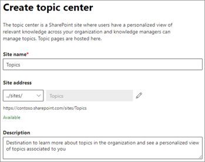
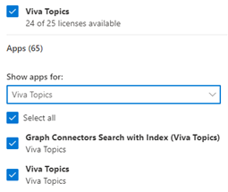

## For Viva Topics in Microsoft 365 admin center

After you sign up for & set up a Viva Topics trial in this learning path, you have a Topic center to curate the topics to be shared. The Topic center is a SharePoint site where users have a personalized view of relevant knowledge across your organization and the Knowledge manager can manage topics. Topic pages are hosted here. 

**You must be a Global administrator, SharePoint administrator or Knowledge administrator to perform these tasks:**

1. On the Create topic center page, you can create your topic center site in which topic pages can be viewed and topics can be managed.
1. In the Site name box, type a name for your topic center. You can optionally type a short description in the Description box.
1. Select Next.
1. On the Review and finish page, you can look at your selected setting and choose to make changes. If you are satisfied with your selections, select Activate.

The Viva Topics activated page will display, confirming that the system will now start analyzing your selected sites for topics and creating the topic center site. Select Done.

You'll be returned to your Connect people to knowledge page. From this page, you can select Manage to make any changes to your configuration settings.

The first-time topic discovery is enabled, it may take two weeks or more for all suggested topics to appear in the Manage Topics view. Topic discovery continues as new content or updates to content is made. It is normal to have fluctuations in the number of suggested topics in your organization as Viva Topics evaluates new information.

## Set up overview for Graph connectors by Microsoft

**The basic process includes the following steps:**

- Add a Graph connector in the Microsoft 365 admin center
- Name the connection
- Configure the connection settings
- Manage search permissions
- Assign property labels
- Manage schema
- Refresh settings
- Review connection

Visit Resources at the end of this learning path on how to configure Graph content connectors*.

## Assign licenses

Once you have configured topic experiences, you must assign licenses for the users who will be using Topics. Only users with a license can see information on topics including highlights, topic cards, topic pages, and the topic center.

**To assign licenses:**

1. In the Microsoft 365 admin center, under Users, click Active users
1. Select the users that you want to license and click Licenses and apps.
1. Under Licenses, select Viva Topics.
1. Under Apps, make sure Graph Connectors Search with Index (Viva Topics)* and Viva Topics are both selected.
1. Click Save changes.

