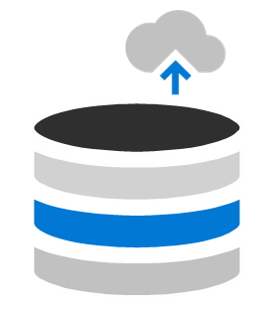

Azure Virtual Desktop is easier to deploy and manage than traditional Remote Desktop Services (RDS) or virtual desktop infrastructure (VDI) environments. You don't have to provision and manage servers and server roles like the gateway, connection broker, diagnostics, load balancing, and licensing.

## What's managed by Microsoft and what you manage

The following illustration shows what services are managed by Microsoft and what you manage.

:::image type="content" source="../media/3-management-ownership.png" border="false" alt-text="Diagram that shows what's managed my Microsoft and what's managed by you.":::

## What Microsoft manages

Azure Virtual Desktop provides virtualization infrastructure as a managed service. Azure Virtual Desktop manages:

- Web client - The Web Access service within Azure Virtual Desktop lets users access virtual desktops and remote apps through an HTML5-compatible web browser like they would with a local PC—from anywhere and any device. You can secure Web Access by using multifactor authentication in Azure Active Directory (Azure AD).
- Diagnostics - Remote Desktop Diagnostics is an event-based aggregator that marks each user or administrator action on the Azure Virtual Desktop deployment as a success or failure. Administrators can query the aggregation of events to identify failing components.
- Management - Manage Azure Virtual Desktop configurations in the Azure portal. Manage and publish host pool resources. Azure Virtual Desktop also includes several extensibility components. Manage Azure Virtual Desktop by using Windows PowerShell or with the provided REST APIs, which also enable support from third-party tools.
- Broker - The Connection Broker service manages user connections to virtual desktops and remote apps. It provides load balancing and reconnection to existing sessions.
- Load balancing - Session host load balancing by depth-first or breadth-first. The broker decides how new incoming sessions are to be distributed across the virtual machines (VMs) in a host pool.
- Gateway - The Remote Connection Gateway service connects remote users to Azure Virtual Desktop remote apps and desktops from any internet-connected device that can run an Azure Virtual Desktop client. The client connects to a Gateway that then orchestrates a connection from the VM back to the same gateway.

Azure Virtual Desktop uses Azure infrastructure services for compute, storage, and networking.

## What you manage

### Desktop and remote apps

Create application groups to group, publish, and assign access to remote apps or desktops.

- Desktop - Remote Desktop application groups give users access to a full desktop. You can provide a desktop where the session host VM resources are shared or pooled. Or you can provide personal desktops to users that need to be able to add or remove programs without impacting other users.
- App - RemoteApp applications groups provide users access to the applications you individually publish to the application group. You can create multiple RemoteApp app groups to accommodate different user scenarios. Use RemoteApp to virtualize an app that runs on a legacy OS or one that needs secured access to corporate resources.
- Images - When you configure session hosts for application groups, you have your choice of images. Use a recommended image like Windows 10 Enterprise multi-session + Office 365. Or choose another image in your gallery or an image provided by Microsoft or other publishers. You can also use your own image built through Hyper-V or on an Azure VM.

### Management and policies

- Profile management - Configure FSLogix with a storage solution like Azure Files to containerize user profiles and provide a fast and stateful experience for users.
- Sizing and scaling - Specify session host VM sizes including GPU-enabled VMs. Specify depth-first or breadth-first load balancing when you create a host pool. Configure automation policies for scaling.
- Networking policies - Define network topology to access virtual desktop and virtual apps from the intranet or internet based on organizational policy. Connect your Azure Virtual Desktop vNET to your on-premises network by using a virtual private network. Or use Azure ExpressRoute to extend your on-premises networks into the Microsoft cloud platform over a private connection.
- User management and identity -  Use Azure AD and role-based access controls to manage user access to resources. Take advantage of Azure Active Directory security features, such as Conditional Access, multifactor authentication, and the Intelligent Security Graph. Azure Virtual Desktop requires Active Directory Domain Services (AD DS). Domain-join session host VMs to this AD DS. Sync AD DS with Azure AD so users are associated between the two.

## Infrastructure and system requirements

Azure Virtual Desktop requires the following infrastructure, clients, and images.

### Infrastructure

Azure Virtual Desktop can be used in a cloud-only organization or in a hybrid environment. Your infrastructure needs the following things to support Azure Virtual Desktop.

For hybrid environments:

- An Azure Active Directory organization
- A domain controller that's synced with Azure Active Directory. You can configure this with one of the following:
  - Azure AD Connect
  - Azure Active Directory Domain Services (Azure AD DS)
- An Azure subscription that contains a virtual network that either contains or is connected to the Windows Server Active Directory or Active Directory Domain Services

For cloud organizations:

- An Azure Active Directory organization
- Azure AD DS
- An Azure subscription that contains a virtual network that either contains or is connected to the Active Directory Domain Services

The Azure VMs you create for Azure Virtual Desktop must be:

- Standard domain-joined, Hybrid AD-joined, or Azure AD-joined.
- Running one of the supported OS images.

### Supported Remote Desktop clients

The following Remote Desktop clients support Azure Virtual Desktop:

- Windows Desktop
- Web
- macOS
- iOS
- Android (Preview)
- Linux

### Supported VM OS images

Azure Virtual Desktop supports the following x64 operating system images:

- Windows 11 Enterprise multi-session
- Windows 11 Enterprise
- Windows 10 Enterprise multi-session, version 1909 or later
- Windows 10 Enterprise, version 1909 or later
- Windows 7 Enterprise
- Windows Server 2022
- Windows Server 2019
- Windows Server 2016
- Windows Server 2012 R2

Azure Virtual Desktop doesn't support x86 (32-bit), Windows 10 Enterprise N, or Windows 10 Enterprise KN operating system images. Windows 7 also doesn't support any VHD or VHDX-based profile solutions hosted on managed Azure Storage due to a sector size limitation.

## Set up process

Microsoft's Azure Virtual Desktop solution on Microsoft Azure is a fully managed desktop virtualization solution.

As you progress through the Azure Virtual Desktop training, you'll notice that the setup process abstracts many of the infrastructure roles you might have deployed for RDS in the past. Use the information in this learning path to **Prepare > Deploy > Optimize** your Azure Virtual Desktop environments.

The following table gives you an overview of the setup process and describes what's covered in the rest of the Azure Virtual Desktop modules.

|Milestone | Steps|
|-|-|
|Prepare  |In the **Prepare** module, we'll discuss the following steps to complete before you deploy Azure Virtual Desktop:  - Set up Azure Active Directory (Azure AD).  - Integrate with Active Directory Domain Services.   - Create Azure resources.  - Assign administrator roles. -Assign licenses to Azure Virtual Desktop users.  -Register the DesktopVirtualization provider with your subscription. |
|Deploy  |In the **Deploy** module, we'll walk through the steps to:  - Create an Azure Virtual Desktop host pool and workspace.  - Make a desktop and apps available to users by using application groups.  - Customize the workspace.  - Connect to the workspace by using the Azure Virtual Desktop client.
|Optimize  |In the **Optimize** module, we'll walk through the steps to:   - Set up roaming and stateful user profiles by using Azure File Storage and FSLogix.  - Configure Azure File Sync to sync on-premises files or user profile data to Azure Storage. - Scale session hosts by using the scaling tool built on Azure Automation and Azure Logic Apps.|
