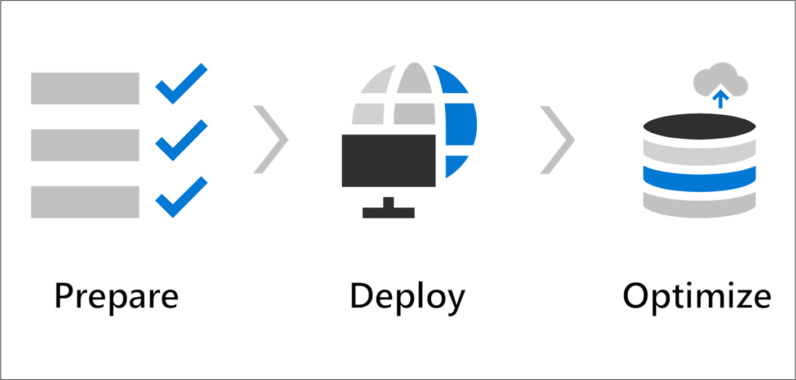

Windows Virtual Desktop is easier to deploy and manage than traditional Remote Desktop Services (RDS) or virtual desktop infrastructure (VDI) environments. You don't have to provision and manage servers and server roles like the gateway, connection broker, diagnostics, load balancing, and licensing. Windows Virtual Desktop lets you use Windows 10 Enterprise multi-session, the only Windows client-based operating system that enables multiple concurrent users on a single virtual machine (VM). Windows Virtual Desktop also provides a more consistent experience with broader application support compared to Windows Server-based operating systems. 

In addition to separating the remote session’s data from the user’s device, Windows Virtual Desktop also improves security by using a more secure connection type to session host VMs, as opposed to the Remote Desktop Protocol over port 3389. The integration of **FSLogix profiles** lets you store user profiles as containers on a separate virtual disk. When the user signs in, their virtual disk dynamically attaches in real time to any Windows Virtual Desktop VM, so the local files in the attached virtual disk feel like they're running from the local C:\ drive. 

Windows Virtual Desktop gives you options to load balance users on your VM host pools. **Host pools** are collections of VMs with the same configuration assigned to multiple users. For the best performance, you can configure load balancing to occur as users sign in (breadth mode) - users are sequentially allocated across the host pool for your workload. To save costs, you can configure your VMs for depth mode load balancing where users are fully allocated on one VM before moving to the next. Windows Virtual Desktop provides tools to automatically provision additional VMs when incoming demand exceeds a specified threshold. 

As you progress through this training following the **Prepare > Deploy > Optimize** steps, you’ll notice that the setup process abstracts many of the infrastructure roles you might have deployed for RDS in the past. The initial provisioning is focused on hybrid integration and deploying host pools, while configuration and day-to-day operations focus on session host, identity, app, and storage management. 

Microsoft’s Windows Virtual Desktop solution on Microsoft Azure is a fully managed desktop virtualization solution.  
 

Use this information to **Prepare > Deploy > Optimize** your Windows Virtual Desktop environments. 
 
| | |
|-|-|
|Prepare  |In the first step, **Prepare**, we’ll walk through provisioning your first Windows Virtual Desktop host pool. You'll then be able to: - Provision your Azure tenant  - Set up Azure Active Directory (Azure AD)   - Set up an Azure Virtual Network   - Integrate with Active Directory Domain Services  - Provision required administrator roles in Azure AD  |
|Deploy  |In the second step, **Deploy**, we’ll create and customize your first host pool. You'll then be able to:  - Set up the Windows Virtual Desktop workspace  - Create a Windows Virtual Desktop host pool  - Manage apps and desktops  - Customize your workspace   - Make apps available to users with app groups   - Consider Remote Desktop Services
|Optimize  |In the third step, **Optimize**, we’ll customize the basic Windows Virtual Desktop environment to take advantage of storage, file management, and automated scaling options. You'll then be able to:   - Set up FSLogix profiles to separate user profiles from virtual machines and underlying infrastructure - Configure depth and breadth scaling automation| 
