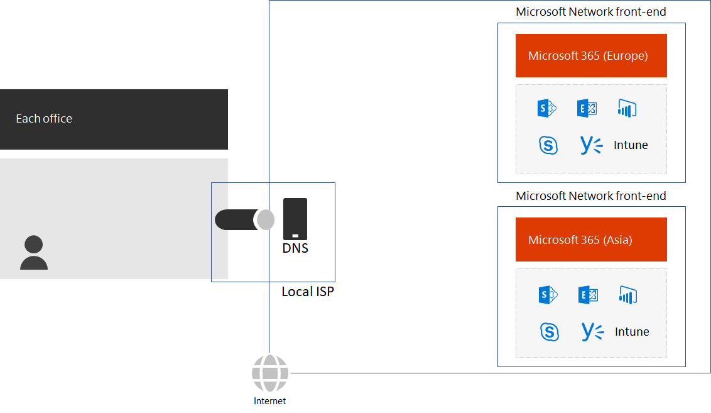
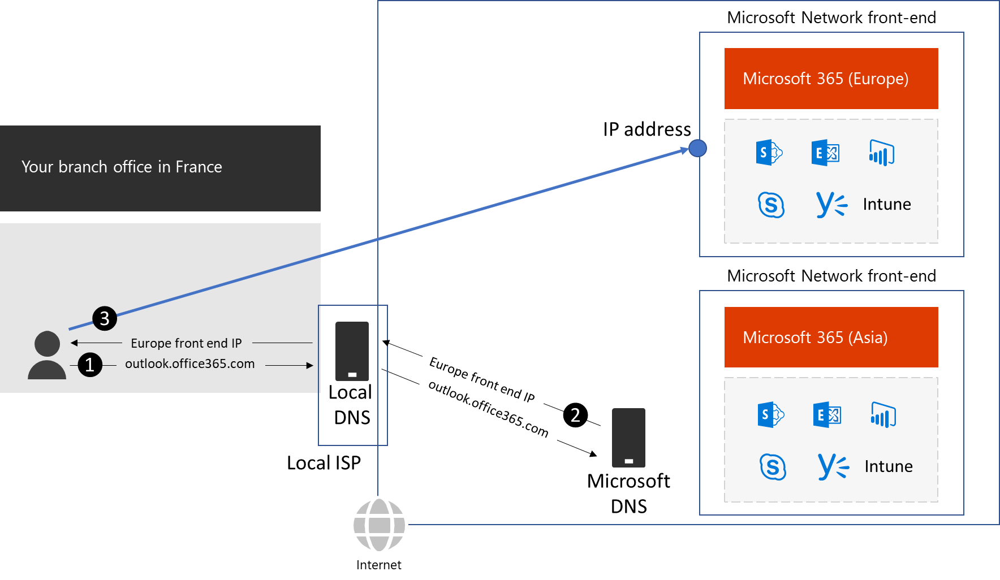
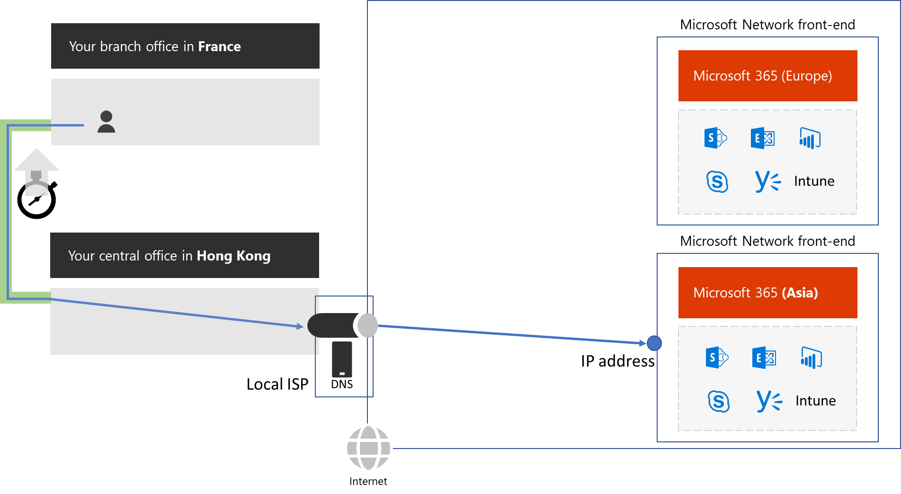

# Local Internet connections

The Microsoft Network that hosts the Microsoft cloud services is one of the largest in the world, with dozens of regional entry points, called front ends, on the Internet. For the best performance for on-premises users, you must minimize the traffic latency between on-premises users and the Microsoft Network front end that is nearest to them.

The first step is to examine the Internet connection for each of your offices. You need to ensure that:

- Each office has a local Internet connection with enough bandwidth to support Optimize and Allow categories of Microsoft 365 traffic and Office 365 ProPlus and Windows 10 packages and updates. 

- The local ISP is using a DNS server with an IP address local to the geographic location of the office. This ensures that DNS queries to Microsoft 365 services for Optimize and Allow categories of traffic are referred to the IP addresses of the geographically nearest Microsoft network front end.

 

When an on-premises client computer accesses a Microsoft 365 cloud service:

1.	It sends a DNS query to resolve a name, such as outlook.office365.com. The DNS server provided by the ISP re-sends that query to a Microsoft DNS server.
2.	Microsoft’s DNS servers match the source IP address of the re-sent DNS query to the region of the world assigned that address. The response is the IP address of the nearest Microsoft Network front end in the same region.
3.	The client computer initiates communication with the nearest front end.

 

Additionally, some organizations route all their Internet traffic across their WAN backbone. For Microsoft 365 traffic, this has the effect of increasing the latency of the traffic because:

- It must also traverse the WAN backbone.
- The DNS server resolving names is not local to the user in the branch office, which results in traffic to a front end in the central office’s region. 

 
 
To remove these delays, use local Internet connections and local DNS servers for the Optimize and Allow endpoints for each office.

Next: Network hairpins

