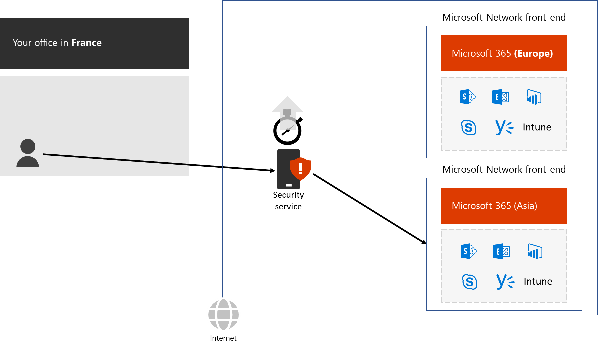
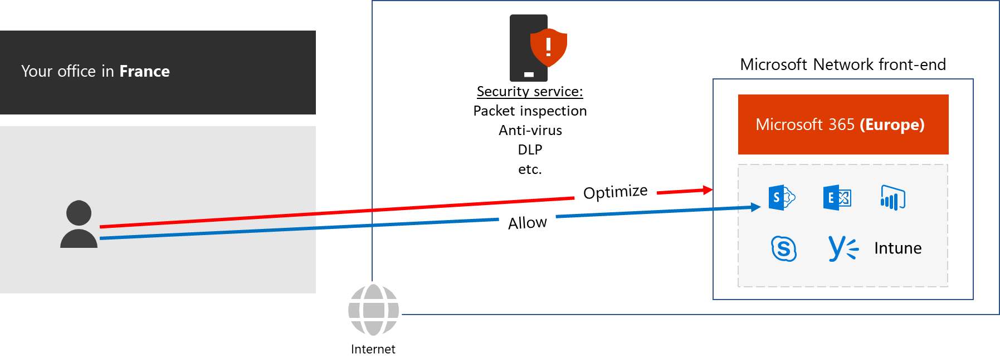

# Network hairpins

A network hairpin is a leg in the path of network traffic that includes an intermediate destination. A good example is Microsoft 365 traffic that is first sent to an Internet-based security service, which then sends the traffic to a Microsoft front end. This additional leg adds latency and can result in traffic to non-local front ends.

 

To avoid this latency, evaluate any cloud-based services in the path between your users and Microsoft’s front ends and eliminate them if possible. For example, many of the security functions performed by cloud-based security services are already being done by the client and Microsoft 365. Eliminate the hairpin by skipping the security service for Optimize and Allow endpoints.

 

You can also determine whether your ISPs have direct peering relationships with the Microsoft’s Network close to each office’s location. These peering relationships are hairpin free.

Next: Proxy and edge device bypass

