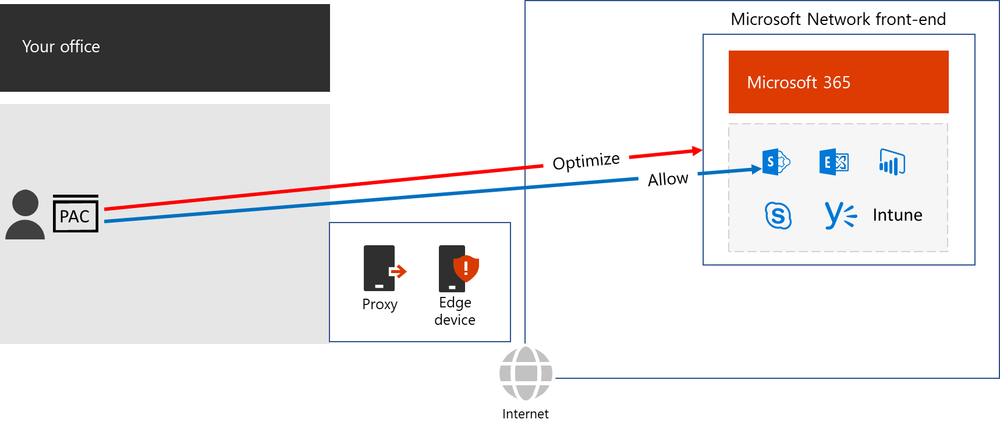

# Proxy and edge device bypass

For typical on-premises users, traffic to the Internet goes from a client browser to a proxy server on the edge of their organization’s Internet. From there, it goes through edge devices such as SSL Break and Inspect and packet inspection devices, and data loss prevention systems and then onto the Internet.

 

Proxies and edge devices are in place to protect the organization from potentially harmful Internet content. However, Microsoft 365 endpoints are well known, and the set of services running on the on-premises client and contained within the Microsoft Network are protected with many security features.

Because this security and protection is already in place, your edge devices don’t need to duplicate it. Review your network security and risk reduction methods to identify duplication. Microsoft 365 traffic should bypass those methods.

For the best performance for Microsoft 365 traffic, configure your:

- Browsers with Proxy Auto-Configuration (PAC) files that bypass the proxy for the set of DNS domain names of Microsoft 365 services.
- Edge devices to skip inspection and processing for traffic to Optimize and Allow endpoints.

 
Next: Summary
