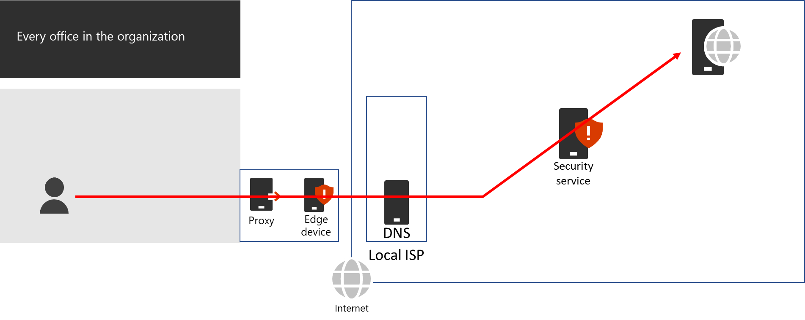
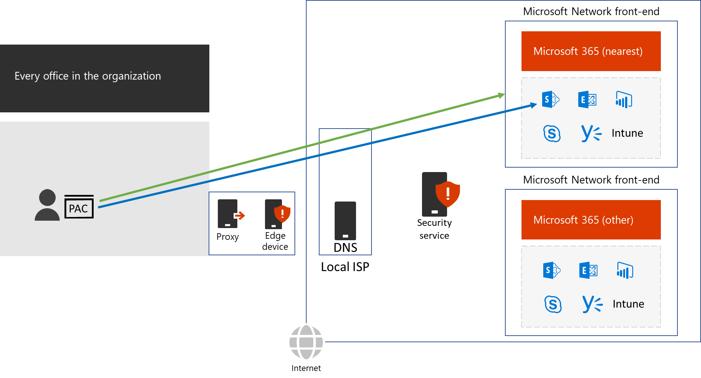

# Summary

To recap, here’s an organization that has optimized performance for Microsoft 365 traffic:

- For every office, general Internet traffic, which includes traffic to Microsoft 365 Default endpoints, gets processed by proxies and edge devices, either locally or centrally, and by intermediate security services, if present.

  
 
- For every office, traffic to Optimize and Allow endpoints:
   - Is routed to a local Internet connection with a local DNS server, and therefore to the Microsoft Network that is nearest to the location of the office.
   - Avoids network hairpins.
   - Bypasses the office proxy and edge devices.

  
 
For more information, see [Phase 1: Networking infrastructure for Microsoft 365 Enterprise](https://docs.microsoft.com/microsoft-365/enterprise/networking-infrastructure).
