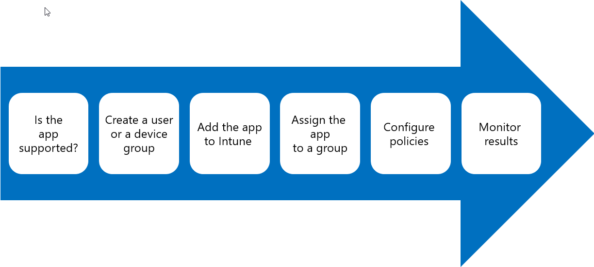

Intune application deployment procedures entail several considerations and settings to ensure that a deployment is successful. No matter what type of app you are deploying with Intune, the overall process is the same.

To deploy an app from Intune, perform the following steps:

1. **Ensure that Intune supports the app**. Make sure that Intune supports the application installation type and that the application can be installed without user intervention.
1. **Create Azure AD groups for either users or devices**. In Intune, you create user-based or device-based groups to help you target software management tasks to specific users or devices. If you have a specific group of users that requires an application, create a user or device group for the app deployment. If you're planning to deploy available installations, you also should link managed users to their computers to ensure that external links and company portal apps are available.
1. **Add the app to Intune**. You must upload LOB apps to Intune cloud storage, specify a URL for web apps, or link a store app to Intune. For LOB apps, you must configure installation requirements, detection rules, command-line arguments, and provide general information about the app. Adding the app makes it available for deployment from the Client apps blade in the Intune console. Assign the app to user or device groups. After you add an application, you can assign the app to a set of users or devices. Once assigned, the app can either be installed by the user or, if the device is managed with Intune, the app can be automatically installed.
1. **Configure policies**. You can manage application features and protect data by deploying app configuration and app protection policies.
1. **Monitor the results of the app deployment**. You can monitor the status of app deployments and installations from the Intune console by viewing the details for any app that appears in the list of apps in your Client Apps blade. You can view the installation status for the app either by device or by user.
