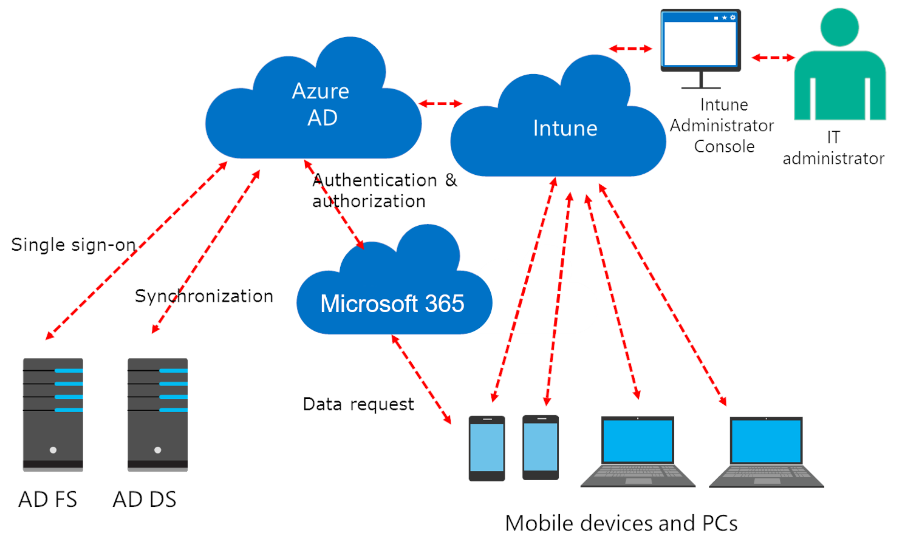

A key task of any IT Administrator is to protect and secure an organization's resources and data, wherever that data may reside. These days, users have many devices on which they open and share personal files, visit websites, and install apps and games. At the same time, they need to access work and school resources, such as email and OneNote. Device management enables organizations to protect and secure their resources and data.

Using a device management provider, organizations can make sure that only authorized people and devices get access to proprietary information. Similarly, users can feel at ease accessing work data from their device, because they know it meets their organization's security requirements.

This module will introduce you to the modern device management options for Windows 10 from Microsoft 365, including **co-management**, **Microsoft Intune**, and **Mobile Device Management (MDM) for Office 365**.

In this module, you will learn to:

- Describe the available options for device management in Microsoft 365

- Explain how Intune can be used to manage device and user profiles

Moving to a modern management approach can sometimes be a challenging task considering the complexity of planning and switching from existing IT systems, organizational structures, and processes. Most organizations are still using some combination of on-premises Windows Server Active Directory (AD) and System Center Configuration Manager (ConfigMgr) to manage their Windows devices.

Mobile device management (MDM) is an industry standard for managing all types of mobile devices, such as smart phones, tablets, laptops and desktop computers and is implemented by using MDM authority and MDM clients. Microsoft offers two MDM authority solutions with Intune and MDM for Office 365. Android, iOS and Windows 10 devices all include MDM client functionality, so they can be properly managed by an MDM authority.

## Co-management

To help IT professionals simplify the transition to modern management, Microsoft designed a new feature called co-management. Co-management offers a simplified and manageable way to transition from either on-premises Active Directory, or ConfigMgr and Active Directory, to a modern management approach with Intune and Azure AD.  Since the two solutions work together, organizations don't have to completely abandon their old management practices and can instead move to a modern approach when it makes sense for them.

## Microsoft Intune

Intune is a cloud-based service that helps enable your workforce to be productive while keeping your corporate data protected by managing mobile devices and apps. It integrates closely with Azure Active Directory (Azure AD) for identity and access control and Azure Information Protection for data protection. When you use it with Office 365, you can enable your workforce to be productive on all their devices while keeping your organization's information protected.

With Intune, you can:

- Manage the mobile devices and PCs your workforce uses to access company data.

- Manage the mobile apps your workforce uses.

- Protect your company information by helping to control the way your workforce accesses and shares it.

- Ensure devices and apps are compliant with company security requirements.

Intune integrates closely with Azure AD for identity and access control, and Azure Information Protection for data protection. You can also integrate it with System Center Configuration Manager to extend your management capabilities.

In the following diagram, you can see how Intune interacts with other components in both your on-premises and cloud infrastructure:

## MDM for Office 365

Mobile Device Management (MDM) for Office 365 offers a subset of Intune services that help secure and manage your users' mobile devices like iPhones, iPads, Androids, and Windows phones. You can create and manage device security policies, remotely wipe a device, and view detailed device reports. MDM gives you a broad way to configure settings that achieve your administrative intent without exposing every possible setting. You can apply broader privacy, security, and application management settings through lighter and more efficient tools, while also allowing you to target internet-connected devices to manage policies.  This solution is typically best for organizations that want to keep an existing MDM provider, but take advantage of the basic features offered by Intune.

### Comparing Intune with Mobile Device Management for Office 365

If your organization has an Office 365 tenant, you can use either Intune or Mobile Device Management for Office 365 to manage individual devices. In fact, you can use both within the same tenant and target specific users and devices with the solution that you feel is best. While MDM for Office 365 provides basic MDM capabilities, Intune provides the most comprehensive device management solution from Microsoft.  The primary differences are:

- **Cost**. Mobile Device Management for Office 365 is included with most Office 365 subscriptions. Intune is either a separate, paid subscription or part of an EMS subscription. EMS is included with an Enterprise E5 subscription, so you might already have Intune.

- **Management interface**. Mobile Device Management for Office 365 uses the Office 365 Security & Compliance Center. Intune uses its own portal or **System Center Configuration Manager (SCCM)**.

- **Devices**. Intune manages the same devices as Mobile Device Management for Office 365 along with Mac OS X devices and all Windows PCs.

- **Capabilities**. Intune has all the capabilities of Mobile Device Management for Office 365, and it can also:

  - Help users access corporate resources with certificates, wireless networks, VPNs, and email profiles.

  - Enroll and manage corporation-owned devices.

  - Deploy internal line-of-business (LOB) apps to users.

  - Restrict actions such as copying, cutting, and pasting in Office mobile and LOB apps.

  - Enable more secure browsing by using the Intune-managed Browser app.

  - Manage infrastructure, including PCs, Macs, and Linux servers along with mobile devices, from the cloud.

  - Allow setting up mobile application management (MAM) policies that affect even devices not enrolled in Intune.

