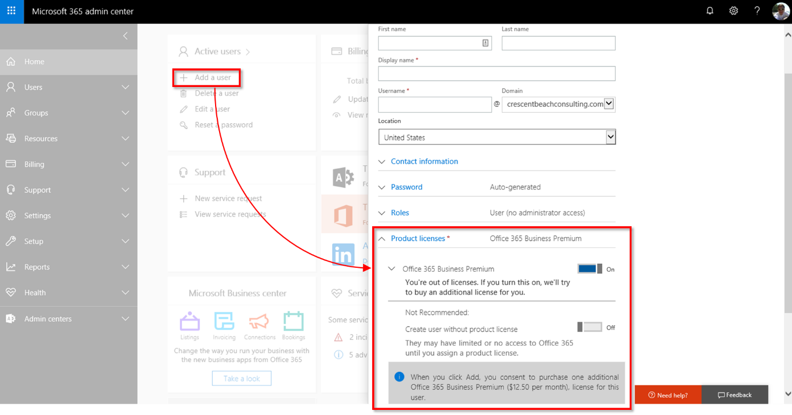

When you buy a Microsoft 365 subscription, you specify the number of licenses that you need, based on how many people you have in your organization. If you have more than one subscription, you can assign licenses to different people for each subscription.

The **Microsoft 365 admin center** is where youcreate user accounts and assign licenses to them. As your organizational needs change, you can buy more licenses to accommodate new people. You can also remove a license from one user and reassign it to a different person. (For example, if someone leaves your organization, you can reassign their license to another employee.) This helps you maintain the correct number of licenses your organization needs without paying for unneeded additional licenses (known as "over-licensing") or running out of licenses. 

You can also deal with expired licenses in the admin portal. If you don't renew a license or are past due paying for the latest billing cycle, the user with the expired license won't be able to use all of their Microsoft 365 products. You either need to renew the license or assign them a different, non-expired license. 

You can also turn functions on or off within a single license for each user. There are many services and tools within a single license that you can turn on or off to fine-tune each user’s account settings. Note, however, that deactivating any or all features for a user doesn't affect license consumption; these individual controls within the user’s product license  are separate from allocating (or removing) a license for a user.

