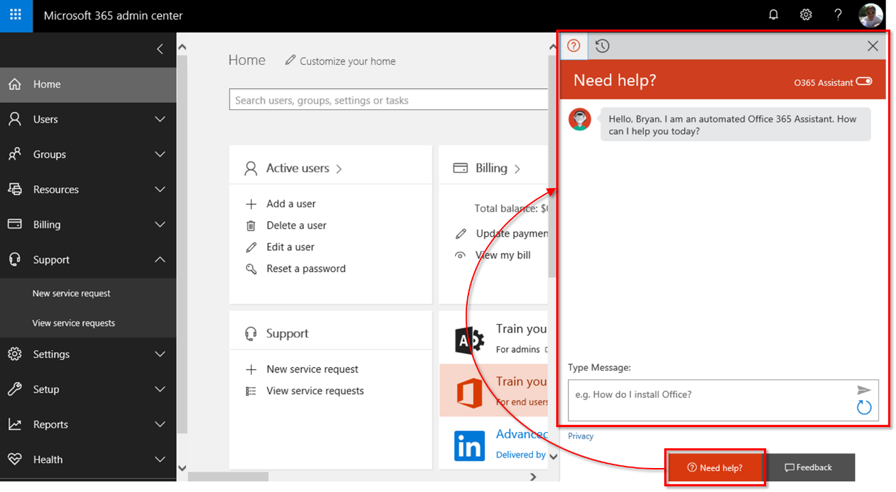

As a Microsoft 365 subscriber you have a variety of support options. The particulars depend on your specific subscription, whether it includes a service package, the service or tool in question, and the source of support. In general, you can get help in the following ways:
- **FastTrack** - Get direct access to Microsoft 365 planning materials and dedicated Microsoft FastTrack project managers and engineers to help you deploy Microsoft 365.
- **Automated assistance bot** - The Microsoft 365 admin center has an automated assistance bot that’s designed to help you find answers to support questions. Accessed from the **Need help** button, the bot known as "O365 Assistant" offers a chat-based user experience.
   
- **Premier Support** - Microsoft Premier Support Services is well suited for large and global enterprises with strategic and critical dependence on Microsoft products, including Microsoft 365 and Microsoft Azure. If you're a Premier SUpport Services member, you'll be assigned a technical account manager, and additional benefits like advisory services and on-site support are available. Premier support engineers are assigned customer issues and can call in any Microsoft expertise that’s needed to solve the problem. 
- **Cloud Service Provider Tier 1 support** - If you got your Microsoft 365 subscription through a Microsoft Cloud Solution Provider (CSP) that is certified as a Tier 1 CSP, contact them directly for technical support. Your Tier 1 CSP can provision your Microsoft 365 tenant for you and act as your first point of contact for all service-related issues. Tier 1 providers will escalate any issues they can’t resolve directly to Microsoft to ensure that you get the help you need.
- **Telephone support** - Some Microsoft 365 components provide phone support. 
- **Microsoft 365 Tech Community** - The space to share experiences, engage and learn from experts. Available at https://techcommunity.microsoft.com/t5/Microsoft-365/ct-p/microsoft365, get access to Microsoft blog posts, announcements, and forum posts from other Microsoft 365 users.
- **Microsoft 365 support forums** - Microsoft offers official support forums where you can ask questions and get answers from both Microsoft and community members. Different technologies and services in Microsoft 365 have their own forums. Some of the more popular ones are the Azure, Windows, and Office forums.

