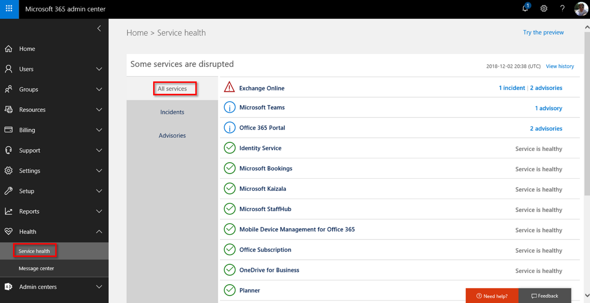

Microsoft constantly monitors the health of the services in Microsoft 365 (whether they're up or down or if performance is impacted). This helps us ensure we're meeting the SLA - our promise to you. You can also monitor the health of your services in the **Microsoft 365 admin portal**. You can filter the list of subscriptions and services to view only what's most relevant to you - from services with degraded performance to advisories to all services.

*Service health view in the Microsoft 365 admin center*

Select any entry to get more details. You can see the following:
- A description of the problem
- When the incident was first logged
- Last update to the incident
- Current status
- User impact
