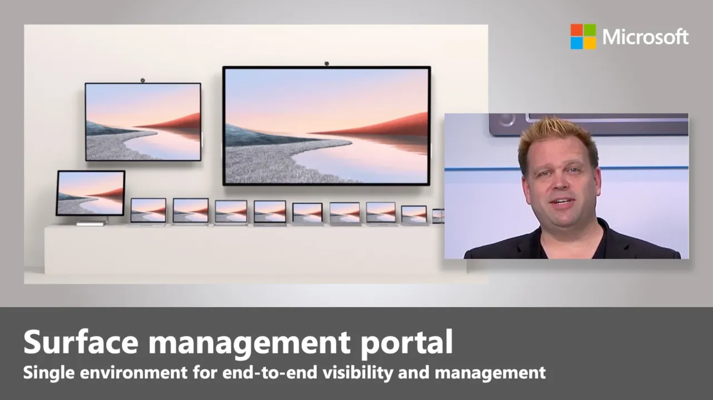

There has been a general shift in the way organizations and their staff work, with more emphasis on remote working and collaboration. While this might enable teams to work more efficiently, it can introduce complexity when it comes to managing devices. The news is full of stories of data breaches and data leaks, typically in the financial and healthcare sectors. These attacks have spread wider to include any systems that deal with personal and confidential data.

Any access point is a possible threat vector, none more so than a device that's used in a public access environment-for example, the classroom or showroom.

This five-minute video shows how you can use Microsoft Endpoint Manager to control all your Surface devices from a single portal.

   Watch this video to see an overview of the Surface management portal and where it fits into Microsoft Endpoint Manager.

## Managing Surface devices with Microsoft Endpoint Manager

Each Surface device can be managed automatically using Microsoft Endpoint Manager. This portal gives you an at-a-glance view of all your Surface devices.

:::image type="content" source="../media/surface-management-portal.png" alt-text="Screenshot of the Surface management portal dashboard.":::

With Microsoft Endpoint Manager, you can gain specific insights into your organization's Surface devices, including:

- A view of all Intune enrolled Surface devices.
- Reporting and compliance for all devices.
- Managing device warranty and expiry dates.
- Management of device support requests.

### View all enrolled Surface devices

The Microsoft Endpoint Manager portal gives you the capabilities to review and drill down into every device in your organization's tenant. Surface devices can be set to automatically enroll the first time a user signs in, or they can be enrolled at the factory. To get an overview of all your devices, you select the **All devices** option from the navigation.

:::image type="content" source="../media/surface-management-all-devices-report.png" alt-text="Screenshot of the device information report.":::

The **All devices** report allows you to filter as listed below. For example, if you select **Not compliant** from the **Device status** section, it will display all the non-compliant devices. You can also select individual devices in the list, which lets you manage the device settings.

### Compliance insights

To check the compliance of all your devices, you can use Microsoft Endpoint Manager's insights card on the main portal page to drill down and fix issues.

:::image type="content" source="../media/surface-management-insights.png" alt-text="Screenshot of the insights section of the Surface management portal.":::

Each of the listed insights is a deep link to all the device reports. Selecting the **16 devices not compliant** link opens the report and shows you all the affected devices.

### Support and coverage

There are many tools you can choose to use to manage an organization's devices. Mobile Device Management (MDM) tools don't normally allow you to handle support requests for their managed devices. The Surface management portal is unique in allowing you to view, manage, and raise new support requests for devices. Select the **Support** tab at the top of the portal to view the support and coverage information.

:::image type="content" source="../media/surface-management-portal-support-activity.png" alt-text="Screenshot of the support and coverage section.":::

Just like the other areas of the portal, you can drill down to see the details of a specific support request. If you need to create a new one, select the **Get help and support** button in the **Troubleshoot and request support** section.

:::image type="content" source="../media/surface-management-portal-create-support-requests.png" alt-text="Screenshot of the troubleshoot and request support section.":::

When you create the new support request, select the device to have all its information added. Then complete the contact details and submit the request.

## Warranty and coverage

Keeping your hardware up to date can be more difficult with the increase in remote working. Due to the close integration between Surface devices and Microsoft Endpoint Manager you can find out the level of warranty and coverage for each device in your tenant.

:::image type="content" source="../media/surface-management-portal-warranty-coverage.png" alt-text="Screenshot of the warranty and coverage section.":::

The information lets you see the devices that are no longer covered by a warranty, the devices close to expiring, the currently in-warranty devices, and the number of eligible devices that haven't enabled their warranty.

## Managing the Device Firmware Configuration Interface on a Surface device

The Device Firmware Configuration Interface (DFCI) profile supports a zero-touch provisioning process, by allowing control of security settings, including boot options and how the device interacts with peripherals.

Surface devices provide the capability to configure and manage firmware through a rich set of Unified Extensible Firmware Interface (UEFI) configuration settings. This gives a layer of hardware control in addition to the software-based policy management provided through Microsoft Endpoint Manager.

For a DFCI policy to be deployed, the Surface device needs to be registered using Windows Autopilot. When the device receives the profile, all the settings and features are applied automatically.

Here are the steps to create a DFCI profile for a Surface device:

1. Sign in to Microsoft Endpoint Manager (<https://endpoint.microsoft.com>) using your admin credentials.
1. Go to the **Devices** pane, and under **Policy**, select **Configuration profiles**.
1. Select **Create a profile**. You'll be creating a **Windows 10 or later** policy.
1. Next, you'll use a template to create a DFCI policy.
1. From the Device Firmware Configuration Interface, you'll need to give the policy a **Name**, in this case: **DFCI Configuration Policy**. When you're done, select **Next**.
1. You now need to disable the Surface device microphones and speakers. To do that, under the **Built-in Hardware** section, select **Microphones and speakers** and make sure it's **Disabled**.
1. Go to the **Assignments** tab, and select **Add Group**. You'll want to apply this policy to the Windows Autopilot Enrollment group. Select **Windows Autopilot Enrollment** from the list, and confirm the assignment by selecting **Select**.
1. Now select the **Applicability Rules** tab. From there, select the **Rule** menu, and then select **Assign profile if**.
1. You'll now build a rule. From the **Property** menu, select **OS edition**, and from the **Value** menu, select **Windows 10/11 Education**, **Windows 10/11 Enterprise**, and **Windows 10/11 Professional**.
1. Finally, on the **Review + create** tab, you'll want to review the new DFCI profile. When you're satisfied, select **Create**.

In this 20-second video, you'll see how the DFCI policy is applied to a Surface device:

> [!VIDEO https://labclient.labondemand.com/Instructions/Video/108850/?url=https%3A%2F%2Flabondemand.blob.core.windows.net%2Fcontent%2Flab108850%2Fuefi-dfci.mp4]
