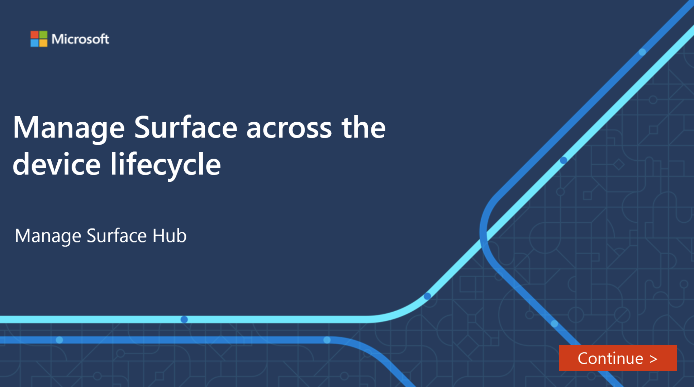

You use Microsoft Endpoint Manager to configure and manage Surface devices, including Surface Hub. Each Surface Hub device has built-in components that integrate with Microsoft Endpoint Manager to allow IT administrators to manage policies and settings.

In this unit, you'll see how to create a device restriction profile using Microsoft Endpoint Manager and check the settings on a Surface Hub.

## Create a device restriction profile using Microsoft Endpoint Manager

If you are using your Surface Hub in a kiosk or public setting, you will want to limit what it is able to do. You can use the Microsoft Endpoint Manager admin center to create a configuration policy, which is then applied. This policy can be created quickly using only a few steps:

1. Sign in to the Microsoft Endpoint Manager admin center using your administrator credentials.
1. Select **Devices** from the navigation options.
1. From the **Devices | Overview** page, select **Configuration profiles**.
1. From the **Configuration profiles** page, select **+ Create profile**.
1. Under **Platform**, select **Windows 10 and later**.
1. Under **Profile type**, select **Templates**.
1. Select **Device restrictions (Windows 10 Team)**.
1. Select **Create**.
1. Add a name, and then select **Next**.
1. You can now browse and choose from preset device restriction settings for Surface Hub across the following categories:
    - Apps and experience
    - Azure operational insights
    - Maintenance
    - Session
    - Wireless projection

## Configuration policy template restrictions for Surface Hub

When you use a template to create a configuration policy for Surface Hub, be aware that only the following are supported:

- Device restrictions (Windows 10 Team)
- Microsoft Defender for Endpoint (Windows 10 Desktop)
- PKCS certificate
- PKCS imported certificate
- SCEP certificate
- Trusted certificate

## Interactive guide

This interactive guide will walk you through the steps and actions needed to create a configuration policy for a Surface Hub device called MSH01. First, select the image to launch the interactive in a new browser tab. When you've completed the interactive, close the tab to return here and finish this module.

## Review and manage settings in the Surface Hub

While it's possible to review and manage Surface Hub devices remotely, it is always worth going to the device to check that the settings match any policy configurations. To do this, you need to visit each Surface Hub individually.

1. At the Surface Hub, select **Start** then choose **All apps**, and scroll down until you find **Settings**.
1. In the **User Account Control** dialog box, enter your administrator credentials and select **Yes**.
1. On the **Windows Settings** page, select **Surface Hub**.
1. In the left navigation, select **Device management**.
1. On the **Device management** page, under **Device management**, select your tenant, and then select **Info**.
1. At the bottom of the page, select **Sync**. You'll need to wait for the synchronization to complete.
1. On the **Settings** page, select the **←** arrow.
1. In the left navigation, select **Home**.
1. On the **Windows Settings** page, select **Update & Security**.
1. On the **Windows Update** page, select **Advanced options**.
1. On the **Advanced options** page, under **Maintenance hours**, verify that the **Start time** and **Duration** match the policy setting.
1. At the bottom of the screen, select **End session**, and then select **Yes**.
