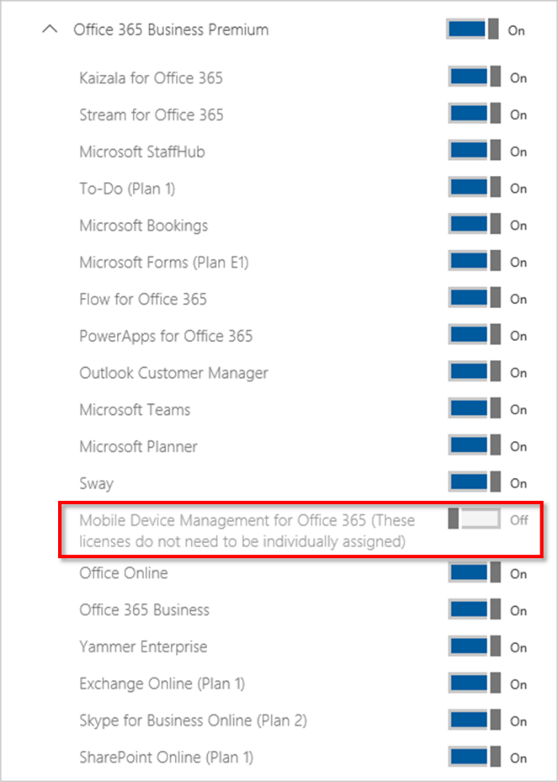

When you buy a Microsoft 365 subscription, you specify the number of licenses that you need based on how many people you have in your organization. If you have more than one subscription, you can assign licenses to different people for each subscription.

The Microsoft 365 admin center is where you create user accounts and assign licenses to them. As your organizational needs change, you can buy more licenses to accommodate new people. You can also remove a license from one user and reassign it to a different person. (For example, if someone leaves your organization, you can reassign their license to another employee.) This helps you maintain the correct number of licenses your organization needs without paying for unneeded additional licenses (known as "over-licensing") or running out of licenses. 

*Acquire licenses in the Microsoft 365 admin center*

You can manage expired licenses in the admin center too. If you don't renew a license or are past due paying for the latest billing cycle, the user with the expired license won't be able to use all of their Microsoft 365 products. You either need to renew the license or assign them a different, active license. 

You can also turn access to functions like Exchange Online or Microsoft Teams on or off, as well as other services and tools, within a single license for each user. Note however, that deactivating any or all features for a user doesn't affect license consumption; these individual controls within the user’s product license are separate from allocating (or removing) a license for a user.

*Enable or disable individual functions for a license* 

### Explore

Explore how to manage your Microsoft 365 licenses

  

Be sure to click the full-screen option in the video player. When you're done, use the **Back** arrow in your browser to come back to this page. 

**Want to try?** View an [interactive version](https://mslearn.cloudguides.com/guides/Manage%20licenses%20in%20Microsoft%20365) of this video (available in English).
