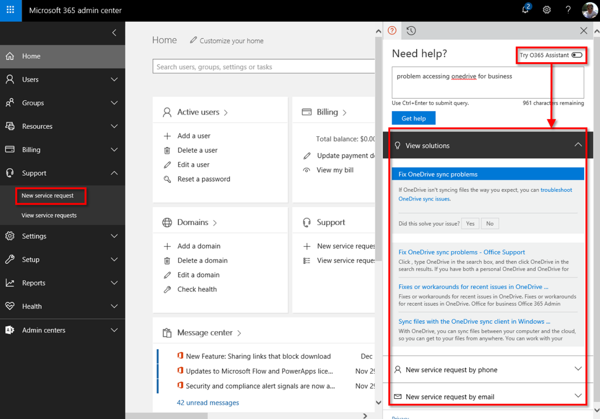
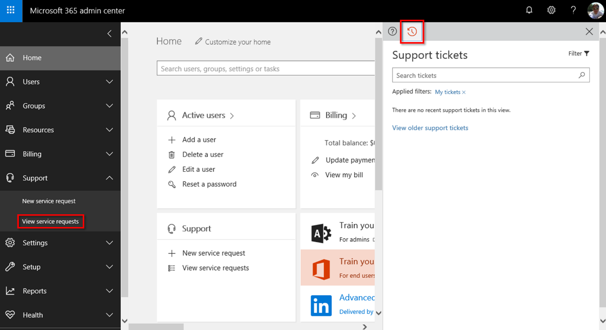

A **service request** is a formal request for help from  Microsoft Support. You can create requests through telephone support, online chat support, and email. Each customer case is identified by a unique code that helps you track it through the support process. 

## Creating a service request
You can find help and figure out when to open a service request in the Microsoft 365 admin center. As shown in the following image, toggle off the O365 Assistant bot in the Support pane, and then type in a description of your issue and search for solutions. If you don't find a solution for your problem, create a new service request by phone or by email.

*Search for solutions to issues and if you are unsuccessful, open a new service request*

## Viewing existing service requests
You can view the status of all your existing service requests. Either click **View service requests** under the Support blade, or if you already have the pane open, select the circular arrow icon in the **Need help** tab to see a list of your service requests.

*View your existing service requests*