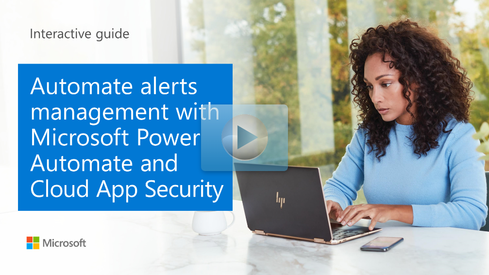

You can automatically remediate many Microsoft Defender for Cloud Apps alerts. Governance Actions in Microsoft Defender for Cloud Apps include many actions that can successfully resolve alerts.

:::image type="content" source="../media/3-governance-actions.png" alt-text="Governance actions":::

Some specific actions might not be included which might require a more complex flow. For example, you could create a flow that requests user validation. This flow could then avoid many instances where the Security Operations Center (SOC) team would have to take actions that are no longer required.

## Creating a custom flow alert with Power Automate

To create a custom flow alert with Power Automate to remove sensitive file sharing after requesting user validation, perform the following steps:

1. Create a file policy in Microsoft Defender for Cloud Apps that includes filters that match the specifics of the sensitive files.
2. In the policy, under **Alerts**, select **Send Alerts to Power Automate** and select the Power Automate playbook to send the alert to.

    :::image type="content" source="../media/3-send-alerts-power-automate.png" alt-text="Send alerts to Power Automate.":::

3. In Power Automate, ensure that there is a step to ask the user for validation.

    :::image type="content" source="../media/3-ask-user-validation.png" alt-text="User validation.":::

4. Note that there are **User Options** that the user can select.
5. Create a switch that will depend upon which user option is selected in the email.

    :::image type="content" source="../media/3-user-options-switch.png" alt-text="User options switch.":::

## Explore custom flows

You can explore Power Automate now using the following interactive guide to simulate the creation of a custom flow.

Click on the image to get started.

Be sure to click the full-screen option in the video player. When you're done, use the **Back** arrow in your browser to come back to this page.
