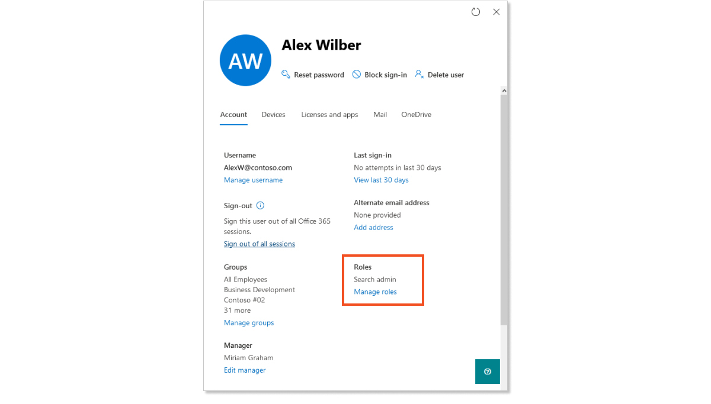
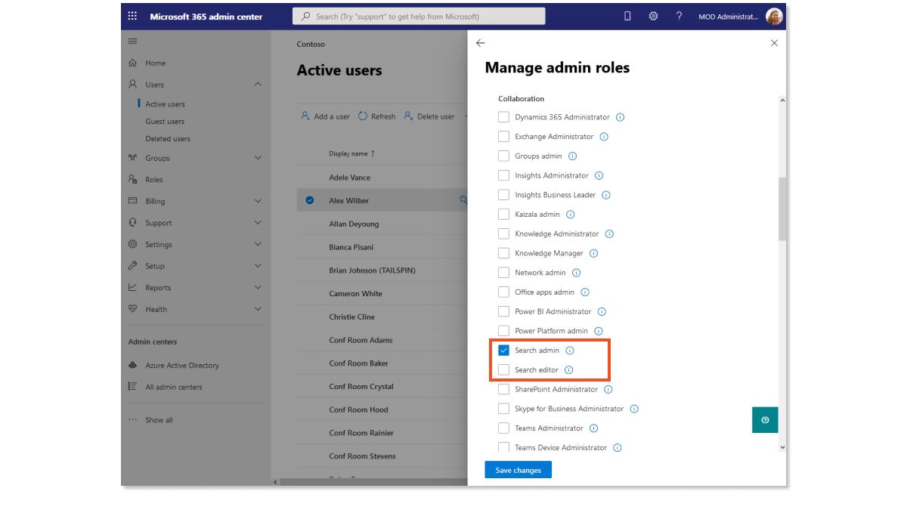

Administrators in the following three roles manage the Search & intelligence settings and content experience for Microsoft Search: 

**Global admin**: Has complete control over, and complete access to, Search & intelligence features and all other enterprise apps and services that contribute to the Microsoft Search experience, including settings for branding, news feed, and the Bing homepage. Only a Global admin can assign the roles of Search admins or Search editors.

**Search admin**: This role can create and manage answer content and settings, add connectors to make more data sources accessible in Microsoft Search, and make other configurations, and customizations. They can perform all of the content-management tasks a Search editor can.

**Search editor**: Usually tasked with the management of answer content such as bookmarks, acronyms, and so on. They have the same permissions and limitations as a Search admin.

The table below provides a more detailed look at each of these roles and the tasks that are available to them.

|     Role         |     Permission     |         Task             |
| ---------------- |  ----------------  |     -------------        |
| **Global admin**  |      **All** (can create and manage all aspects of Microsoft 365 and Azure portal settings, assign roles, groups*)  **Can** also assign user as specialty admin (such as Search admin) or customized permissions (such as Search editor)  |     - Tenant/service management -Assign section admin and/or section editor |
| **Search admin**  |      **Can** create and manage all aspects of Microsoft Search   **Cannot** edit organizational profile, manage users or groups, edit licenses, configure conditional access, company profile settings, or other Microsoft 365 or Azure portal settings |    -Search service management (manage answer content, add data connectors, apply search customizations, change configurations)      |
| **Search editor**  |   Same as Search admin  |   -Create and manage editorial content such as bookmarks, Q&As, locations, floorplans   |
> [!NOTE]
>
> * Only Global admins, User admins, and Groups admins can create and manage groups in the Microsoft 365 admin center.

### Assigning roles

The IT admin from our scenario has recruited someone from the team to manage and create Microsoft Search content. The IT admin is the organization’s Global admin and wants to assign a Search admin role to them. Below, we outline the steps to assign such a role.

1. In the [Microsoft 365 admin center](https://admin.microsoft.com/), select **Users** > **Active Users**.
2. Choose a user account to open the user details pane, select **Manage roles**.

3. Select **Admin center access**.
4. Expand **Show all by category** to display a list of predefined specialty roles.
5. The **Collaboration** section appears at the top of the expanded list. In this section, you'll see two search-specific roles: **Search admin** and **Search editor**.

6. Select **Search admin** and click **Save changes**.

Now, the newly assigned Search admin has access to the Search & intelligence settings and can review the metrics that will be available.

> [!IMPORTANT]
>
>The steps above outline how to assign a search role to an existing user. To learn how to provision and apply a license to a new user, see [Add users and assign licenses at the same time](/microsoft-365/admin/add-users/add-users).
