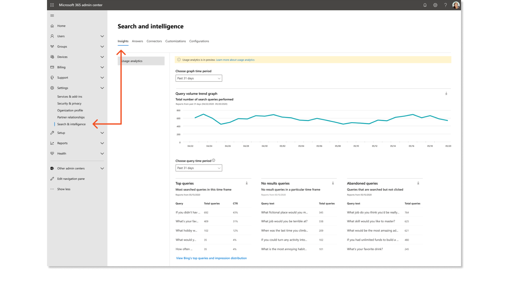
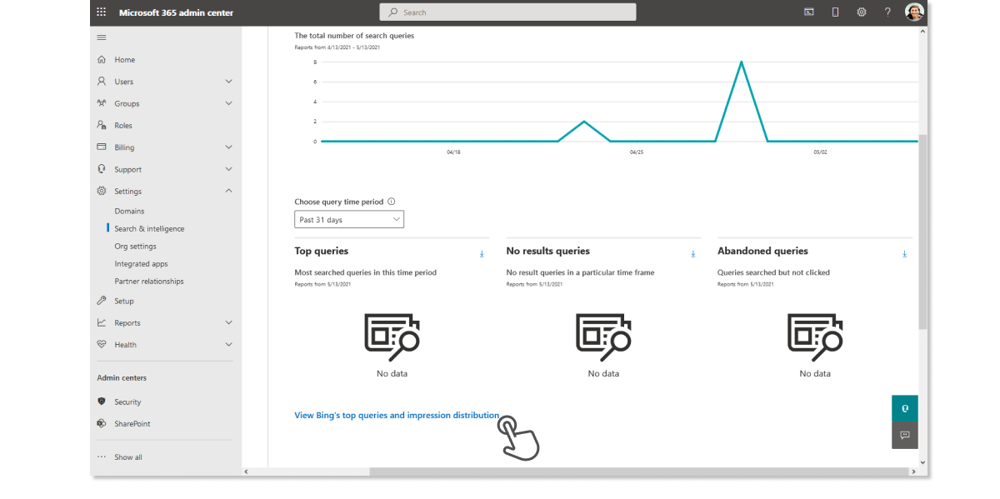

As part of their planning effort, the Global and Search admins from our scenario are ready to begin determining how they'll measure the success of Microsoft Search. These are a few options that we suggest:

- Awareness of available Microsoft Search usage metrics
- Quantitative measurements of existing search and productivity tools
- Qualitative measurements of your organizations previous or existing search solutions

### Microsoft Search usage metrics

Use the Microsoft Search metrics to help define how you'll measure success of the search experience and adoption across your organization. After Microsoft Search has rolled out, you can use these same data points to make informed decisions about content you need to add or retire.

To review usage metrics, go to the **Insights section** of the **Search & intelligence** settings in the [**Microsoft 365 admin center**](https://admin.microsoft.com/Adminportal/Home). If your organization hasn't widely adopted Microsoft Search yet, your insights dashboard will have little or no data to report. The image below shows an example of how usage metrics appear after people in your organization begin using Microsoft Search.

The following search data is available for Office.com and SharePoint Online:

   | Report                            | Description |
   | --------------------------------- | ------------------------- |
   | **Query volume**                  | The total number of search queries performed. Use to determine periods of high and low search activity. Low volume may indicate a lack of user awareness of Microsoft Search or search entry points. |
   | **Top queries**                   | The most popular search queries in your organization. Use to understand the types of information your users are searching for. |
   | **No results queries**            | Popular search queries that returned no results and might create user dissatisfaction. Use to identify potential content gaps or improve discoverability of existing content. |
   | **Abandoned queries**             | The most popular search queries in your organization. Use to understand the types of information your users are searching for. |

To review data for Microsoft Search in Bing, select **View Bing's top queries and impression distribution** at the bottom of the Usage analytics page. The Bing usage analytics show all top searches, as well as top searches by result type, and impressions by results type over a seven-, 30-, or 90-day time period.

### Quantitative measurements

Understanding how products like Office apps, SharePoint, and Microsoft Edge are used within your organization today may help you set benchmarks for how frequently you expect people to use these entry points to access Microsoft Search. For more information on:

- SharePoint search usage, see [View search usage reports](/sharepoint/view-search-usage-reports).
- Microsoft 365 apps usage, see [Microsoft 365 Reports in the admin centerMicrosoft 365 Apps usage](/microsoft-365/admin/activity-reports/microsoft365-apps-usage).
- Microsoft Edge usage, see [Microsoft browser usage report](/deployedge/microsoft-edge-browser-usage-report).

If your organization has a helpdesk or support team, either internal or through an external provider, you should consider using any data they can share about issues or usage as part of your success measurements.

### Qualitative measurements

User surveys and focus groups can help you understand what people in your organization like and dislike about your current internal search solution and help you prioritize the types of content they would expect or like to find when using Microsoft Search.

Once you determined the methods and metrics you'll use to measure the success of Microsoft Search, it's important to consistently apply them so you can see the progress over time. Discuss these with your stakeholders to ensure everyone understands what you are measuring and why. Also, as you continue to use and improve Microsoft Search, you may need to refine or add other measurements.
