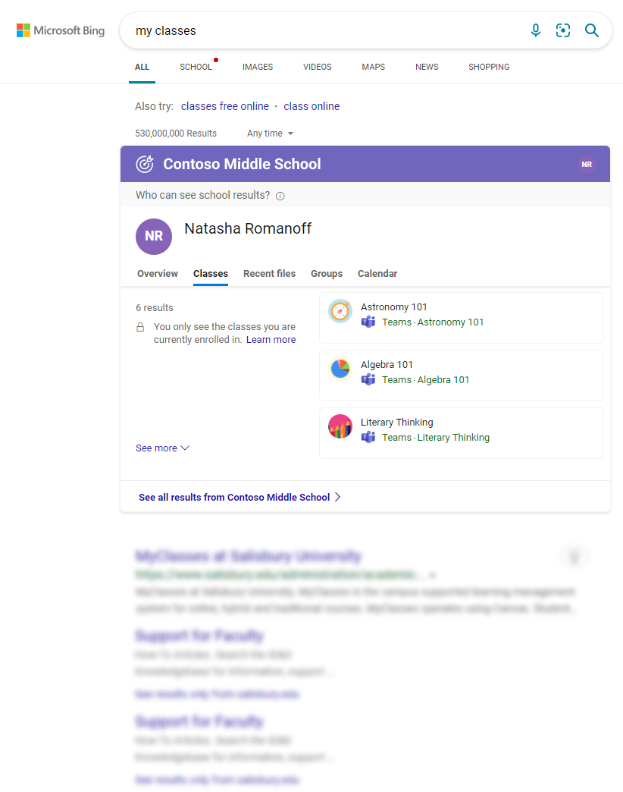

Users [must be signed in with their school account](https://support.microsoft.com/office/how-microsoft-search-in-bing-helps-keep-your-info-secure-cbce46ae-bb1f-4d0e-86f1-5984f4589113) to find school results using Microsoft Search. This account is the same one they use to sign in to Microsoft Teams or other Microsoft 365 apps. Users won't see school results with a personal Microsoft account. To learn more about the differences between accounts, see [What is a work or school account?](https://support.microsoft.com/office/what-account-to-use-with-office-and-you-need-one-914e6610-2763-47ac-ab36-602a81068235#bkmk_msavsworkschool) 

Users can access school search results from:

* Bing.com
* Windows Search
* Microsoft Edge
* Bing mobile

:::image type="content" source="../media/module-4-unit-2-find-school-results.gif" alt-text="GIF showing where you can start a search for answers and results from your school.":::

If a user is already signed in to Microsoft Edge or a Microsoft 365 app or site, they’re all set. They'll be automatically signed in when they go to Bing. When your users search on Bing, there are two locations they'll see school results:

## All results page

The most relevant school answer appears in Bing results on the All page

Benefits of the All page:

* Quick access to school results when needed
* Public results allow users to explore the breadth and depth of the web
* Ads are never targeted based on a user’s school identity

## School results page

Only school results appear on the School page; web results are excluded.

:::image type="content" source="../media/module-4-unit-2-where-to-find-school-results-answer-school-school-vertical.png" alt-text="Image showing Classes answer on Microsoft Search in Bing School page.":::

Benefits of the School page:

* Dedicated space for school results
* Design maximizes the number of school results a user sees
* Filters make it easier to explore and find info
