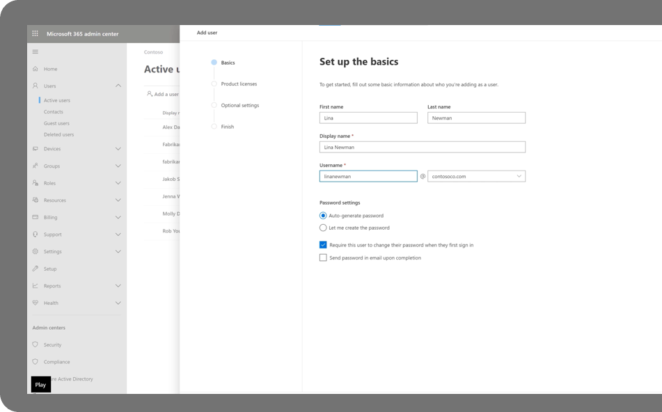
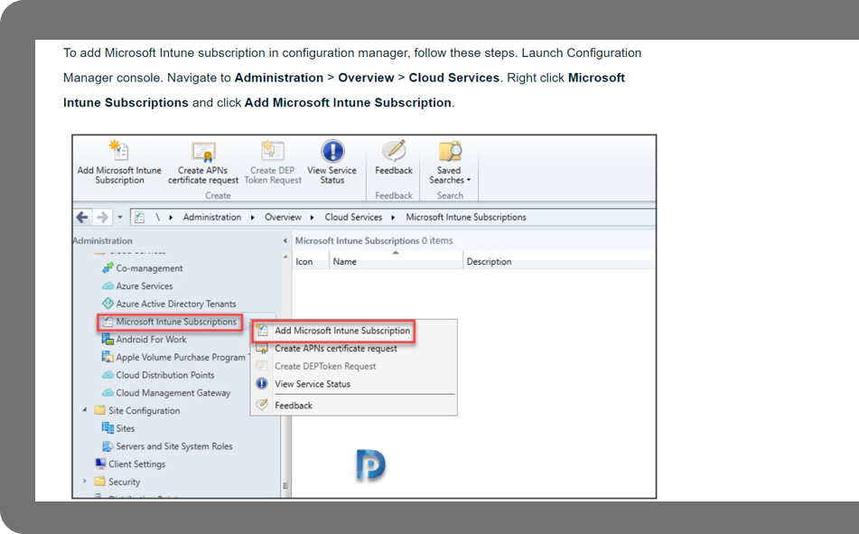

Ensure that your Microsoft 365 tenant is set up correctly so that users can start saving documents to the cloud, simplifying cloud management for your school or district. Setting up your Microsoft 365 tenant according to your needs is a key step to ensuring your environment is configured correctly and to allow your school to begin to utilize the cloud – for tasks like saving documents or printing via the cloud. To set up your Microsoft 365 tenant:

1. **Add domains**
    After creating the tenant, you will need to add domains for your organization. We recommend creating a small number of domains to start (for example, one for teachers and one for students). You can add domains in the Office admin center.

1. **Configure admin and security settings**
    Now you can start setting admin and security settings through the Microsoft 365 admin center. You can also leverage admin center settings recommendations to streamline this process.

1. **Migrate storage to OneDrive for business (recommended)**
    Now you can start moving curriculum content to the cloud and host it in Teams, OneNote, or OneDrive. If you plan to use OneDrive, you should start this process with [known folder redirection](/onedrive/redirect-known-folders).

1. **Onboard printers (recommended)**
    In order to use and manage your existing printer fleet in the cloud, you will need to start onboarding these devices to [Microsoft Universal Print](/universal-print/).

1. **Connect Configuration Manager to Intune (optional)**
    If you are already using Configuration Manager, you may want to connect to Intune. This enables current devices to be managed by both Configuration Manager and Microsoft Intune.

All done setting up your tenant? Next learn how to quickly enroll devices at scale across your institution.
