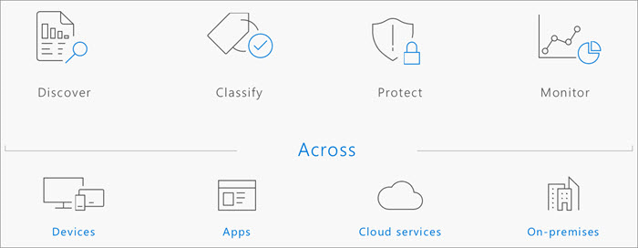

In a mobile-first, cloud-first world, important business data lives and travels everywhere. 

Organizations need to balance the goals of productivity and security. How do you create and share information across boundaries, while preventing the unauthorized disclosure, modification, or destruction of data? What can you do to reduce the risk that employees share sensitive information accidentally or use sensitive information inappropriately?

To balance productivity and security effectively, you need to have a strategy for protecting and managing your sensitive information. You need to know where your sensitive information is located. And you need to be able to control it as it travels within and outside your organization. You also need to have a way to classify, label, and apply appropriate protections to this information.

It can be helpful to think about your information protection strategy in terms of these four key activities:  
- Discover
- Classify
- Protect
- Monitor

The Microsoft Information Protection solutions in Microsoft 365 help you protect sensitive data throughout its lifecycle—across devices, apps, cloud services, and on-premises locations.

## Integrated capabilities protect and manage data throughout its lifecycle
The unified labeling experience in Microsoft 365 provides organizations with a more integrated and consistent approach to creating, configuring, and automatically applying comprehensive policies to protect and govern data – across devices, apps, cloud services, and on-premises. The information protection capabilities also support your overall data governance strategy. Classifying and labeling data enables you to apply policy-based protections and/or retention actions. Advanced monitoring and analytics provide visibility and insights into your organization’s data. You can understand where important data resides, receive proactive alerts on policy violations, and view recommendations on policy enhancements based on your environment.

The following image shows how these integrated capabilities work together over the course of the data lifecycle to keep information protected and managed.

The following units will explain in greater detail how these capabilities work at each phase of the data lifecycle.