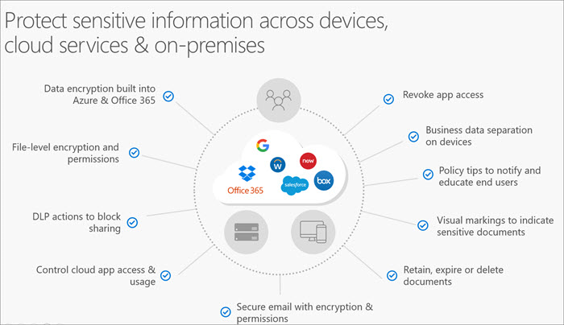
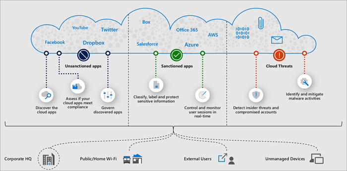

Sensitive data may initially be created on an individual device, but it is then frequently shared or stored in other locations, such as cloud-based storage, on-premises file shares, or email. There are several complementary protection measures you can take to protect this sensitive information wherever it lives or travels: 

- As a starting point, both Microsoft 365 has data encryption built into the service – for both data at rest and data in transit. 
- To protect individual files, you can apply rights-based permissions so that only intended recipients can access and view the information.
- You can apply Data Loss Prevention actions, such as blocking the sharing of a file that is detected to have sensitive information, such as credit card information or social security numbers.
- You can limit or block access to cloud apps present in your environment, or revoke app access among specific individuals.
- To help end-users make more informed decisions, you can enable policy tips that notify users that the document they are working with contains sensitive information, or you can even automatically apply a visual marking to documents, such as a header or footer. 
- To help prevent sensitive information from staying around longer than necessary and potentially posing a risk, you can automatically retain, expire or delete documents, based on data governance policies defined by your company. 

Here’s a closer look at a few specific protections you can apply.

## Apply encryption using a sensitivity label
When you create a sensitivity label, you can restrict access to content that the label will be applied to. For example, with the encryption settings for a sensitivity label, you can protect content so that:
- Only users within your organization can open a confidential document or email.
- Only users in the marketing department can edit and print the promotion announcement document or email, while all other users in your organization can only read it.
- Users cannot forward an email or copy information from it that contains news about an internal reorganization. 
- The current price list that is sent to business partners cannot be opened after a specified date.

When a document or email is encrypted, access to the content is restricted, so that it:
- Can be decrypted only by users authorized by the label’s encryption settings.
- Remains encrypted no matter where it resides, inside or outside your organization, even if the file’s renamed.
- Is encrypted both at rest (for example, in a OneDrive account) and in transit (for example, a sent email).

More info: https://docs.microsoft.com/en-us/Office365/SecurityCompliance/encryption-sensitivity-labels

## Send protected email
Because email is one of the most common ways employees share information, it poses a high risk for unintended disclosure of sensitive information. Office 365 Message Encryption (OME) enable people in your organization to share protected email with anyone on any device. Users can send and receive protected messages with other Office 365 organizations as well as non-Office 365 customers using Outlook.com, Gmail, and other email services.

Video: Office 365 Essentials: Office Message Encryption: 

>[!VIDEO https://www.youtube.com/embed/CQR0cG_iEUc]

## Prevent inappropriate sharing with Data Loss Prevention policies (DLP)
By configuring Data Loss Prevention (DLP) policies, you can help prevent sensitive information from being leaked outside your organization. Sensitive information might include financial data, health records, or personally identifiable information (PII) such as credit card numbers or government identification numbers. DLP detects sensitive information by using deep content analysis (not just a simple text scan). This deep content analysis uses keyword matches, dictionary matches, the evaluation of regular expressions, internal functions, and other methods to detect content that matches your DLP policies. Potentially only a small percentage of your data is considered sensitive. A DLP policy can identify, monitor, and automatically protect just that data, without impeding or affecting people who work with the rest of your content.

DLP includes many sensitive information types that you can use in your DLP policies. You can customize these built-in sensitive information types or create new custom sensitive information types.

With a DLP policy, you can:
- **Identify sensitive information across many locations, such as Exchange Online, SharePoint Online, and OneDrive for Business**. For example, you can identify any document containing a credit card number that's stored in any OneDrive for Business site, or you can monitor just the OneDrive sites of specific people.
- **Prevent the accidental sharing of sensitive information**. For example, you can identify any document or email containing a health record that's shared with people outside your organization, and then automatically block access to that document or block the email from being sent.
- **Monitor and protect sensitive information in the desktop versions of Excel, PowerPoint, and Word**. Just like in Exchange Online, SharePoint Online, and OneDrive for Business, these Office desktop programs include the same capabilities to identify sensitive information and apply DLP policies. DLP provides continuous monitoring when people share content in these Office 2016 or 2019 programs.
- **Help users learn how to stay compliant without interrupting their workflow**. You can educate your users about DLP policies and help them remain compliant without blocking their work. For example, if a user tries to share a document containing sensitive information, a DLP policy can both send them an email notification and show them a policy tip in the context of the document library that allows them to override the policy if they have a business justification. The same policy tips also appear in Outlook on the web, Outlook 2013 and later, Excel 2016, PowerPoint 2016, and Word 2016.
- **View DLP reports showing content that matches your organization's DLP policies**. To assess how your organization is complying with a DLP policy, you can see how many matches each policy and rule has over time. If a DLP policy allows users to override a policy tip and report a false positive, you can also view what users have reported.

## Protect data when it travels outside your org
Most organizations use SaaS apps from multiple providers, and their employees may additionally have personal social media accounts or data storage solutions. How do you keep track of whether sensitive data is leaking out of your SaaS cloud apps accounts, or whether sensitive data is being inappropriately shared to third-party apps or social media accounts?

Microsoft Cloud App Security is a Cloud App Security Broker (CASB) solution. It gives you visibility into your cloud apps and services, provides analytics to identify and combat cyberthreats, and enables you to control how your data travels.

In other words, it helps you manage and see what information goes to the cloud and what information can be downloaded from the cloud, as well as the devices, users, or locations that can access it. The following image provides a visualization of the functions of a Cloud App Security Broker solution.

Broadly, Microsoft Cloud App Security can help your organization: 
- Discover and manage Shadow IT in your organization: 
- Protect your sensitive information
- Detect and remediate cyberthreats across cloud apps
- Ensure the compliance of cloud apps in your organization

From an information protection and data governance perspective, Microsoft Cloud App Security provides some of the following capabilities:
- **Granular data loss prevention (DLP) policies**: Set granular policies to control data in the cloud—either automated or based on file label—using out-of-the-box policies or you can customize your own.
- **Policy enforcement**: Identify policy violations, enforce actions such as quarantine and permissions removal
- **Understands classification & labeling**: Reads classification and labeling in the document – so you can gain visibility into sharing of sensitive files and create policies
- **Revoke access for 3rd party apps**: Detect and manage 3rd party app access

For more information: https://docs.microsoft.com/cloud-app-security/what-is-cloud-app-security

