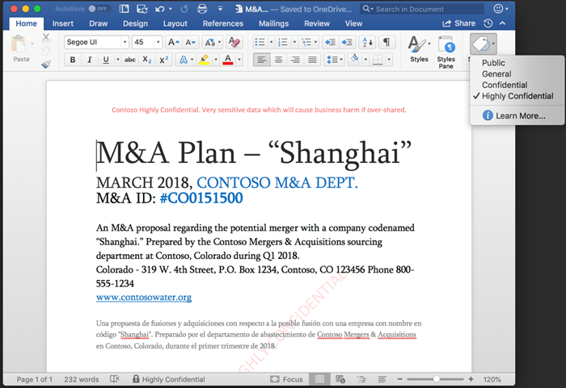

The Discover and Classify phases of information protection involve scanning and detecting sensitive data – all based on the policies defined and configured by your organization. 

Key considerations:
- Is there an automated way to discover important data?  
- Which regulations and compliance factors matter? 
- Is my data spread out across devices, the cloud, and on-premises servers? 
- Is my data spread out geographically? 
- Are certain employees or groups more relevant for discovery? 
- Do I know the characteristics of sensitive or important data?

## Discover sensitive information
In order to protect your organization’s information, you need to be able to discover sensitive information no matter where it is created or lives. That means having sensitive data discovery capabilities across your on-premises file shares or datacenters, on individual devices, as well as across cloud services and SaaS applications. 

What counts as “sensitive data” for your organization will be determined by things like your industry (e.g., healthcare, financial services), governmental regulations and policies, as well as your organization’s internal policies.
- You can start by using **Content Search** to search for in-place items such as email, documents, and instant messaging conversations.
- Microsoft has many built-in **sensitive information types** (part of Data Loss Prevention) that can be used to detect common sensitive information types, such as financial information, healthcare related information, PII and other information types. 
- If you need more granular control beyond the built-in sensitive information types, you create your own **custom sensitive information types**, or add your own unique dictionary of terms to detect against. 
- Beyond detecting sensitive information in documents and emails, you can also use **Microsoft Cloud App Security** to detect content in cloud storage services, based on policy. You can discover sensitive data across third-party SaaS apps. You can also apply labels and protection to sensitive files with Microsoft Information Protection.
- The **Azure Information Protection Scanner** enables you to discover, classify, and protect files on on-premises servers, network shares, and on-premises SharePoint Server sites.

For more information, see:
https://docs.microsoft.com/Office365/SecurityCompliance/content-search
https://docs.microsoft.com/office365/securitycompliance/what-the-sensitive-information-types-look-for
https://docs.microsoft.com/cloud-app-security/what-is-cloud-app-security
https://docs.microsoft.com/azure/information-protection/deploy-aip-scanner

## Classify content with sensitivity labels
After you have identified the sensitive data you want to protect, you can apply sensitivity labels to help your organization monitor the transmission and usage of documents that are potentially sensitive. 
Sensitivity labels are metadata tags within a document that are:
- **Customizable**. You can create categories for different levels of sensitive content in your organization, such as Personal, Public, General, Confidential, and Highly Confidential.
- **Clear text**. Because the label is in clear text, it’s available for third-party apps and services to apply protective actions to labeled content.
- **Persistent**. After a sensitivity label is applied to content, it persists in the metadata of that email or document. This means the label roams with the content, including the protection settings, and becomes the basis for applying and enforcing policies.

In the Office apps, a sensitivity label simply appears as a tag on an email or document. The Sensitivity drop-down menu makes it easy to view and select the appropriate label. The screenshots below illustrate the end-user experience in Office apps on Mac. The experience is similar across Word, PowerPoint, Excel and Outlook.

## How sensitivity labels protect content
Sensitivity labels in documents and emails can also be understood by other apps and services. For example, if a “Highly Confidential” document resides on a Windows device, Windows Information Protection and Windows Defender ATP can work together to block the copying or sharing of content from that document to other locations on the device, such as personal email accounts or social accounts. 

You can use sensitivity labels to:
- **Enforce protection settings such as encryption or watermarks on labeled content**. For example, your users can apply a Confidential label to a document or email, and that label can encrypt the content and apply a Confidential watermark.
- **Protect content in Office apps across different platforms and devices**. Sensitivity labels work in Office apps on Windows, Mac, iOS, and Android. 
- **Prevent sensitive content from leaving your organization on devices running Windows, by using endpoint protection in Microsoft Intune**. After a sensitivity label has been applied to content that resides on a Windows device, endpoint protection can prevent that content from being copied to a third-party app, such as Twitter or Gmail, or being copied to removable storage, such as a USB drive.
- **Extend sensitivity labels to third-party apps and services**. With the Microsoft Information Protection SDK, third-party apps on Windows, Mac, and Linux can read sensitivity labels and apply protection settings. Support for apps on iOS and Android is coming soon.
- **Classify content without using any protection settings**. You can also simply assign a classification to content (like a sticker) that persists and roams with the content as it's used and shared. You can use this classification to generate usage reports and see activity data for your sensitive content. Based on this information, you can always choose to apply protection settings later.

You have flexibility in how you choose to apply sensitivity labels. You can configure a policy to automatically apply a sensitivity label to a document based on the detection of sensitive information. For example, policy could be defined to automatically mark a document as “confidential” if it contains social security numbers. 

Alternatively, you can set things up so that a recommended classification and sensitivity label can be provided to users. You can also give users the ability to override an automatic classification, while requiring a justification for the override.

Because individual users may be most familiar with the data in your organization, you can also enable users to classify and apply a sensitivity label themselves. For example, if they are working on a document that contains privileged information, they can apply a sensitivity label of “highly confidential” right within the app. 

## Labels enable policy-driven actions
Classification and the application of sensitivity labels are a powerful part of the information protection process because they are the means by which organizations can apply and enforce policy actions. Using classification and labeling, you can apply specific **protection actions**, such as encryption, Data Loss Prevention actions, end-user notifications, and IT alerts. You can also apply specific **data governance actions**, including data retention, expiration, and deletion.

In the next unit, we’ll look more closely at the specific protection policies that can be applied using labels.
For more information:
https://docs.microsoft.com/en-us/Office365/SecurityCompliance/sensitivity-labels
https://docs.microsoft.com/en-us/Office365/SecurityCompliance/apply_sensitivity_label_automatically
