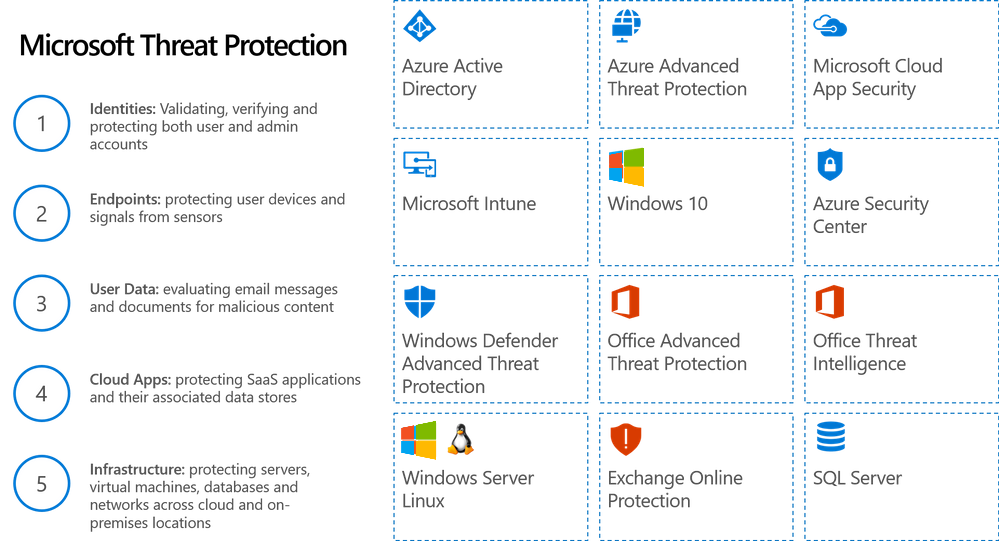

Microsoft Threat Protection helps protect users, identities, devices, user data, apps, and your infrastructure.

- **Identities**. Detect suspicious user behavior, logins from multiple locations, and more. Solutions include Azure Active Directory Identity Protection, Azure Advanced Threat Protection, Microsoft Cloud App Security.
- **Endpoints**. Help prevent attacks on devices, detect anomalous behavior, like suspicious processes, and automatically block potential threats. Solutions include Windows Defender Advanced Threat Protection, Windows 10, Microsoft Intune.
- **User Data**. Apply analytics and intelligence to prevent threats such as phishing and 0-day attacks. Microsoft solutions include Exchange Online Protection, Office 365 Advanced Threat Protection, Office 365 Threat Intelligence, Windows Defender Advanced Threat Protection, Microsoft Cloud App Security.
- **Cloud Apps**. Exchange Online Protection, Office 365 Advanced Threat Protection, Microsoft Cloud App Security.
- **Infrastructure**. Azure Security Center, SQL Server, Linux.

The following solutions, included in Microsoft 365, help you deal with threats to your users, devices, and data.

## Azure Active Directory Identity Protection 
Azure Active Directory uses adaptive machine learning algorithms and heuristics to detect anomalies and suspicious incidents that indicate potentially compromised identities. Using this data, Identity Protection generates reports and alerts so you can evaluate issues and take action.

Azure Active Directory Identity Protection is more than a monitoring and reporting tool - you can configure risk-based policies that automatically respond to issues. These policies, along with other conditional access controls provided by Azure Active Directory and EMS, can either automatically block or start remediation actions like resetting passwords and enforcing multifactor authentication.

## Azure Advanced Threat Protection (ATP)
Azure Advanced Threat Protection (ATP) is a cloud-based security solution that identifies, detects, and helps you investigate advanced threats, compromised identities, and malicious insider actions directed at your organization. 

Through security reports and user profile analytics, Azure ATP helps reduce your attack surface, making it harder to compromise user credentials and advance an attack.

## Azure Security Center
Azure Security Center provides unified security management and advanced threat protection across hybrid cloud workloads. Get a unified view of security across your on-premises and cloud workloads, automatically discover and onboard new Azure resources, and apply security policies to ensure compliance with security standards. You can collect, search, and analyze security data from a variety of sources, including firewalls and partner solutions.

## Microsoft Cloud App Security
Microsoft Cloud App Security gives you visibility into your cloud apps and services, provides analytics to identify and combat cyberthreats, and enables you to control how your data travels. The cloud app security framework includes:

## Microsoft Exchange Online Protection (EOP)
Microsoft Exchange Online Protection (EOP) is a cloud-based email filtering service that helps protect against spam and malware and includes features to safeguard against messaging-policy violations. EOP can simplify the management of your messaging environment and alleviate many of the burdens that come with maintaining on-premises hardware and software.

## Microsoft Intune
Microsoft Intune, a mobile device management component of Enterprise Mobility + Security (EMS), integrates closely with other EMS components like Azure Active Directory (Azure AD) for identity and access control and Azure Information Protection for data protection. When you use it with Office 365, you can help your users be productive on all their devices, while protecting your information.

## Office 365 Advanced Threat Protection
Because email is a primary way malware gets into your organization, Advanced Threat Protection helps to identify threats before they land in a user’s mailbox. This feature, included in Microsoft 365 E5 subscriptions, provides protection by scanning email and URLs, identifying and clobkcing malicious files, and detecting when someone tries to impersonate one of your users to access your organization's data.

## Office 365 Threat Intelligence
Office 365 Threat Intelligence is a collection of insights and information available in the Office 365 Security & Compliance Center. Office 365 Threat Intelligence monitors signals and gathers data from multiple sources, such as user activity, authentication, email, compromised PCs, and security incidents. You can use this information to understand and respond to threats against users and intellectual property.

## Windows Defender Advanced Threat Protection (ATP)
Windows Defender Advanced Threat Protection (ATP) helps you prevent, detect, investigate, and respond to advanced threats. Windows Defender ATP uses technologies built into Windows 10 that connect to Microsoft's cloud services. Endpoint behavior sensors collect data and send it to cloud security analytics, Microsoft optics that use big data and machine learning to turn behavioral data into insights, detections, and recommended responses. ATP also leverages threat intelligence collected from Microsoft hunters, security teams, and partners to identity and understand attacker tools and generate alerts when it detects them in data from the endpoint sensors.

## Windows 10
Windows 10 includes built-in security protections to help safeguard against viruses, phishing, and malware. Features like BitLocker and credential guard help protect the integrity of the boot process and user credentials, while Windows Hello uses biometric authentication (fingerprints and facial recogniition) to guard against potential spoofing. Windows Information Protection (WIP) helps protect enterprise apps and data against accidental data leaks on both enterprise-owned and personal devices.
