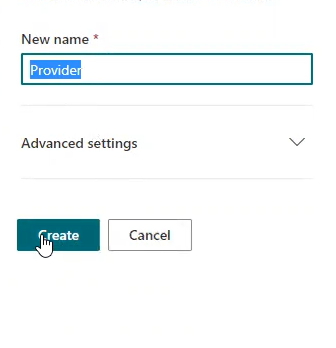
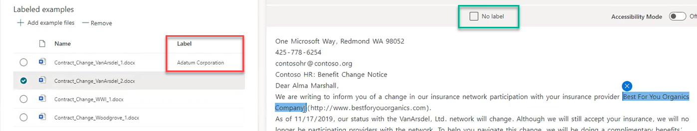
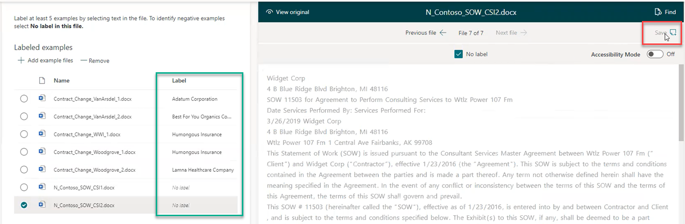
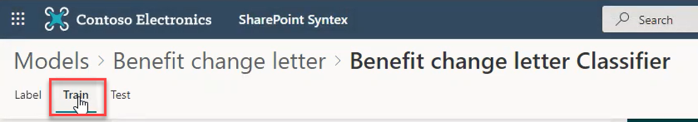
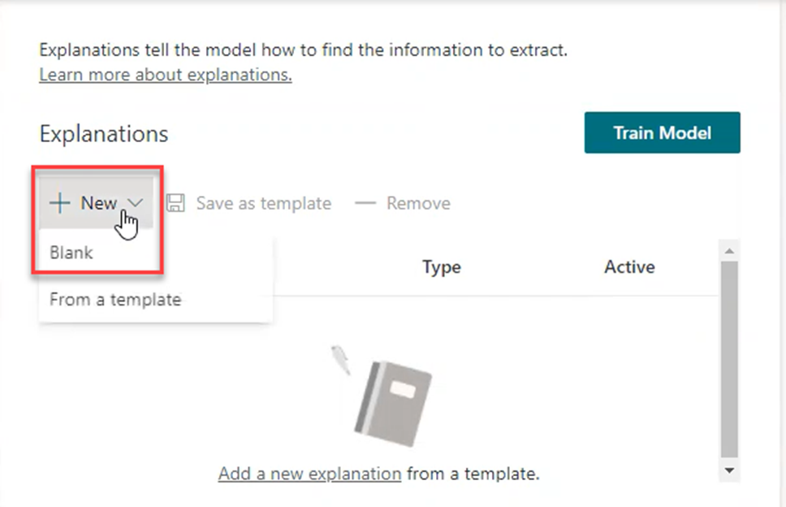
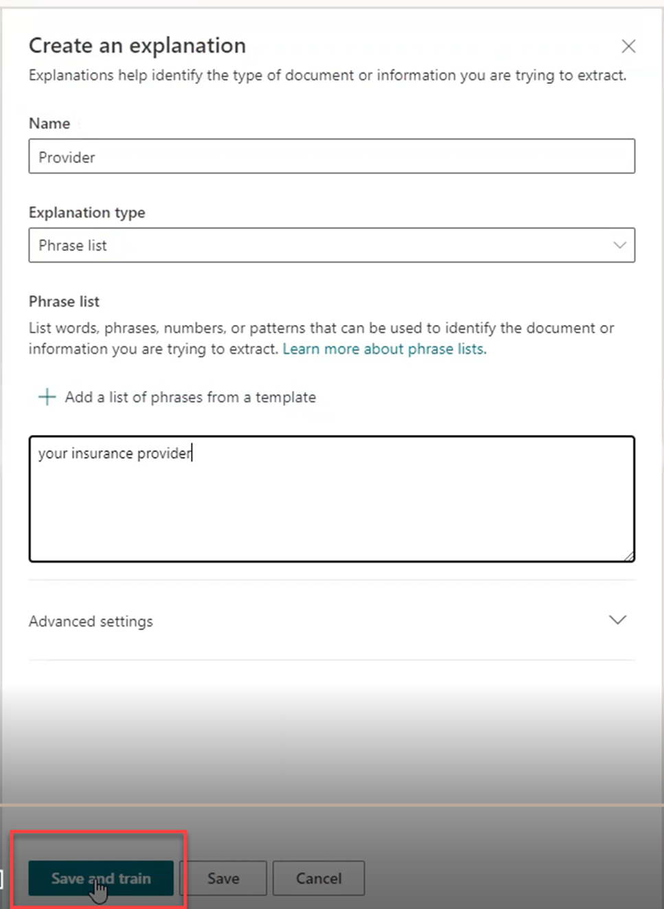
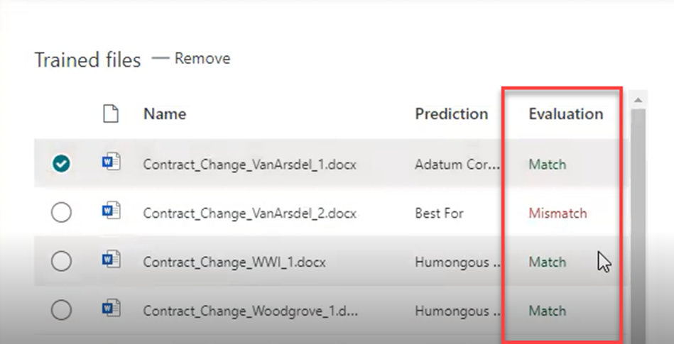
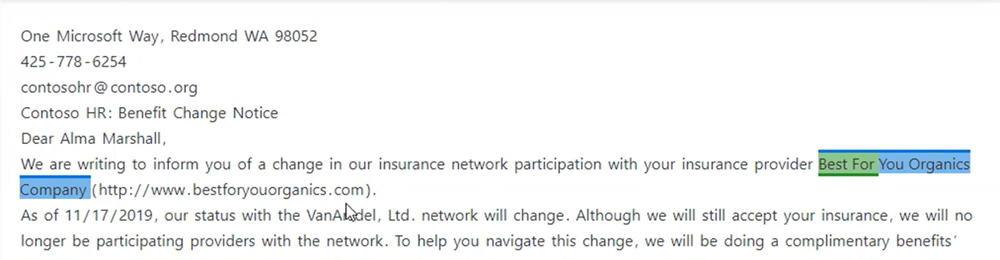
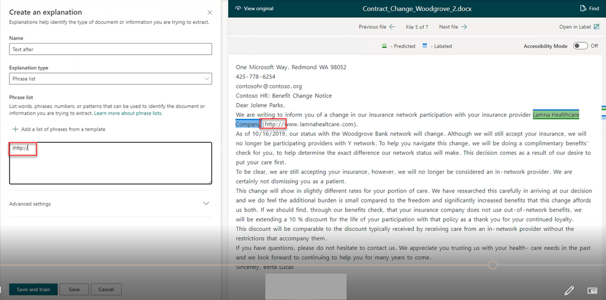
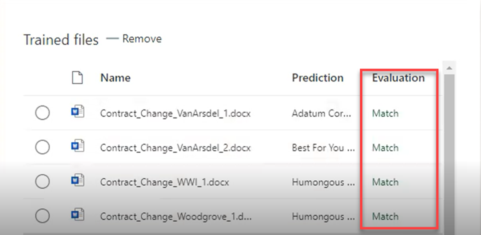

Megan and the Human Resources department not only want to classify their documents appropriately within the libraries, they also want certain information extracted from the documents and displayed as columns within the library.

Now we will look at how Megan can create an extractor to pull out the information they need to be displayed.  

1. Notice another pattern in the Benefits change letters just before the name of the insurance provider: “We are writing to inform you of a change in our insurance network participation with your insurance provider. . .” This is a phrase you can use to train an extractor to identify the name of the insurance provider.
   1. Return to the main Models > Benefit change letter by clicking on “Benefit change letter” at the top of the window.

    

1. Select “Create extractor.”
1. A dialogue box opens on the right side of the screen.
1. Name the extractor. In this case, because you’re extracting the name of the insurance provider, name the extractor “Provider.” This name will turn into a column in the SharePoint libraries filled in with the insurance provider names once the model is applied.
1. Click “Create.”

    

1. You return to the training window with the training documents listed and the first one automatically selected.
   1. You will train the model to recognize the insurance provider’s name.
   1. The model will also extract that name and label each letter with that name.
1. Highlight what portion of the document is the insurance provider name.
   1. Click “Next file.”
   1. Note that the insurance provider name you highlighted is now listed as a label for the first letter.
   1. Work through each file until you reach the files that are not Benefits change letters.
   1. For the two negative examples, check the box just above the letter that says “No label.” This tells the extractor that these files do not match the requirements to be Benefits change letters.

    

1. Once all files have been either labeled or listed for no label, click “Save” in the upper right-hand corner of the screen.

    

## Add an explanation

1. As before, you will need to add explanations for this extractor.
   1. In the upper left-hand title bar, click “Train.”

    

1. Once again, the explanation dialogue opens with your list of documents and the first document automatically selected for reading in the right-hand pane.
1. Click “New” in the Explanations dialogue box.
1. Select “Blank.

    

1. Name the Explanation. Since you’re explaining the insurance provider extractor, you can name this explanation “Provider” to match the extractor.
   1. Because you will specify the text phrase leading up to the insurance provider name, select “Phrase List” from the drop down.
   1. Highlight the phrase “your insurance provider” from the body of the Benefits change notice.
   1. Copy and paste that phrase into the Phrase list document.
   1. You have instructed the model that this phrase is always followed by the name of the insurance provider.
1. Click “Save and train” in the lower left-hand corner of the screen.

    

1. The model will now attempt to evaluate each document in the training library against the criteria you defined in the “Evaluation” column.
   1. You are returned to the training screen where you can watch the model work in the documents.
   1. It may take a minute for the model to work through the training library.

    

1. When the evaluation completes, you will see the “Evaluation” column fill with the words “Match” or “Mismatch,” depending one how well document phrase patterns fit model definitions.

    

1. In this example, you see that the second document is listed as a “Mismatch.” This is because the insurance provider name is longer than two words.
   1. Click into the mismatched letter and note that the model highlights the first two words of the insurance provider name in green, and the rest of the name in blue.  

    

   1. The blue highlight is the first part of the model you trained. You told it what the name of the insurance provider was. The green highlight is the newest explanation where you explained to the model that it should look at the text after the phrase “your insurance provider.” But the model doesn’t know how many words past that phrase it should look.
   1. You will need to add an explanation that tells the model where to stop looking.
   1. To give the model the best chance of identifying an insurance provider name regardless of the name length, you need another phrase pattern to help the model capture the best data. In this case, you’ll identify a phrase at the end of the insurance provider name and you’ve noticed that in each letter, the insurance provider name is followed by the same pattern – the company URL.  

1. To create the new explanation to help the model resolve mismatches, click “New” in the Explanations dialogue box.
   1. Select “Blank.”
   1. Name the new explanation. In this case, you pick “Text after” since this name is only for the model and your reference.
   1. Select “Phrase List.”
   1. Copy the phrase after the insurance provider name “(http://” and paste it into the Phrase List window.

    

1. Click “Save and train” again.
   1. The model will evalutate the training files again – this time with both explanations helping it identify  both the beginning and the ending of the target insurance provider names to be extracted.
   1. This time, with the extra information, the model matches each training file correctly.

    

You have successfully trained the extractor.
