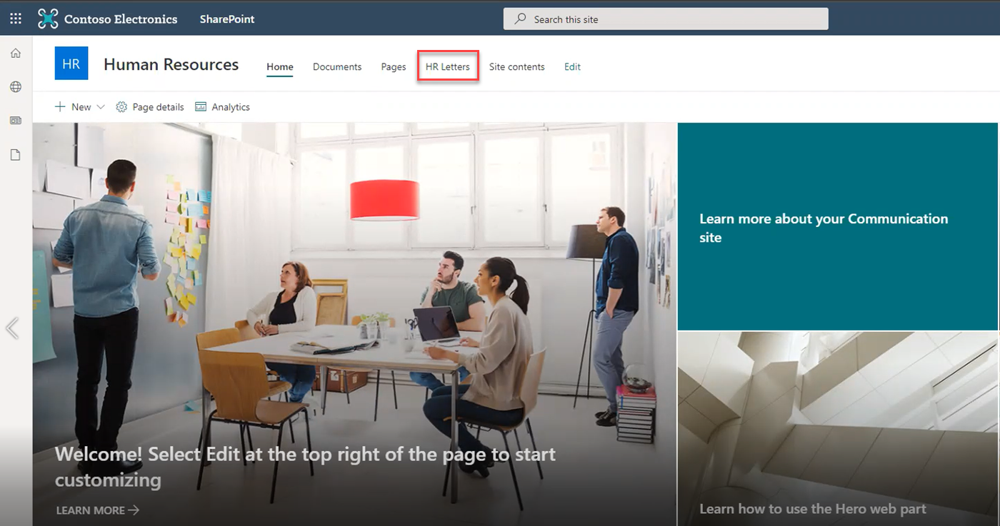
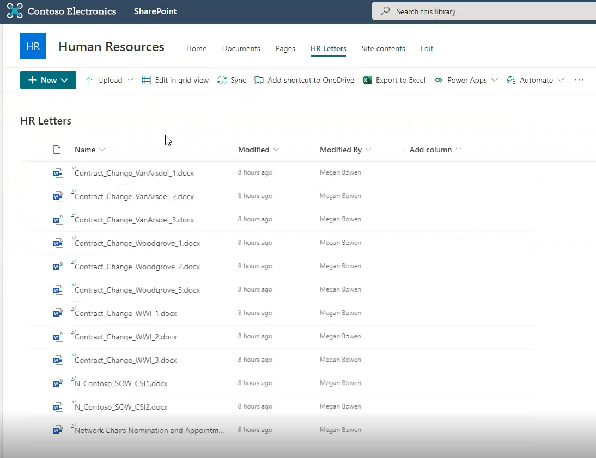
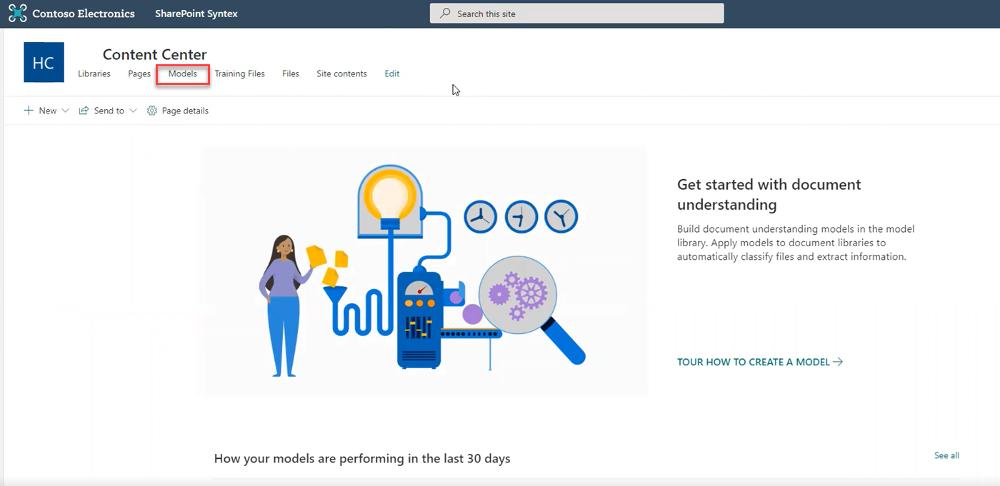
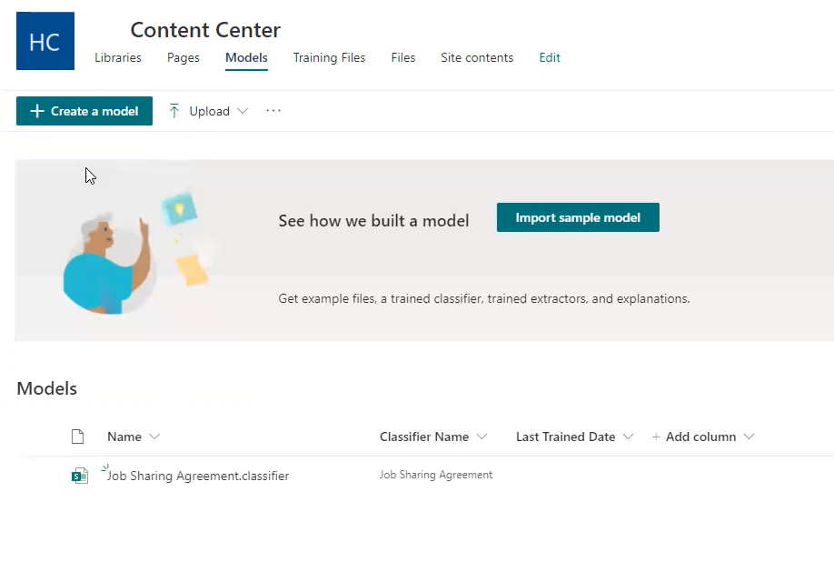
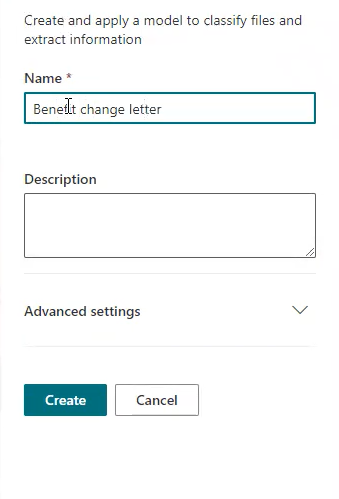
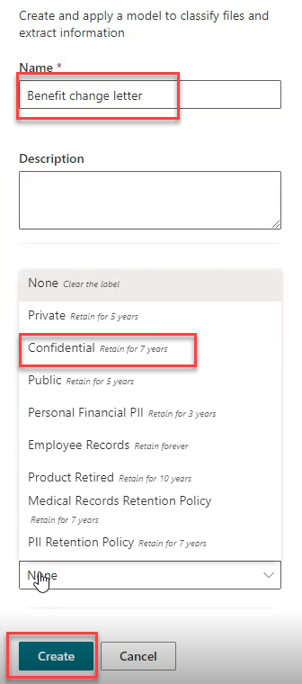
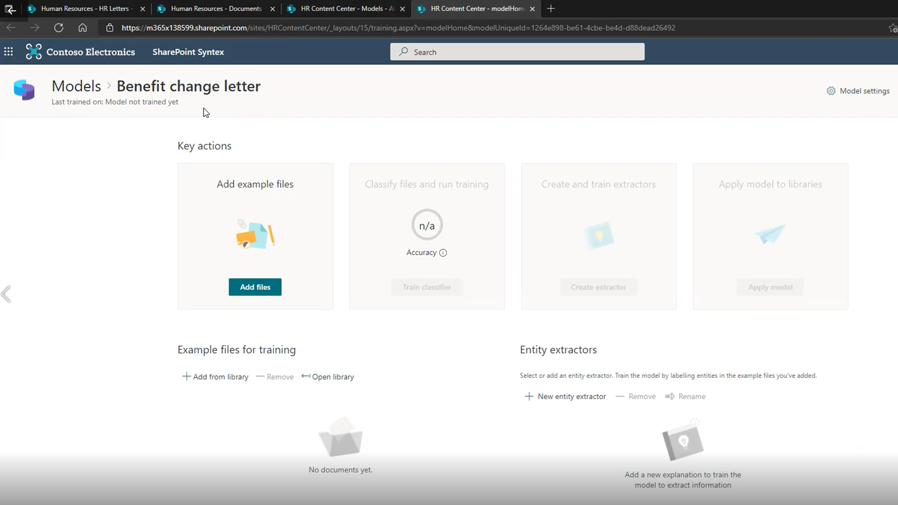

Before applying document understanding models, they need to be created within the content center that was created during SharePoint Syntex setup.

Megan Bowen, a Human Resource administrative assistant at Contoso Electronics, volunteered to act as the document understanding model owner and build and apply models since she is familiar with the documents and the libraries.  

Here, you'll learn how to instruct Megan and other model owners how to build document understanding models.

Megan and her managers have identified a library of letters to begin building their document understanding model.  

Megan opens the HR Letters library, which contains many documents of varying types. Megan and her team want to identify which documents are letters notifying Contoso Electronics employees of benefits changes. Given the healthcare data contained in those letters, Contoso Electronics has an obligation to retain them for seven years. Yet, looking through the library, nothing distinguishes these sensitive notification documents from any other document. Prior to using SharePoint Syntex, in order to know which letters must be retained and which are safe to delete, Megan must open each document.  

Human Resources would like to use SharePoint Syntex document understanding to automatically identify which documents are benefits notification letters, and then classify them appropriately. To do this, you must first help Megan define a document understanding model and then you’ll show her how to the model following these steps.

1. Start in the content center. This is the place for creating and training document understanding models, and then applying those models to document libraries.
1. Select "Models."

    

1. The Create a Model page opens.
   1. The "Create a Model" button appears.
   1. You can see a list of models that have been created previously by other model owners.  

    

1. Select "Create a Model" in the upper left-hand corner of the page.
1. A "New document understanding model" dialogue box opens on the right-hand side of the browser.  
1. Enter a name for the model. In this case, name the model "Benefit Change Letter."

    

1. Each model is tied to a SharePoint content type and that must be defined as you create the model.
   1. Click "Advanced Settings."
   1. You will see two radio buttons, the first allows you to create a new content type, the second allows you to select one of the content types that already exist in your SharePoint site.
   1. Since you are defining benefits changes letters, which are a new content type, you need to create a new content type called "Benefits change letter."
      1. Click into the drop-down box for Retention Label and select "Confidential." This selection is based on the Human Resources manager’s knowledge of document retention requirements.
   1. This is also the place to define and assign a retention label to the documents your model identifies.

    

1. Click create.
1. SharePoint Syntex brings you to the Content Center: Models page view.  

    

1. The page lays out the four key steps you need to take with your model.
   1. The first step: Add files to be used for training the model to recognize benefits change Letters.
   1. Include negative examples – a few documents that are not benefits change letters.
1. Classify files and run training.
   1. Teaches the model to recognize benefits change letters so it can analyze every document in each library it is applied to.  
   1. It will classify documents as it identifies them as a benefits change letters, applying the "Confidential" label that was selected when the model was created.
1. Create and train your extractors. Extractors pull data from the letters. In this case, Human Resources would like to sort the letters based on the names of the insurance provider, which is buried in the body of the document.
1. Apply your models to the libraries of your choice. Once the model is trained with a few example documents, you can apply it to the library or libraries of your choice.

We’ll walk through each of these items step-by-step following your model creation.
