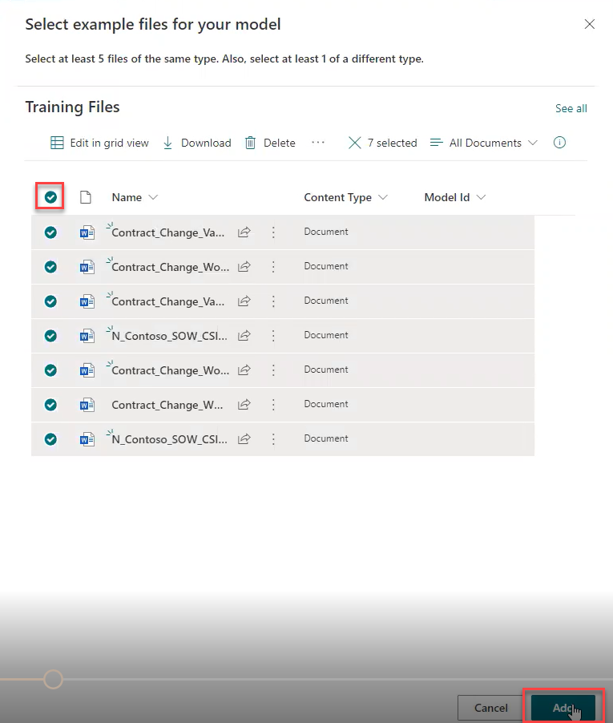
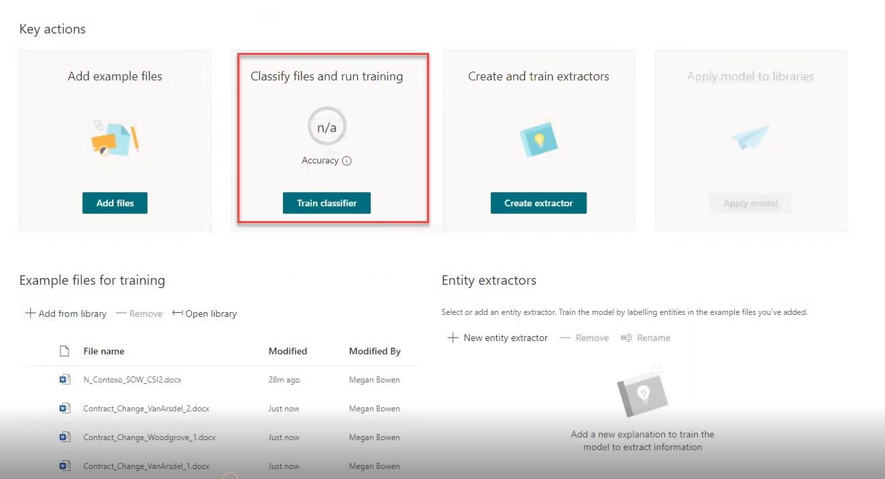
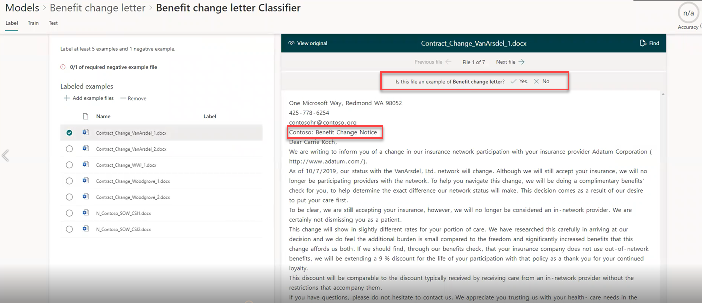
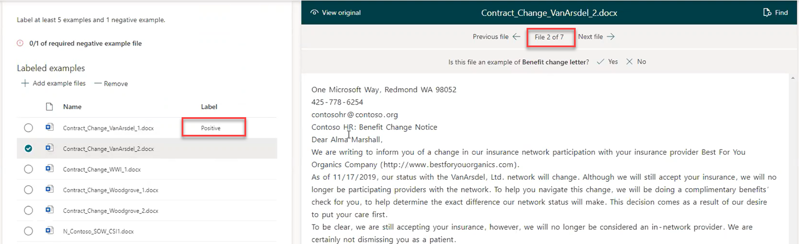
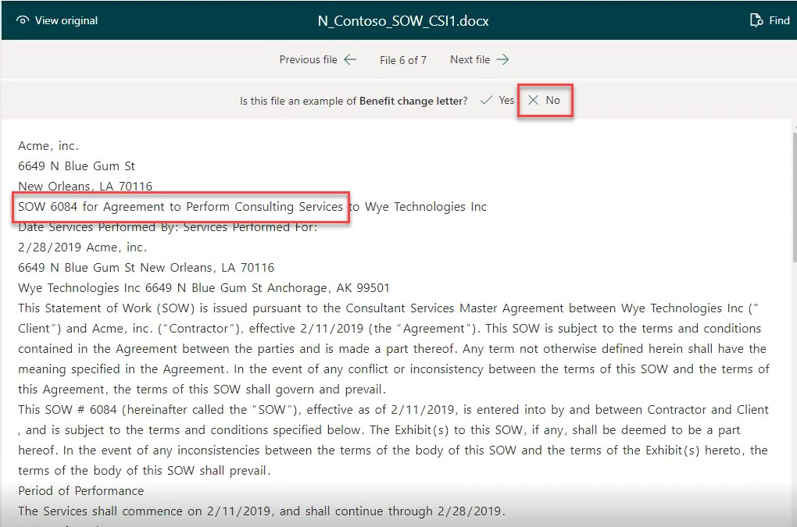
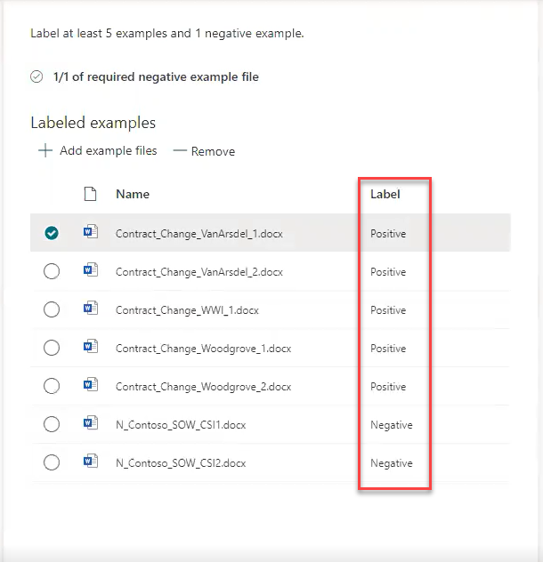
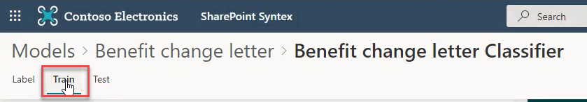
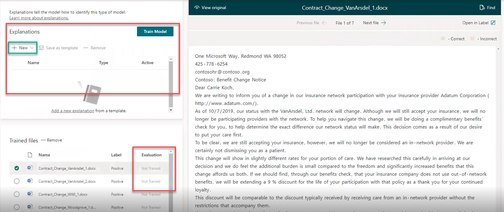
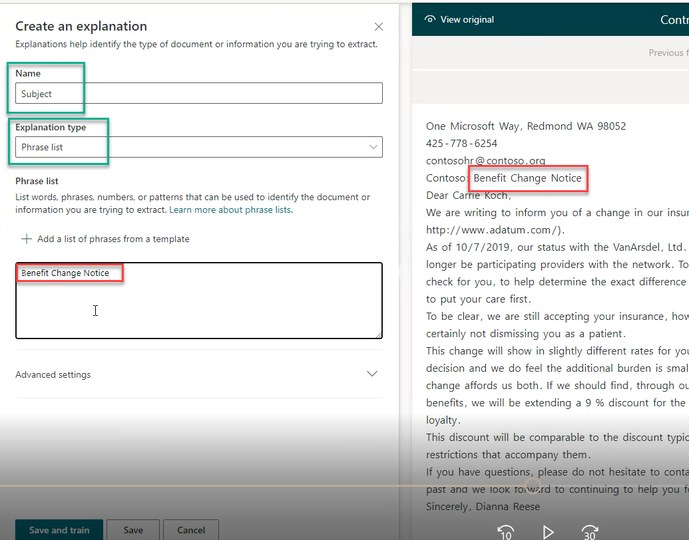

Before you train your model, you must identify five positive example documents. In other words, these documents need to be examples of benefits letters. It is also helpful to include a couple of negative examples – documents that are not benefits letters. Pull those documents together in one place as a set of training files.

You and Megan identified a group of seven documents for use in training the new model.

1. Begin in the Content Center: Models > Benefit change letter page.
1. Click "Add files" in the Add example files column.
1. The Select example files for your model window opens.
1. Click "Upload" to bring the training files into the training area.
   1. Select all of the files in the training files folder and click "Open."
   1. The upload begins. It may take a moment to complete.
   1. Note that the default Content type is 'Document.' This training will teach SharePoint Syntex how to change that default content type from 'Document' to 'Benefit change letter.'
1. When the upload finishes, click the radio button in the top left column to select all of the documents.
   1. Click 'Add' in the lower right-hand corner of the window.

    

1. The seven documents are added to the training area. More key actions options light up and you can move forward with training.
1. Move to the next column in line: Classify and run training.
   1. Click "Train classifier."

    

1. The Classifier training window opens with one of the training documents automatically selected and open.
   1. You need to mark which of the example files are good examples of Benefits change letters.
   1. In document view, click either "Yes" or "No," depending on whether the document displayed is a Benefits change letter or not.
   1. Note that formatting has been stripped so SharePoint Syntex can focus in on the text.

    

1. Because this is a Benefits change letter, click "Yes."
   1. The trainer moves to the next file in line.
   1. The trainer labels the first document "Positive" as a match for Benefits change letter.

    

1. Move through each of the example files in this same way until all of them have been identified as either positive or negative.
   1. Select 'No' when a file opens that is NOT a benefits change letter.

    

1. Once you've moved through the example files, you will notice they've been labeled as positive – meaning the documents are Benefits change letters, or negative – they are not Benefits change letters.

    

## Create an Explanation

Now, you must explain to the model why Benefits change letters are Benefits change letters. For that, click "Train."  

12. The Explanations dialogue box opens in the training area.
    1. Again, the first document is automatically selected and opened.  
    1. Explanations tell the model what elements go into making a Benefits change letter.

    

1. Before you can train the new model, you must add a new Explanation.
   1. Click "New", then "Blank."
   1. This opens the Create an Explanation dialogue box.
   1. Name the explanation and select the Explanation type from the dropdown box.
   1. In this case, you and Megan decide to use the subject line as an explanation, so name this "Subject."
   1. In the dropdown box, you can chose from "Phrase List" and "Proximity".
   1. Because the subject line of the Benefits change letters is a phrase, select "Phrase List."
1. A new dialogue box opens for "Phrase list" asking you to identify words, phrases, numbers, or patterns that can be used to accurately identify a Benefits change letter.
   1. Note that each of the Benefits change letters has the same subject line, therefore, you can use that phrase to help the model recognize Benefits change letters in the rest of the Human Resources libraries.
   1. Copy and paste the phrase "Benefit Change Notice" into the text box on the left.

    

1. Click "Save" at the bottom of the page.
   1. Do not click "Save and Train."
   1. Human Resources management wants to label each of the Benefits change letters with the name of the insurance providers, as well. This requires defining an extractor before training the model.
   1. When you click "Save," the Explanation dialogue box closes, returning you to the Classifier page.
