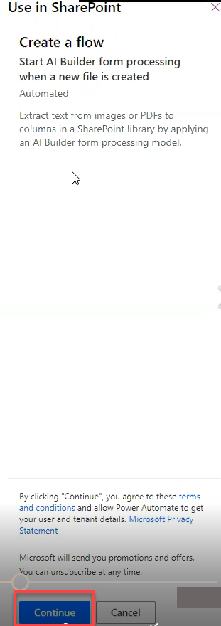
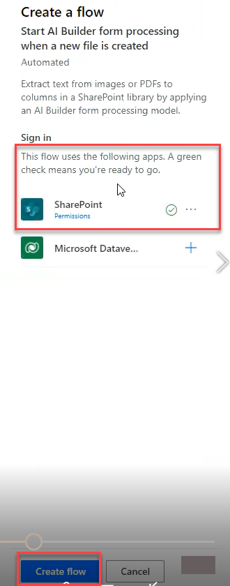
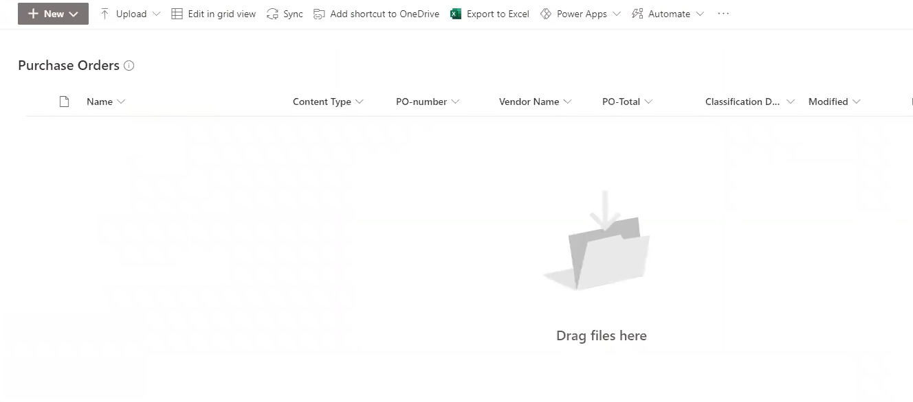
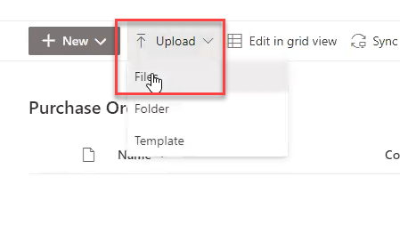
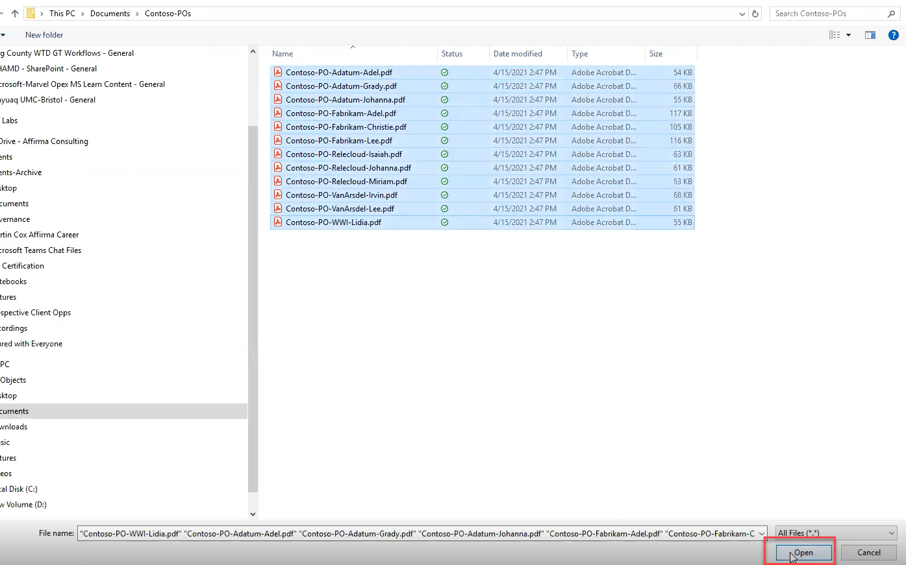
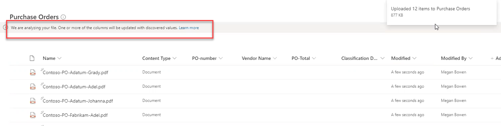
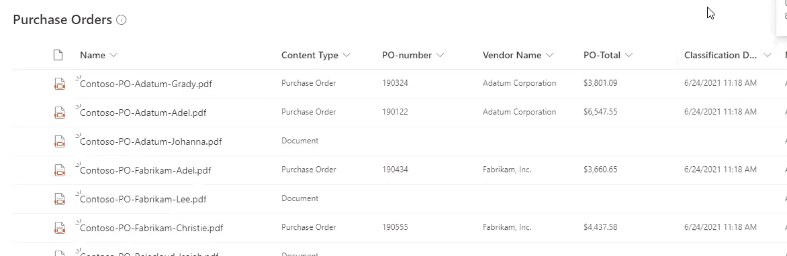

Now that you have successfully created and trained your form processing model, it's time to apply this model to the appropriate SharePoint document library so that it can start categorizing and extracting information from the appropriate documents for the Contoso Electronics Accounting team, which in this case, are POs.

1. Click **"Use model"** to apply it to a document library.
1. The **Use in SharePoint** panel opens on the right-hand side of the screen
   1. Click **"Continue."**

    

1. On the next **"Create flow"** screen, Power App notes the applications you're signed into. A green checkmark beside the application means you are ready to apply the form processing model inside that app.
   1. Click the **"+"** sign beside an app if you need to sign in to apply the model.
   1. Otherwise, since SharePoint is ready to go, click **"Create flow."**

    

1. The **Use in SharePoint** pane will work for a moment, then display a green checkmark and a notice that your flow was successfully created.
   1. Click **"Go to SharePoint"** at the bottom of the pane.
      - Because you built this form processing model from within a document library, AI Builder and Power App knew to apply the model to that library.
   1. The model will now process documents as they are saved to the library.
1. You return to the empty PO document library you created earlier.
   1. Now, the library has columns for the fields you trained in your form processing model.

    

1. Upload the POs to the new library to begin processing them with the new model.
   1. Click **"Upload,"** then **"Files"** in the top left of the navigation ribbon.

    

1. Navigate in file manager to the folder where the POs are stored.
   1. Note: _Not the training set folder_. You want the folder with the _entire_ Contoso Electronics PO inventory.
   1. Select all the files.
   1. Click **"Open"** to begin the upload.

    

1. Upload begins.
   - The initial upload does not fill in the extended columns at first.
   - Your form processing model begins working on the documents as they upload into the library.
   - The process may take a few minutes, but as the form analyzes the documents, it will begin extracting data and filling in the columns beside each document title.
   - You will see a banner at the top of the library telling you the model is reading through your documents.

    

1. After a few minutes, data will begin flowing into the columns.
   - Content type will change from _"Document"_ to _"PO."_
   - _PO-number_, _Vendor Name_, and _PO-Total_ will begin to fill with information pulled from each of the files.
   - Depending on the number of files to be processed, this could take a few minutes or considerably longer.

    

Congratulations! You have successfully created a form processing model and applied it to a library. Once the model finishes extracting data into all columns, the accounting team at Contoso Electronics can sort POs by vendor name, or PO Total, or order the POs by PO Number.
