In this unit, you will teach the accounting department how to plan for and create a form processing model to extract data from POs.Currently, their POs are stored in Microsoft OneDrive.To apply form processing to the existing POs and to every PO that is added to the file folder, you must make plans to import the forms to a dedicated SharePoint library.

1. Create a training set.
   1. Identify and isolate a group of files to be used to train the model you create.
   1. Five files are the recommended minimum.
   1. Copy your files into a file folder named Training Set.
   1. After you’ve brought over your PO examples, add at least two other files of the same type (PDF in this case) that are not POs.
   1. For this example, Statements of Work in PDF format will suffice.
1. Create a SharePoint document library where your POs will be imported
   1. Click "Site Contents” in the left-hand pane of the accounting department’s SharePoint site.

    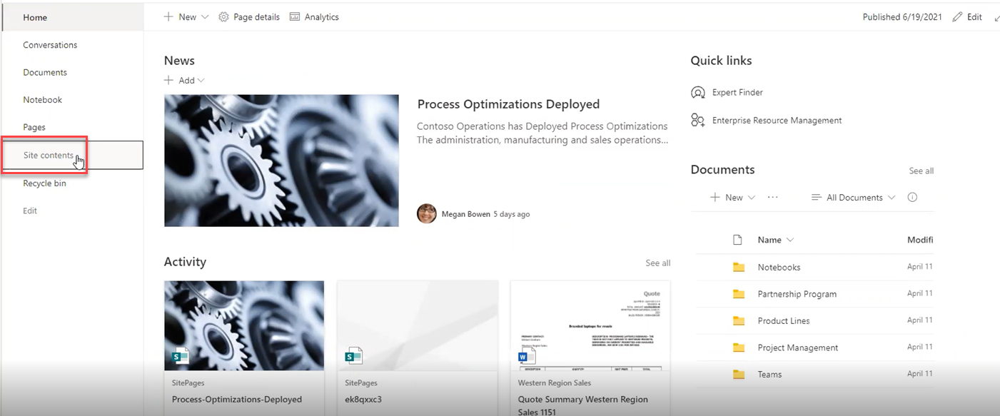

1. Click "New” to create a new library dedicated to POs.
   1. Select "Document Library” from the dropdown of options.

    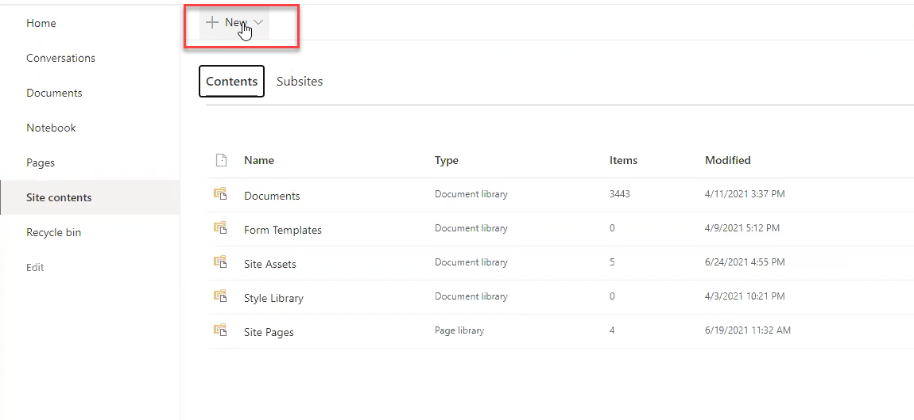

1. The Create document library pane opens on the right-hand side of the screen.
   1. Name the site – in this case "POs."
   1. Click "Create."

    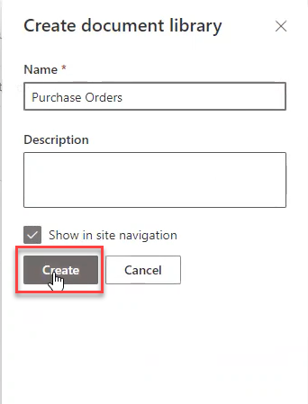

1. This creates a new, empty document library with no columns of useful information.

    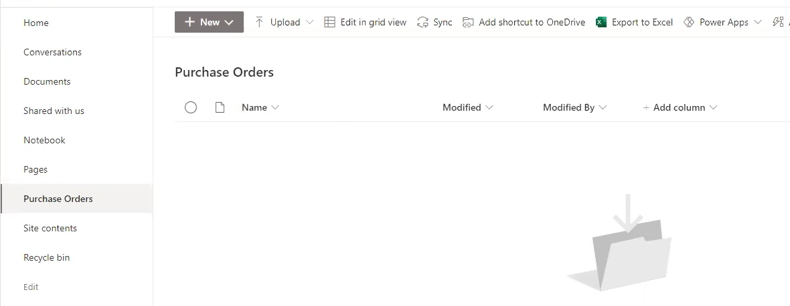

1. From within this empty SharePoint library, click on "Automate” in the upper right-hand navigation ribbon.
   1. From the dropdown, select "AI Builder,” which opens another option box
   1. Select "Create a model to process forms."

    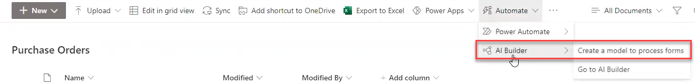

1. A dialogue box opens on the right-hand side of the page asking you to name your new model.
   1. The name you choose will be used as the Content Type in your new SharePoint library, so select a name that makes sense in reference to how the forms will be labeled – as POs, for this example.
   1. Type in the name.For this example, we’ll use "PO” as the name for the model.
   1. In Advanced Settings, you have the choice between creating a new content type or selecting from a set of predefined content types available to SharePoint Syntex.For our purposes, you can leave the default "Create new” selected.
   1. Also leave the box checked for default view of the library.Unchecking this box removes the view the model creates to show the data the model is going to extract.Without this box checked, it may look as if your model failed.
   1. Click "Create."

    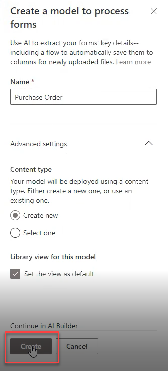

1. PowerApps AI Builder opens.
   1. This transition may take a moment to complete as AI Builder creates your new model.
1. The AI Builder tool page opens on "Choose information to extract."
   1. Accounting wants to see the PO number, the vendor’s name, and the total PO amount in dollars.
1. Click "Add."
   1. Select "Field."

    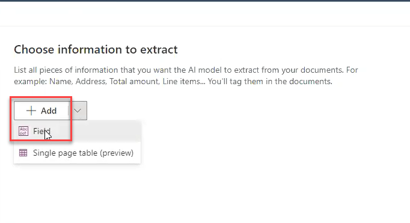

1. The Field dialogue box opens, asking you to define the first field you want your AI model to extract.
   1. In this case, name the field "PO-number."
   1. Click "Done."
   1. You’ll see the field added to the page.
   1. Add another field called "Vendor Name."
   1. Add another field called "PO-Total."

    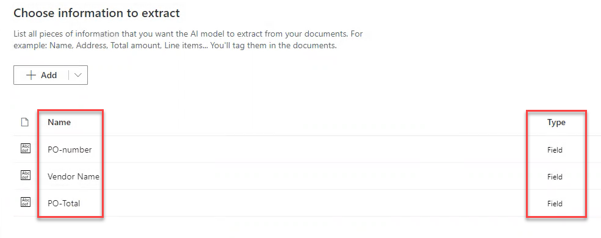

1. Click "Next” button at the bottom of the page.

## Train and test your model

13. The "Add collections of documents” page opens.
    1. Add the training files you identified earlier.
    1. Click "New collection."
    1. "Add documents” appears on the page with a button beneath it.
    1. Click the plus sign in that "Add documents” button.

    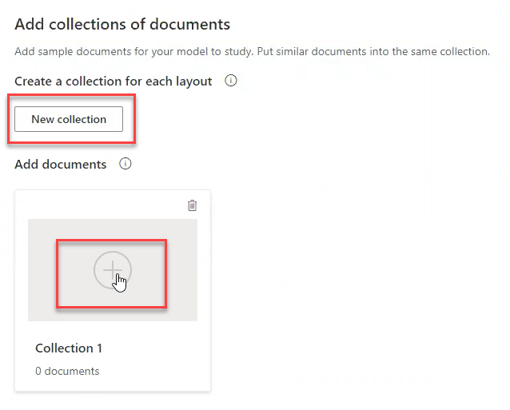

1. The "Collection 1” pane opens in the right-hand part of the screen.
   1. The instructions tell you to select five or more documents with the same layout – like your collection of POs.
   1. Note that forms need to be either .JPG, .PNG, or .PDF files.
   1. Click "Add documents."

    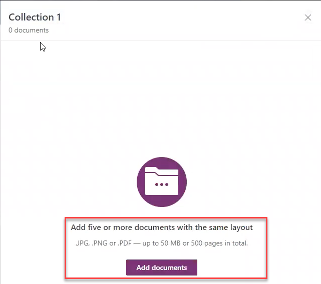

1. The "Select source” window opens with a list of data sources.
   1. Select "Upload from local storage."
   1. Navigate to the location of the training files.
   1. Import all the training files.
   1. The files will load.
   1. Note that while we’re loading seven files, only five of them conform to the requirement of being POs.
   1. The two negative documents will be used while training your model.
   1. Click "Add 7 documents."

    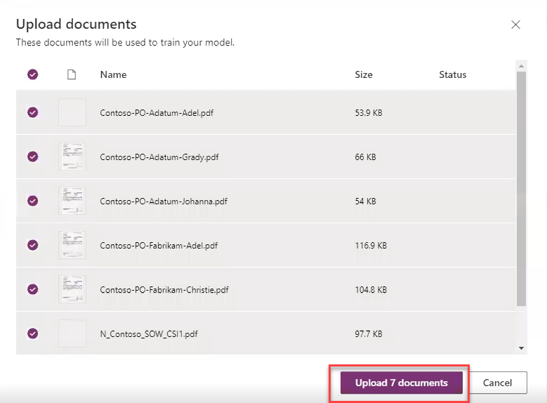

1. The documents will take a few minutes to upload to the environment.
   1. When the upload completes, click "Close."
1. Click "Analyze” at the bottom of the screen.

    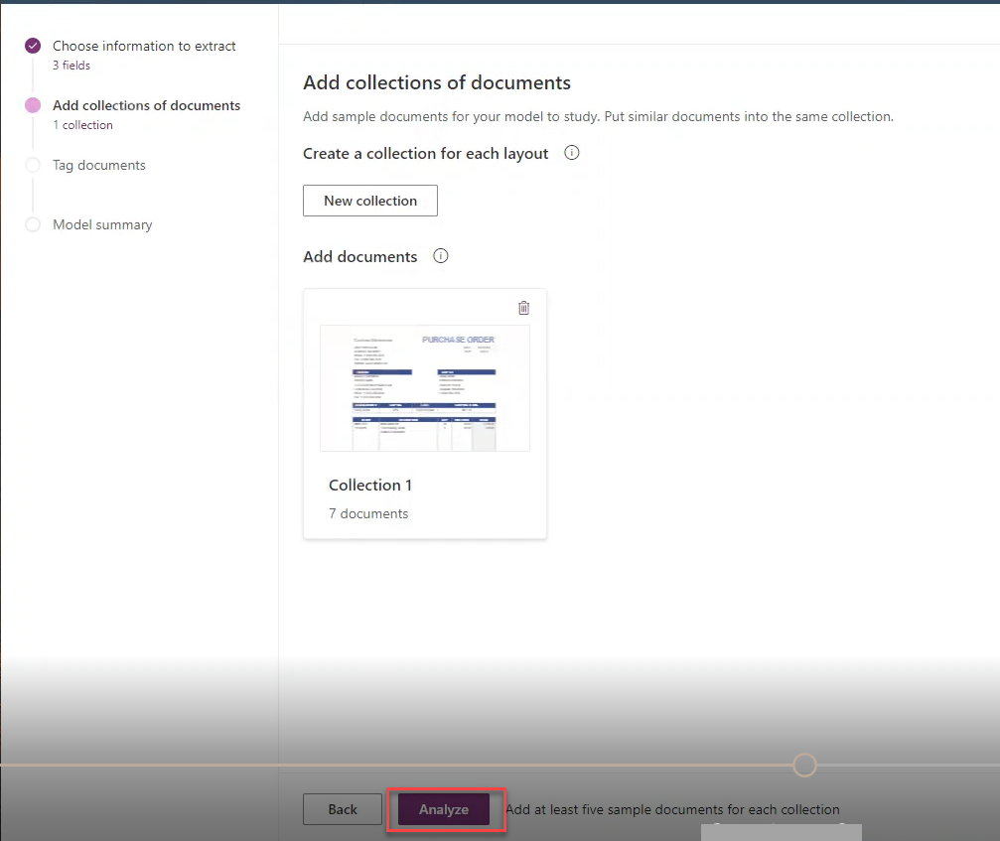

1. The training center will begin analyzing the documents.
   1. This step may take a few minutes to complete.
1. When the analyze documents step completes, AI Builder displays a rendering of the first PO in the Tag documents page of the AI Builder.
   1. A window pops up pointing out where the documents are listed in the right-hand pane of the AI Builder screen.
   1. You can browse through the documents by clicking "Next."
   1. To begin tagging the document fields, click the "X” in the upper right-hand corner of the window.
   1. For our purposes, click the "X” to close the window.

    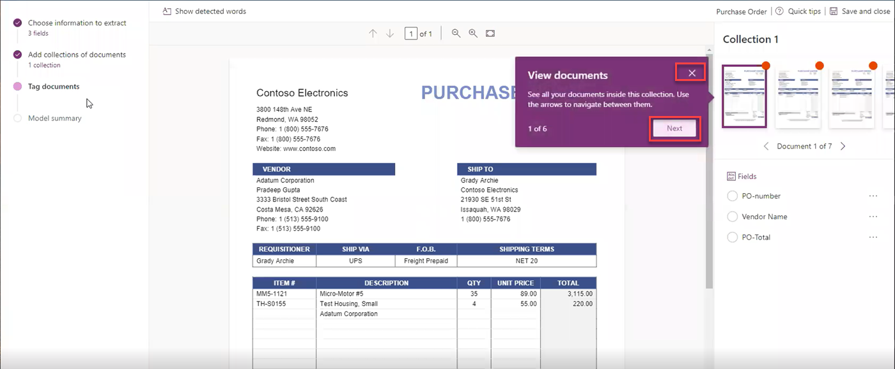

1. Highlight the PO Number.Click and drag to draw a dotted line box around the PO Number in your document.

    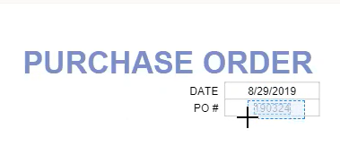

1. When you release the mouse button, the box will solidify, and a dialogue box opens listing the three fields you defined earlier: PO-number, Vendor Name, and PO-Total.
   1. Note that the PO Number you highlighted is now listed at the top of the dialogue box.
   1. Select the correct field. In this case, click the radio button beside "PO-number."

    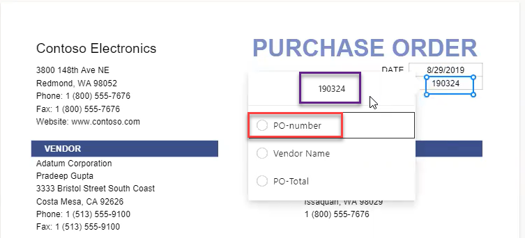

1. Once you make a selection, the dialogue closes, the box around the PO number turns green, and a green check mark appears in the field list on the right-hand side of the AI Builder screen.

    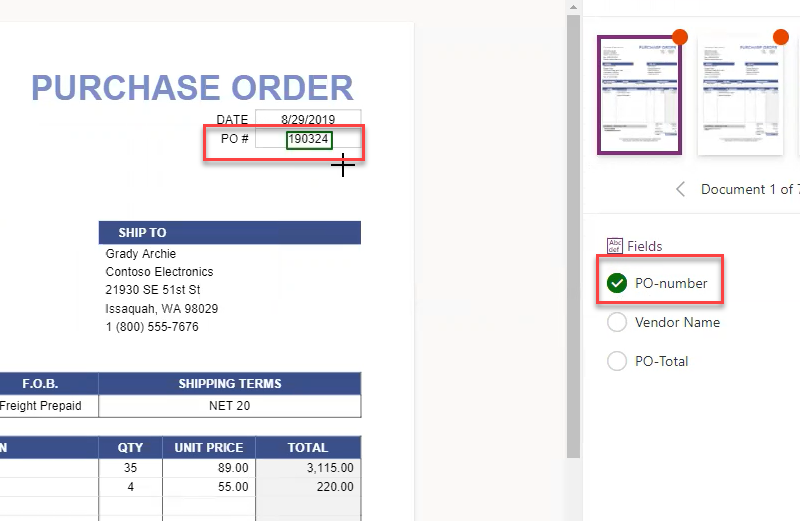

1. Repeat this process for the Vendor name.
   1. Highlight the complete vendor name.
   1. Notice that when the dialogue box opens, it contains only two field names.
   1. Make your selection, "Vendor Name,” and check that box.
   1. As before, the box closes, the outline around the vendor name turns green, and the green checkmark appears beside "Vendor Name” in the list of fields on the right-hand side of the page.
1. Scroll down in the document to "Total."
   1. Highlight the dollar amount.
   1. When the dialogue box opens, only "PO-Total” remains as a choice.
   1. Click the radio button.
   1. You’ve successfully initiated training for your form processor.

    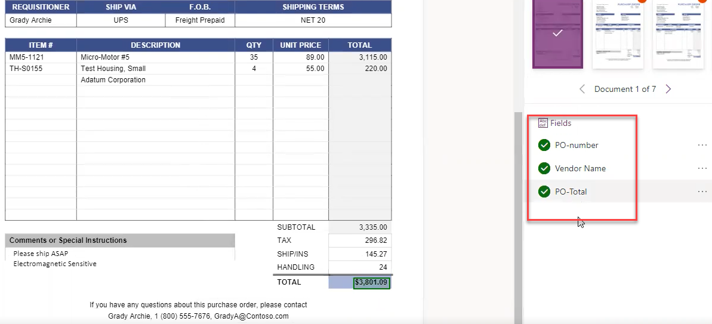

1. Walk through each document in the same way until you reach the two .PDF files that are not POs.
   1. Note that as you move through the documents, AI Builder may automatically recognize some of your fields and automatically tag them for you.
1. For the documents that are not POs, you will mark the defined fields as "Not available in document."
   1. Bring up one of the training documents that is not a PO.
   1. In the right-hand pane, click on the three dots to the right of each possible field name.
   1. Select "Not available in document."
   1. Do this for each field in each negative document.

    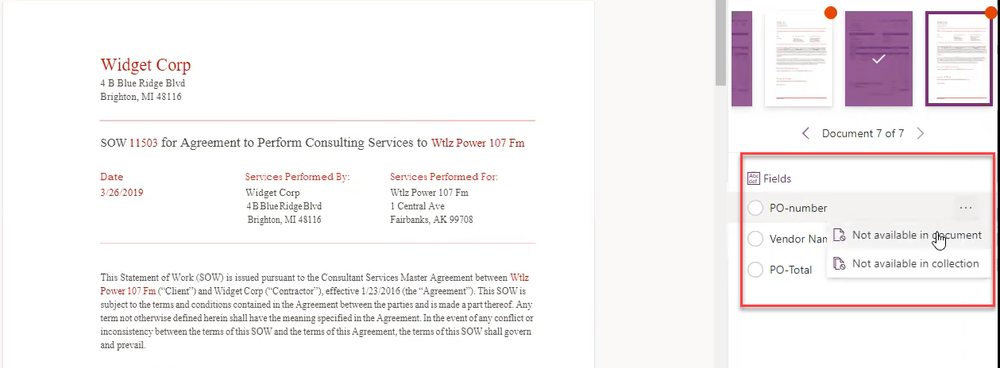

1. Select "Save and close” in the upper right-hand corner of the screen.

    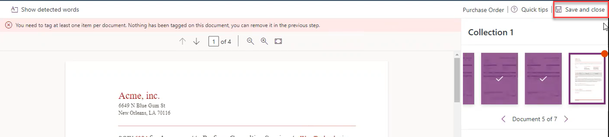

1. AI Builder saves the PO model.
1. Click the model name to open the model for next steps.

    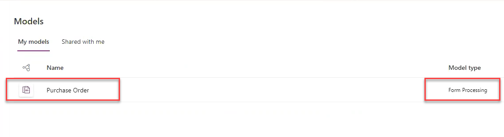

1. The training page opens with the first PO rendered, along with the field list on the right-hand side of the screen.Your fields will have green check marks next to them.
   1. Click "Next” at the bottom left of the screen to begin training your form processing model.

    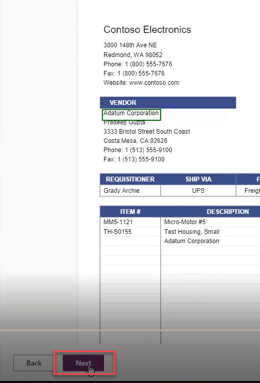

1. The Model summary page opens.
   1. Review the information for your model.
   1. Click "Train."

    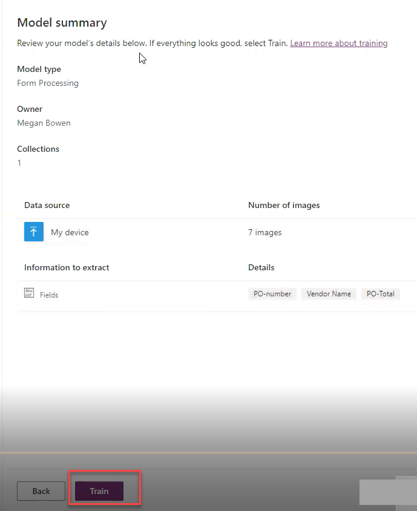

1. The model begins training.
   1. A dialogue box opens telling you that the model is training and that it may take several minutes.
   1. It is okay to close the window and return later, if necessary.However, with the limited number of training documents you used, the model will finish training quickly.
   1. When training finishes, AI Builder will display a message "Training complete."
   1. Click "Go to Details page."

    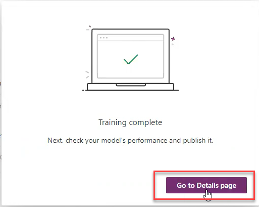

1. The Details page opens with a banner across the top saying that your model hasn’t been published and therefore, cannot be used in apps or flows.
   1. To publish your model, click "Publish” at the bottom of the Training document box.

    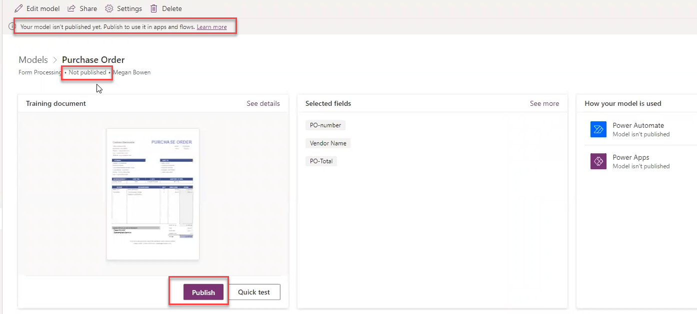

1. When the model finishes publishing, the page refreshes.
   1. The status beneath "Models>PO” now reads "Published.”
   1. Note that the model is published under Power Apps on the right-hand side of the screen, and you can click in to read documentation about the model.

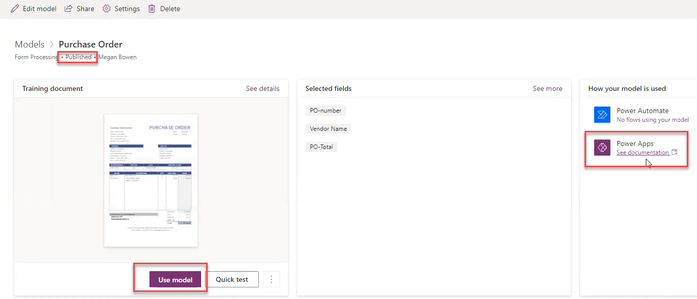
